## Sirviendo aplicaciones Php y Python
Carlos Javier Oliva Domínguez

*La actividad consiste en configurar 2 sitios web (virtual hosts) en nuestro servidor web Nginx.*

----
### Sitio web 1
En este sitio web 1 vamos a crear un nuevo `Virtual Host` con la dirección http://php.alu3295.me que tendrá su directorio `home` en la ruta `home/alu3295/webapps/php`.

Porsupuesto, lo primero que haremos será crear la carpeta home en  dicha ruta.

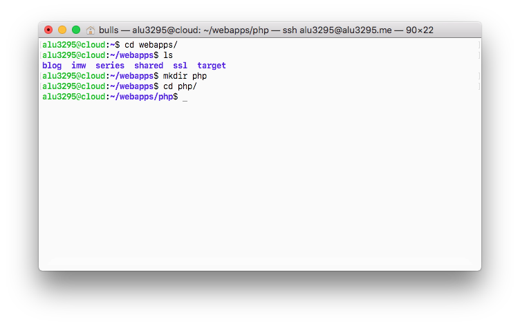

Para ir preparando lo que va a mostrar nuestra página, usaremos los archivos proporcionados por el profesor. Los descargaremos al home de nuestro nuevo sitio.

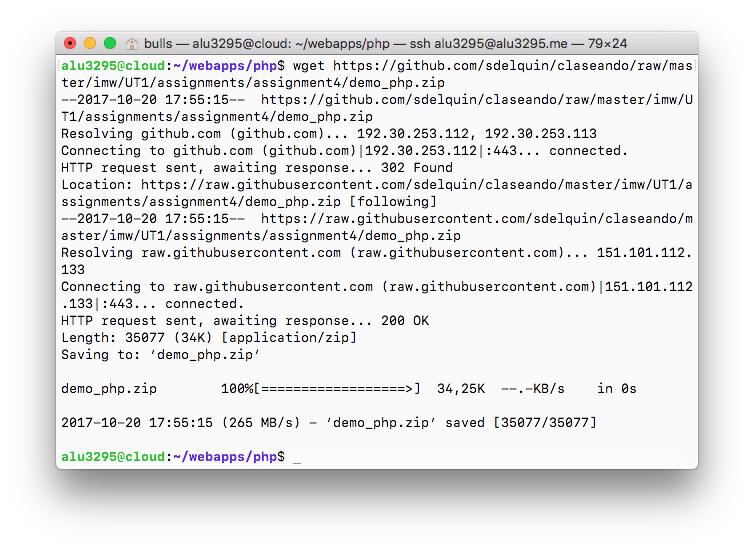

Lo sigueinte será descomprimir el archivo que acabamos de descargar.

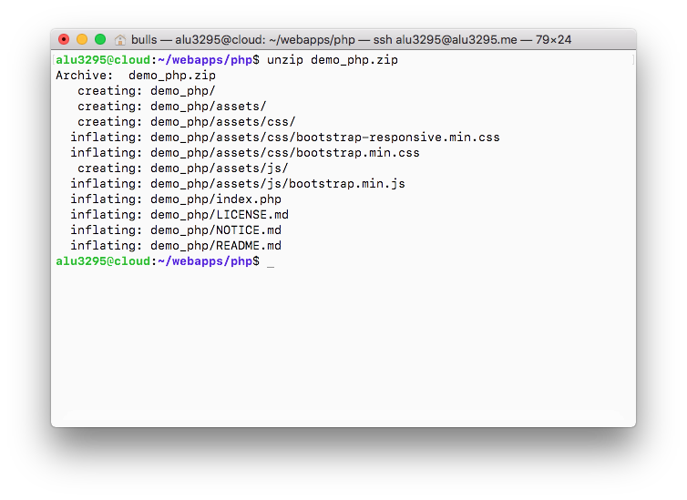

Ahora nos dirigiremos a la ruta `/etc/nginx/sites-available"`y vamos a crear un nuevo archivo de configuración al que llamaremos `php`.

Como ya sabemos este archivo contendrá todas las configuraciones referentes a nuestro nuevo virtual host.

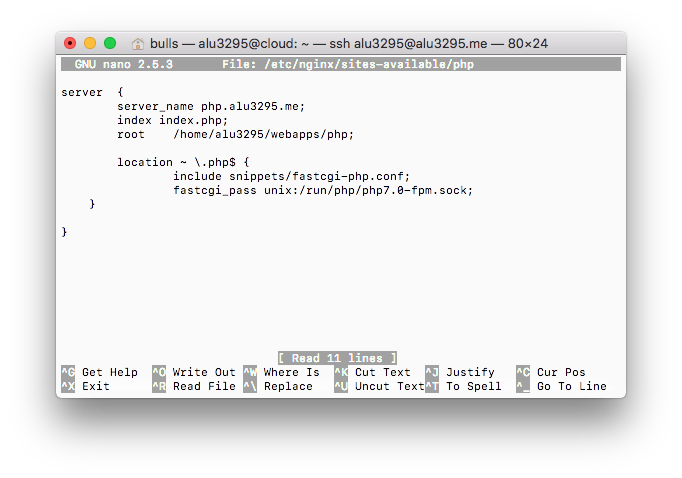

Lo siguiente que haremos será dirigirnos a la ruta `/etc/nginx/sites-enabled` y crearemos un enlace simbólico de la configuración de nuestro nuevo virtual host.

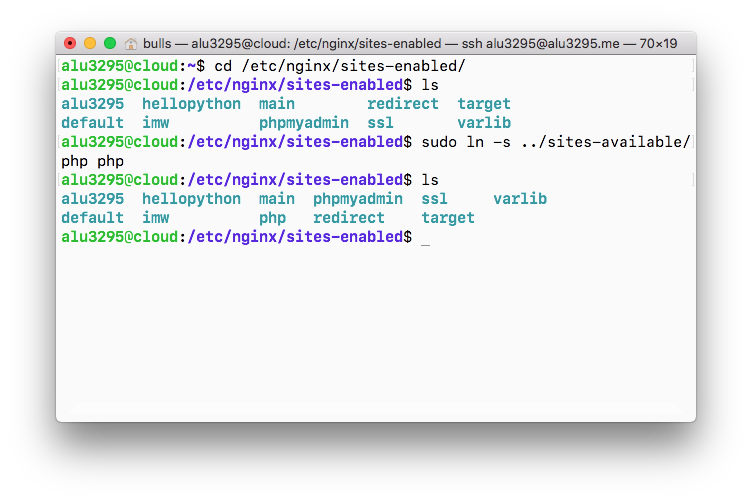

Comprobamos que el enlace simbólico `php` se ha creado correctamente.

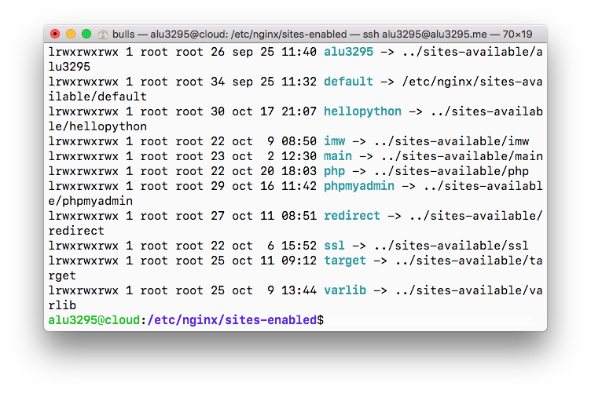

Ahora un punto muy importante sería recargar el `servicio nginx` para que las configuraciones anteriormente efectuadas surtan efecto.

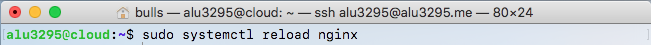

Finalmente nos dirigirnos a la dirección `php.alu3295.me`y comprobamos que nuestra nueva aplicación web funciona correctamente.

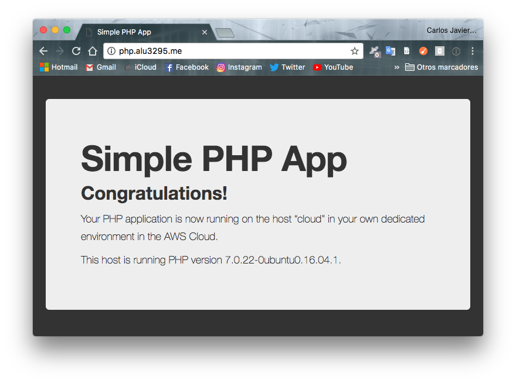

## Sitio web 2
Para sitio web usaremos la dirección http://now.alu3295.me

Para comenzar necesitamos crear un nuevo `Entorno virtual` sobre el que vamos a trabajar.

Tal y como hicimos en prácticas anteriores, vamos a crear el directorio de nuestro nuevo `Entorno virtual`. Para ello iremos a la carpeta oculta que se encuentra en nuestro home y creamos el nuevo `Entorno virtual`.

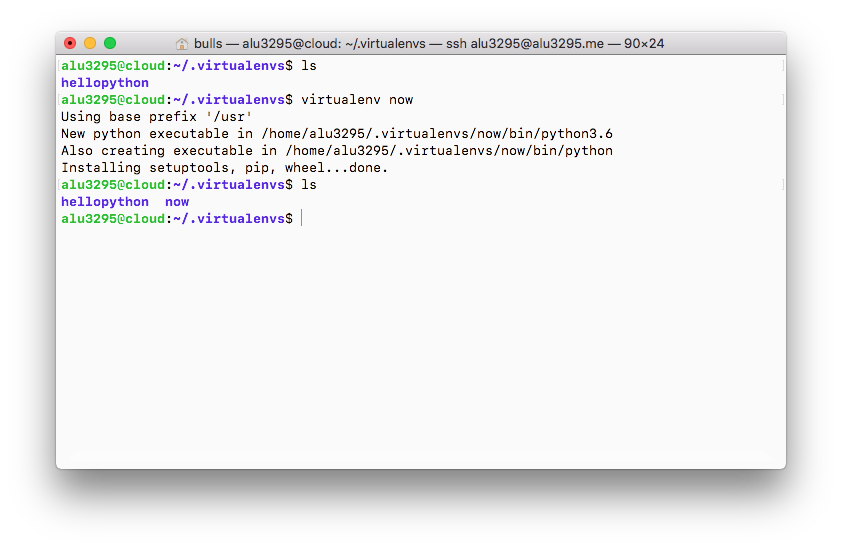

Tras crearlo vamos a proceder a activarlo y ya de paso comprobamos la version de Python que estaremos usando en esta práctica.

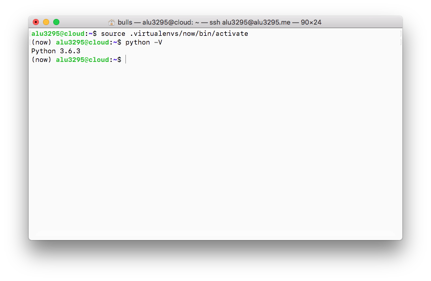

Una vez activado vamos a proceder a la instalación de uWSGI que será el encargado de procesar las peticiones http para aplicaciones con código python.

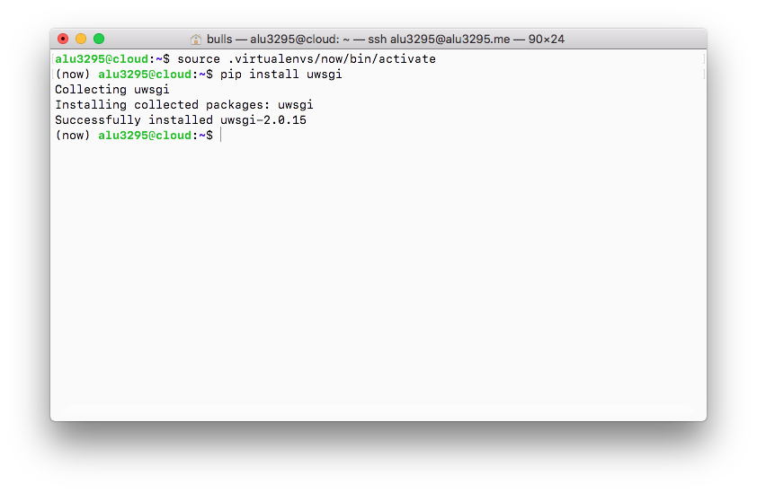

Lo siguiente será instalar un mini-framework de desarrollo web denominado flask.

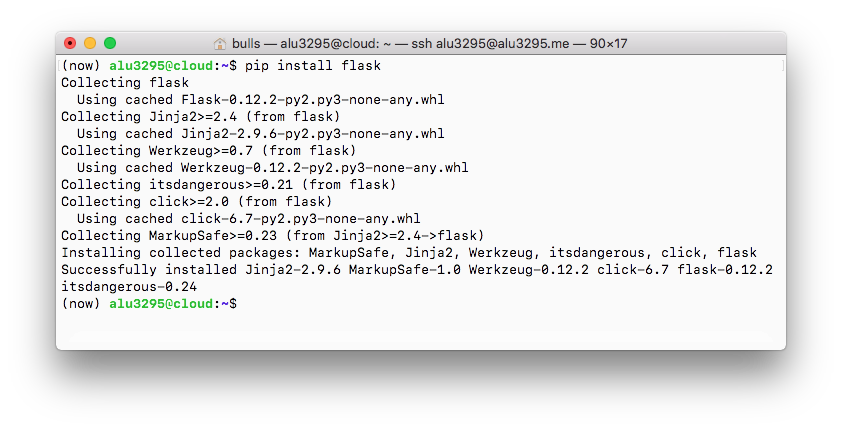

Finalizada la instalación del framework anterior nuestro servidor estará casi listo para servir nuestra pequeña aplicación python.

Ahora vamos a crear un nuevo directorio dentro del /home de nuestro servidor al que llamaremos `now` y dentro crearemos un archivo `main.py` que contendrá el codigo python de nuestro programa.

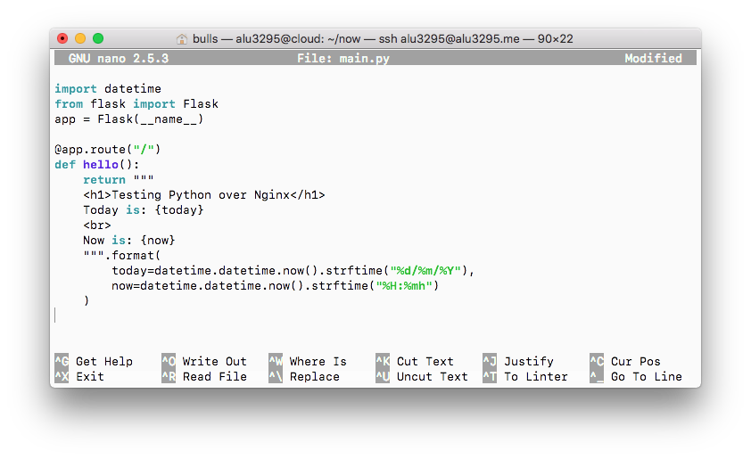

Ahora nuestra programa en python estará listo pero tenemos que configurar el medio para que pueda funcionar.

Para ello iremos a nuestro directorio `now` y vamos a crear un archivo llamado `uwsgi.ini` que contendrá la configuración de uWSGI.

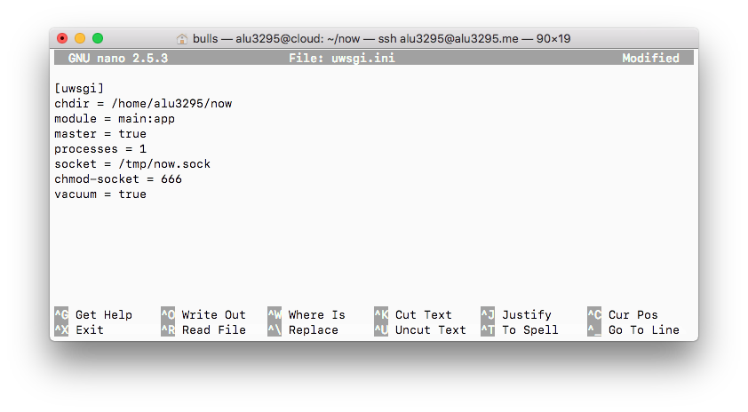

Lo siguiente será crear un pequeño script que será el encargado de activar el entorno virtual de nuestra aplicación y de lanzar el proceso uwsgi para que escuche peticiones en el socket especificado.

Dicho script irá en el directorio `now`, directorio de nuestra aplicación.

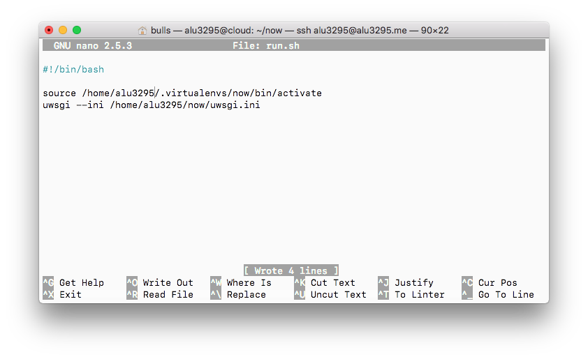

Ahora le damos permisos de ejecución al script.

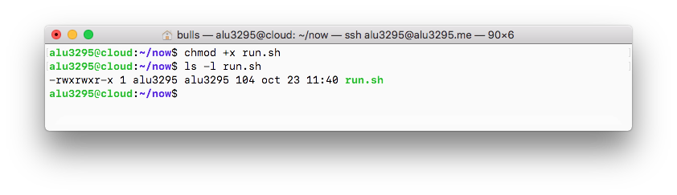

En este punto, podríamos lanzar el script run.sh sin tener que activar el entorno virtual previamente, ya que el propio script realiza esta tarea.

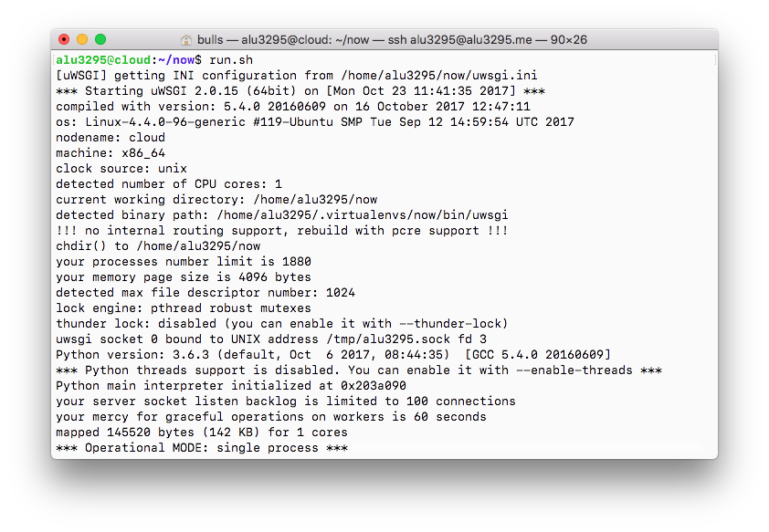

Ahora tendremos que crear un nuevo `Virtual Host` para nuestra aplicación python.

Para ello nos dirigimos a `/etc/nginx/sites-enabled` y creamos un archivo llamado `now` que contendrá la siguiente información:

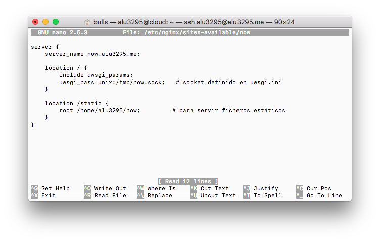

Tras lo anterior, crearemos un enlace simbólico de `now` en la ruta `/etc/nginx/sites-enabled`.

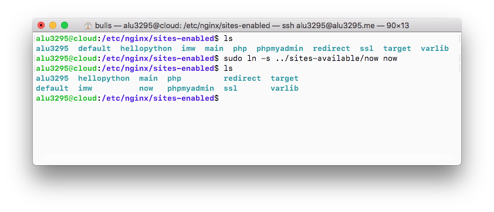

Algo muy importante sería recargar el servicio nginx para que todas las configuraciones nuevas surtan efecto.

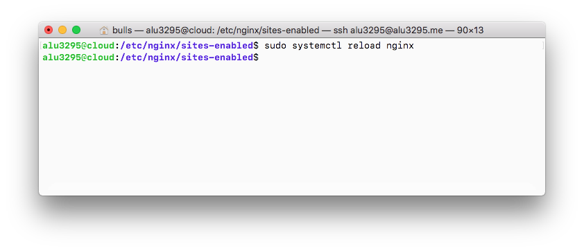

Tras acceder a nuestra aplicación nos sale el error `502 Bad Gateway`... esto se debe a que nos falta lanzar nuestra aplicación `uWSGI` para que escuche en el socket especificado y devuelva el sencillo html que hemos preparado en nuestra aplicación python.

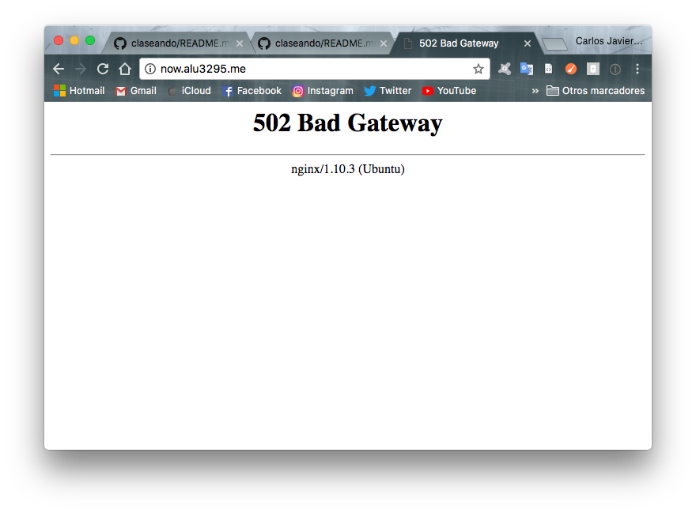

Tan solo bastaría ejecutar `run.sh` para iniciar `uWSGI`.

Tras lo anterior nos saldrá nuestra aplicación en el navegador pero si paramos la ejecución volveremos a tener el error `502` anterior.

Para que esto no pase y para mantener nuestra aplicación activa y poder gestionar su arranque/parada de manera sencilla, necesitamos un proceso coordinador. Para este cometido, se ha desarrollado `SUPERVISOR`.

Recordemos que ya lo teníamos instalado de prácticas anteriores, lo que haremos será comprobar que esté activo.

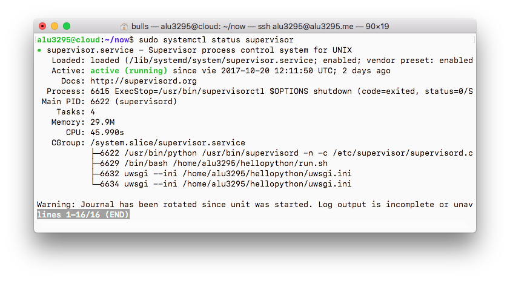

Para que nuestro programa `now` sea gestionado por supervisor, debemos añadir un fichero de configuración compuesto por lo siguiente:

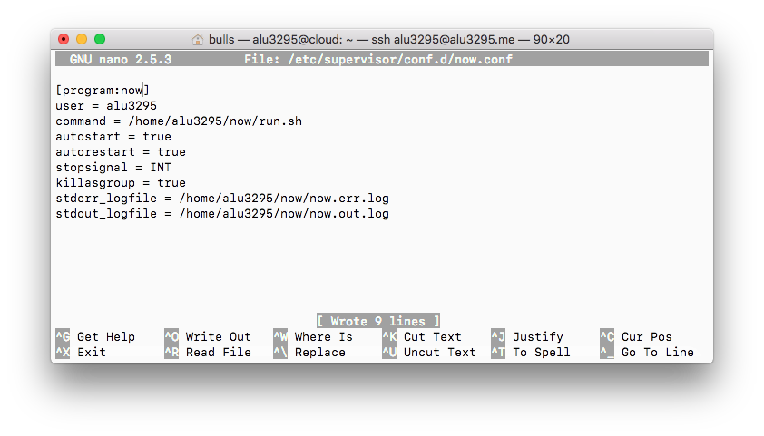

Tras el paso anterior vamos a reiniciar el `SUPERVISOR` mediante el comando `sudo systemctl restart supervisor
`.

Ahora haremos una serie de comprobaciones para ver si el `SUPERVISOR` funciona correctamente.

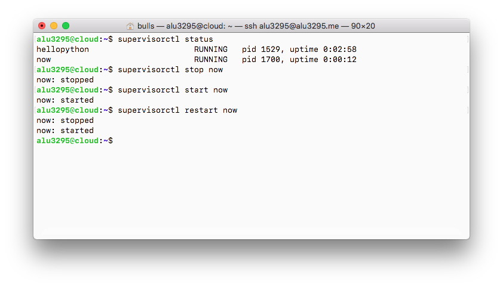

A modo de configuración final iremos a un navegador y podemos ver que nuestra aplicación funciona correctamente.

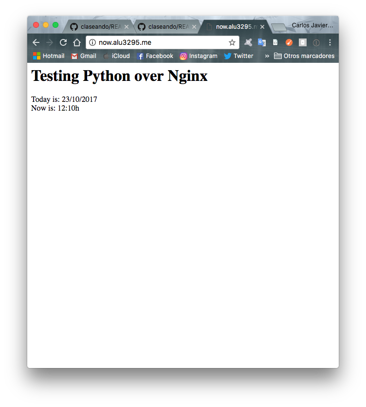
