Carlos Javier Oliva Domínguez
____

## UT1-A3: Trabajo con virtual hosts
#### Sitio Web 1
**Primera Parte**

En la primera parte de esta práctica vamos a crear un `Sitio web` con la dirección `http://imw.alu3295.me`. Para ello vamos a crear un nuevo `host virtual`en la ruta correspondiente dentro de nuestro Servidor Nginx.

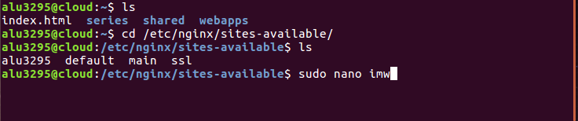

Ahora vamos a añadir la consiguración del nuevo Virtual Host (nombre y ruta del home).

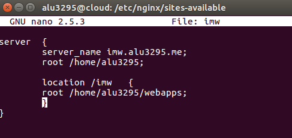
 - A modo de aclaraciones futuras, hemos decidido incluir todos los Servidores Virtuales `(Virtual Hosts)` en /home/webapps/ a modo de brindar una mejor organización estructural al directorio del servidor.

 En este punto vamos a hacer un enlace simbólico desde `sites-available` en `sites-enabled` al archivo `imw` que contiene la configuración del Virtual Host.

 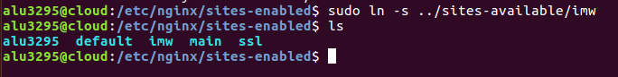

 El siguiente paso será descargar, en la máquina de `Desarrollo` la imágen propuesta por el profesor y posteriormente transferirla a la máquina de `Producción`.

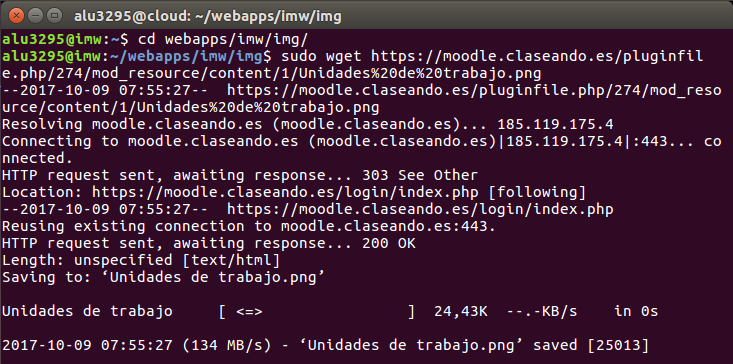

Tras la descarga, vamos a mover dicha imágen a la máquina de `Producción` con la ayuda del comando `scp`.

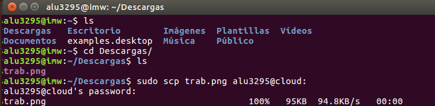

Posterirmente la incluiremos en el home del `Virtual Host` imw.

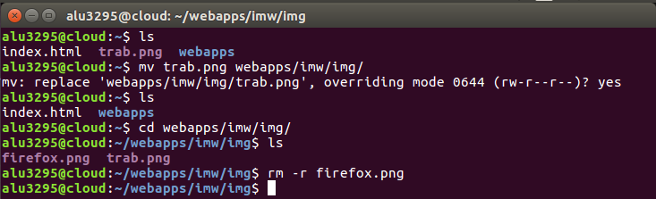

Ahora vamos a preparar un sencillo index para mostrar nuestra imágen.

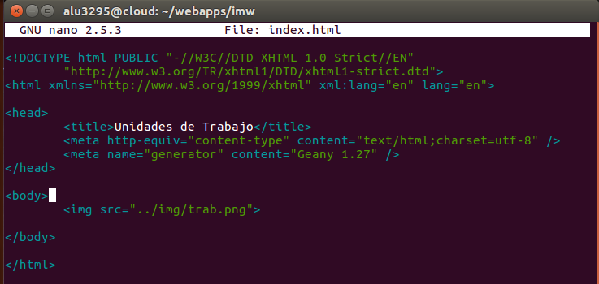

En la siguiente imágen podemos comprobar el resultado de lo antes realizado, donde se muestra nuestro nuevo `Virtual Host` mostrando lo requerido en esta práctica.

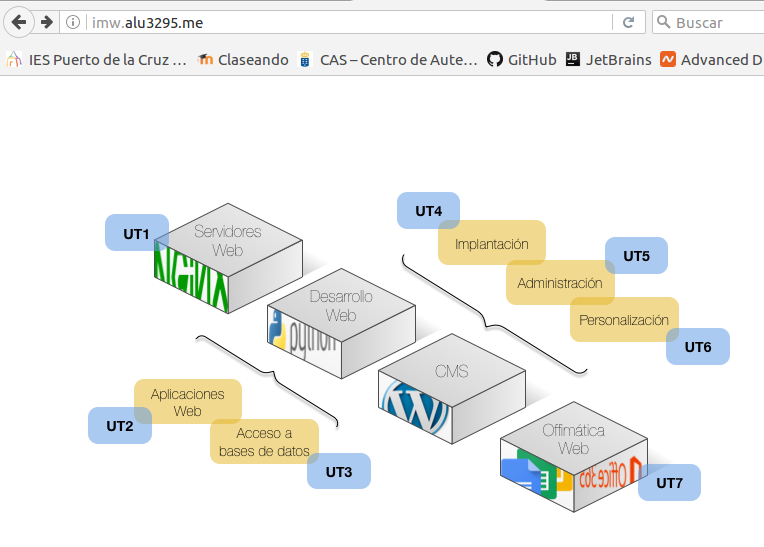

**Segunda parte:**

En la segunda parte de esta práctica vamos a mostrar una página con un enlace al Real decreto del título de Administración de Sistemas Informáticos en Red. Para ello crearemos un location dentro del archivo de configuración (imw) del `Virtual Host` que creamos en la primera parte.

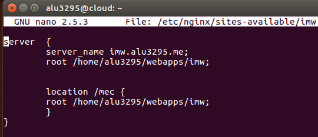

En este momento solo tenemos que crear un directorio al que vamos a llamar `mec` dentro del `Virtual Host` imw.

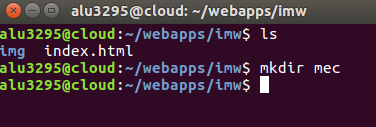

El siguiente paso será descargar el PDF con el Real Decreto desde nuestra máquina de `Desarrollo`.

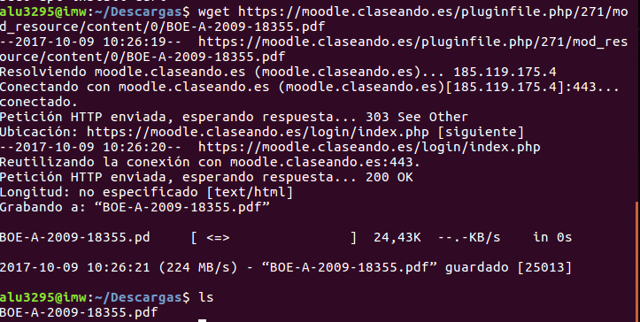

Ahora lo moveremos a la máquina de `Producción` mediante el comando `scp`.

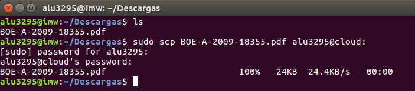

Lo moveremos al directorio correspondiente. `webapps/imw/mec/`.

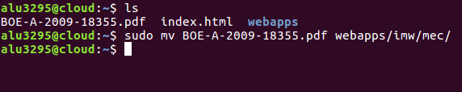

El último paso será crear un index donde vamos a enlazar el documento PDF.

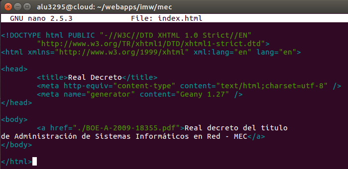

Como resultado final podemos comprobar que tras acceder a la url `imw.alu3295.me/mec` la página noes muestra el Real Deceto del título de Administración de Sistemas Informáticos en Red.

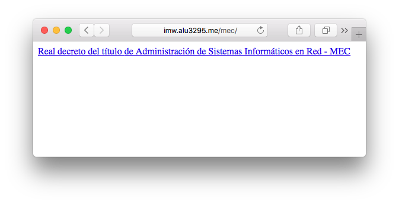

#### Sitio Web 2

En este sitio web dos vamos a crear un `Virtual Host` con la dirección `http://varlib.alu3295.me:9000` y haremos que muestre un listado de ficheros y directorios de `var/lib`de nuestra máquina de producción.

Lo primero que haremos será ir a `/etc/nginx/sites-available` y crearemos un fichero de configuración nuevo, que contendrá la siguiente configuración.

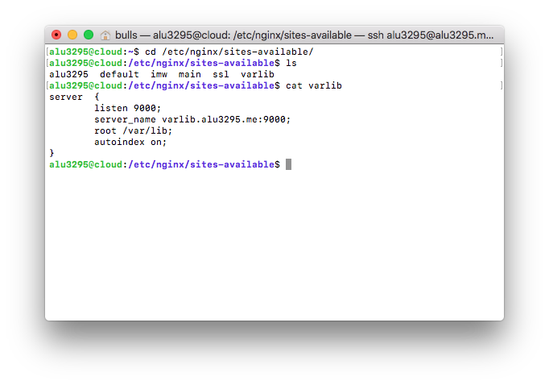

El siguiente paso, tras el guardado del archivo anterior, será la creación de un enlace simbólico dentro de `/etc/nginx/sites-enabled` apuntando al archivo anterior, que contiene la configuración del sitio web 2.

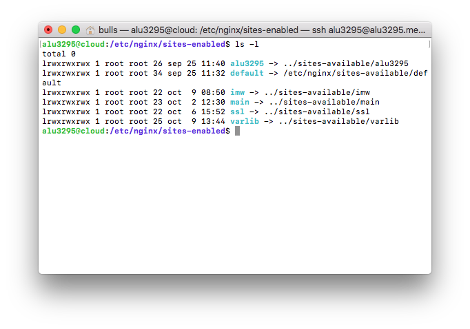

Ahora podremos comprobar la correcta conexión con la web 2 mediante el puerto 9000 mostrando los ficheros y directorios de `var/lib`.

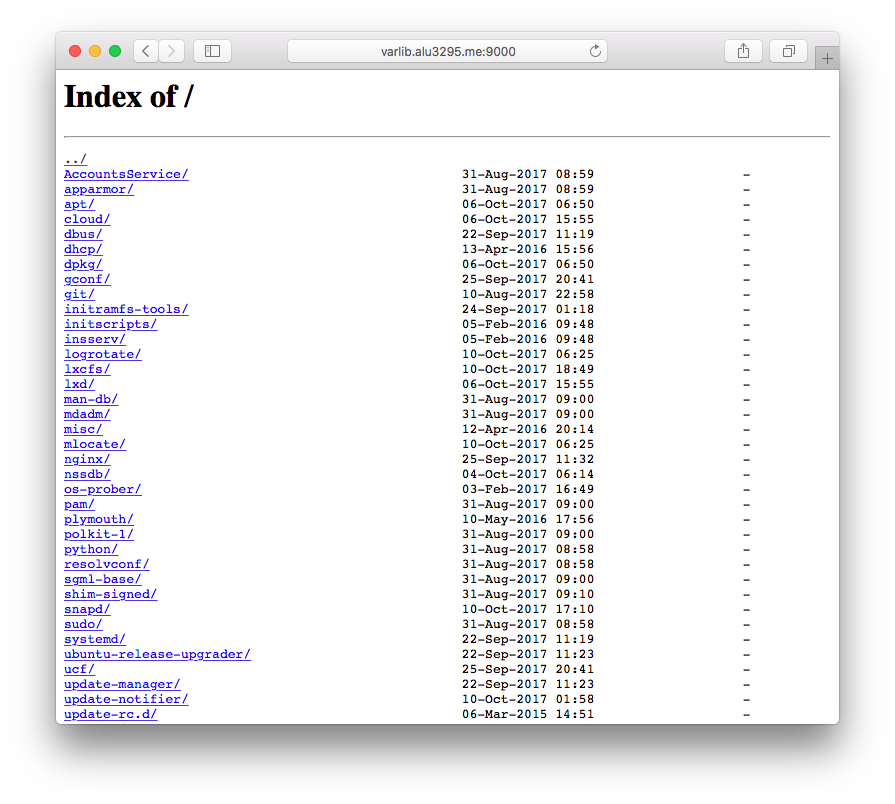
#### Sitio Web 3
 **Primera Parte**

 En la primera parte del sitio web 3 vamos a crear el `Virtual Host`con la dirección https://ssl.alu3295.me/students/ y debe pedir usuario y clave:
 - USUARIO: usuario1
 - CLAVE: aula108

Dicha configuración la incluiremos en el fichero de configuración `ssl`que creamos con anterioridad.
- Simplemente crearemos un location y le pondremos como home la ruta `/home/alu3295/webapps/ssl/students`, es aquí donde guardaremos todo lo relacionado con la página `students`.
 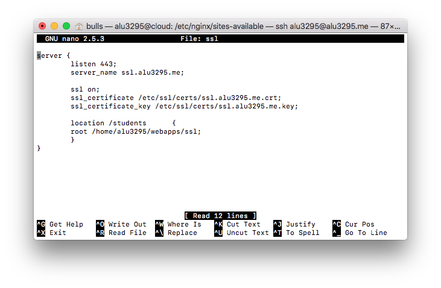

 El siguiente paso que haremos será encriptar la clave requerida en este ejercicio (aula108) para nuestro usuario1 y la guardaremos en un fichero que llamaremos `.htpasswd.`

 Dicho fichero será incluido en el home de `students`.

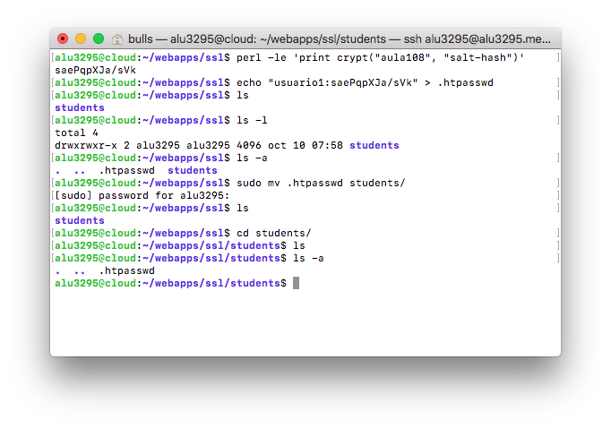

Ahora vamos a hacer un paso muy importante, será añadir una autenticación que nos será requerida cuando intentemos entrar a https://ssl.alu3295.me/students/. Añadiremos por supuesto la localización del archivo `.htpasswd`que contiene la información de login necesaria.

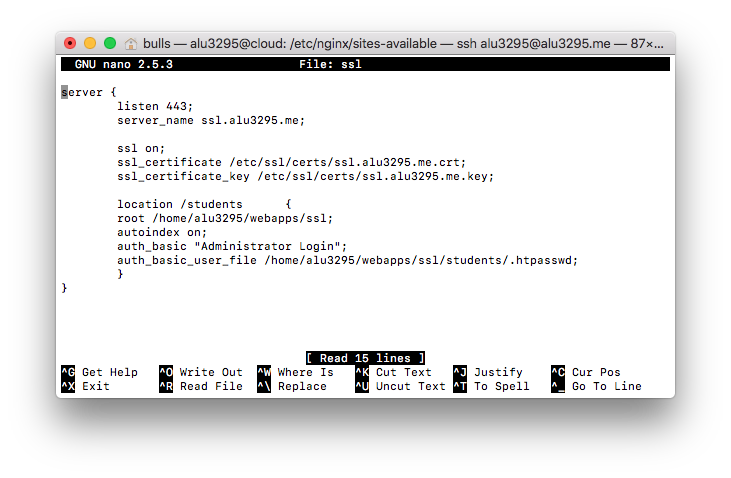

Ahora para que las configuraciones anteriores tengan su efecto en el Servidor, vamos a recargarlo.

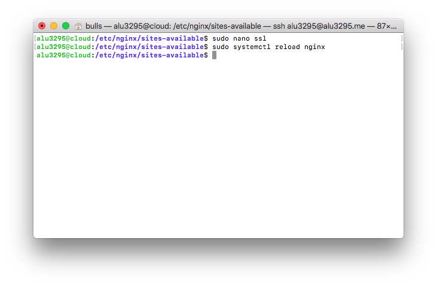
**Segunda Parte**

Siguiendo los requerimientos del profesor, vamos a crear un archivo que contenga la información de ciertos alumnos de clase, que podremos ver al acceder a https://ssl.alu3295.me/students/.

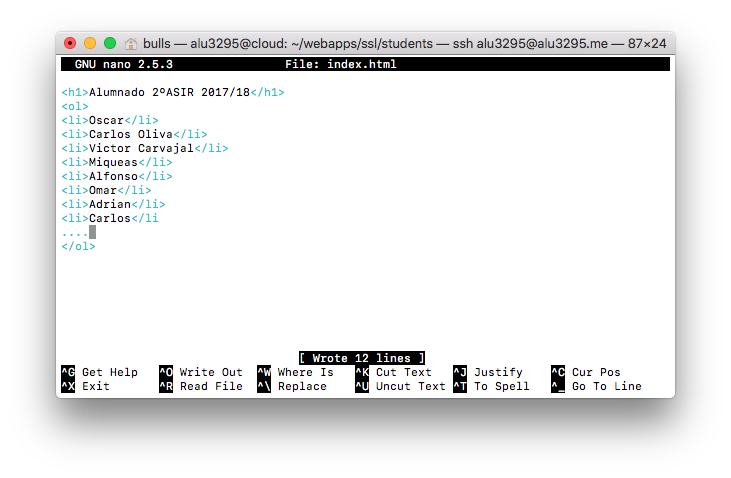

Ahora tras acceder a la web que acabamos de crear nos pedirá el usuario y contraseña que predefinimos anteriormente.
- USUARIO: usuario1
- CLAVE: aula108

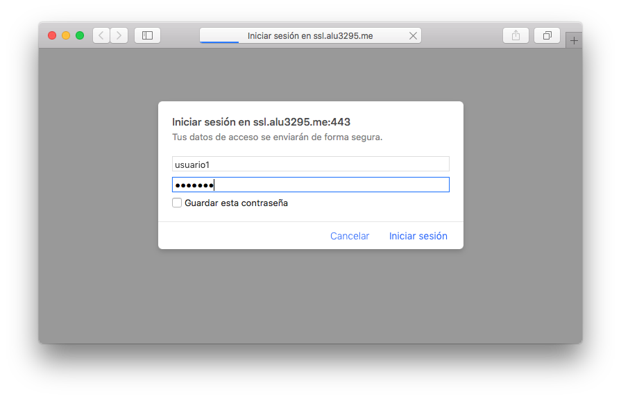

Como podemos comprobar, tras el log in nos saldrá la información de los alumnos de clase.

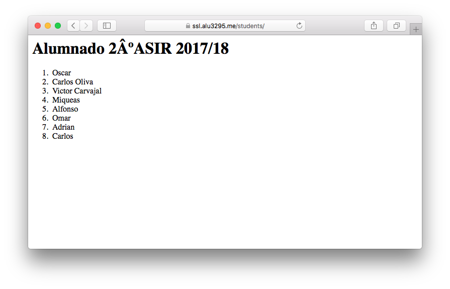

**Tercera Parte**

*Muy importante: Si hacemos una vista hacia atras, recordamos que el archivo `.htpasswd` que es el que contiene la información confidencial de cada usuario (contraseña) es perfectamente accesible desde la url https://ssl.alu3295.me/students/.htpasswd puesto que lo habíamos incluido en el home de nuestra web.*

Permitir el acceso de cualquier usuario a este archivo sería un gravísimo problema de seguridad, para ello vamos a prohibir el acceso al archivo en cuestión (`.htpasswd`) a todos los usuarios, sin excepción.

**Antes de prohibición:**
Si entraramos a la ruta antes citada, podríamos descargar perfectamente el archivo `.htpasswd` en nuestro equipo y ver la información de los demás usuarios.

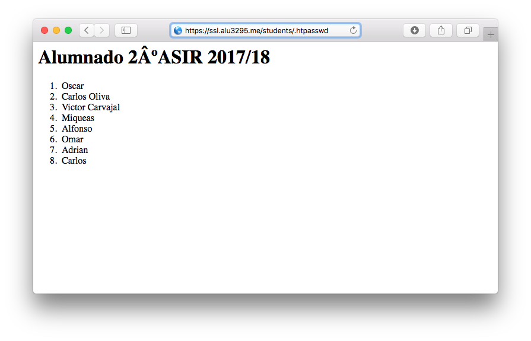

Como podemos ver, tras acceder a dicha dirección, se ha descargado el archivo a nuestro ordenador. Tan solo bastaría abrirlo con un editor de texto y aparecería toda la información de los usuarios.

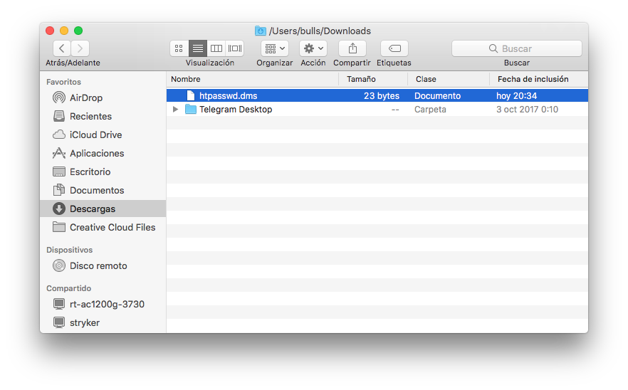

Es por esto que prohibiremos el acceso a dicho archivo.

**Después de prohibición:**
Ahora al entrar a dicha ruta, nos tendría que prohibir el acceso al fichero.

Con el fin de proporcionar un orden de directorios he optado por crear una carpeta llamada `private`que contendrá el archivo `.htpasswd` y futuros archivos privados de la página `students`.

Tras la creación de `private`moveremos `.htpasswd`dentro.

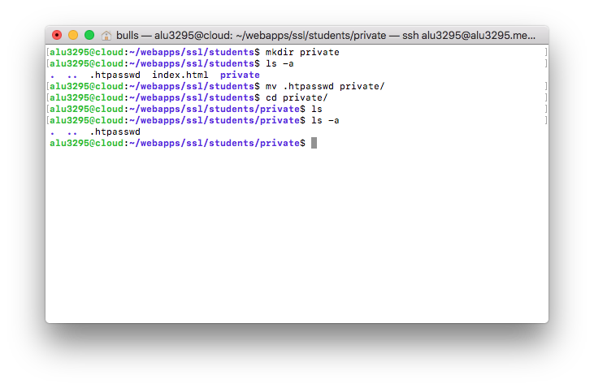

Y por último, añadiremos la siguiente línea, que denegará el acceso a todos los usuarios, al archivo de configuración de nuestro `Virtual Host` que recordemos se encuentra en `/etc/nginx/sites-available/ssl`

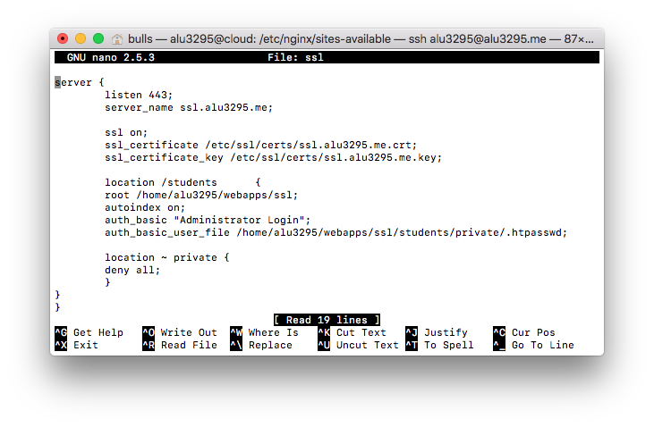

Tras esto, recargaremos el servidor y comprobaremos el resultado.

Como podemos comprobar, ahora está prohibido que podamos acceder al archivo en cuestión.

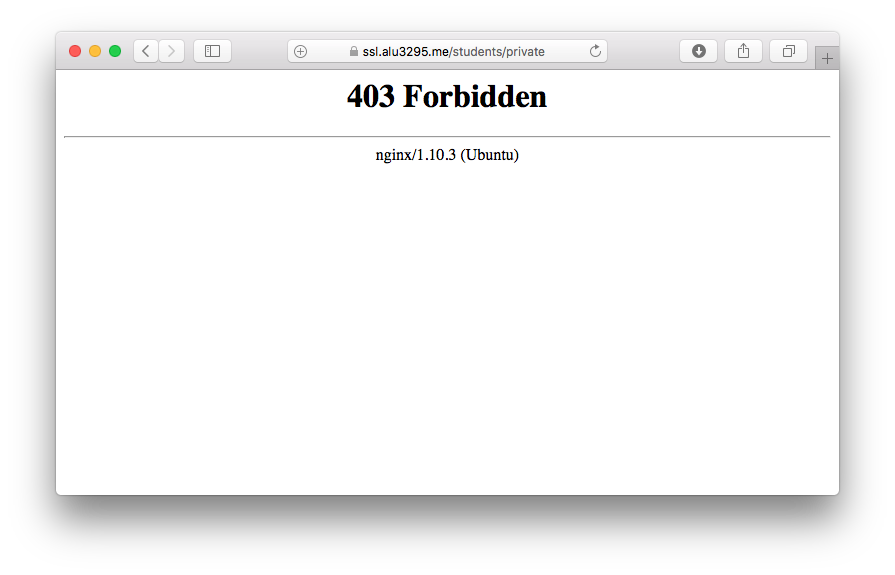

----
#### Sitio web 4
**Primera Parte**

En esta primera parte vamos a crear un `Virtual Host` con la dirección `http://redirect.alu3295.me`.

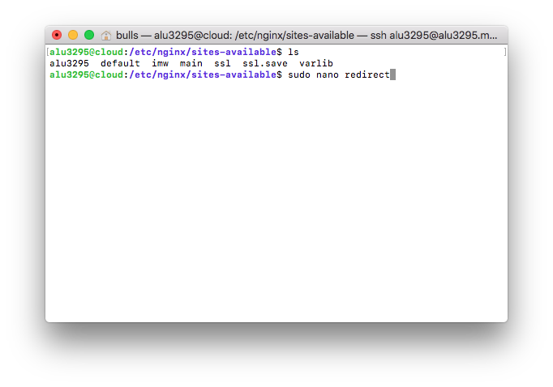

Tras la creación del archivo `redirect` incluiremos la configuración de dos `Virtual Host`.
- El primero redigirá las conexiones de `redirect.alu3295.me` hacia `target.alu3295.me`.
- El segundo redigirá las conexiones de `www.redirect.alu3295.me` hacia `target.alu3295.me`.

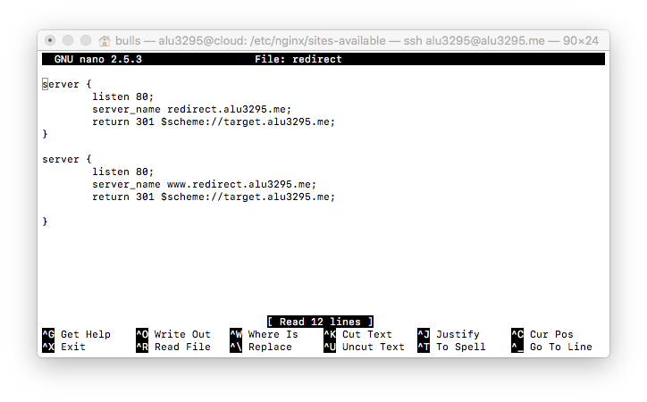

El siguiente paso será crear un enlace simbólico de `redirect` en `sites-enabled`.

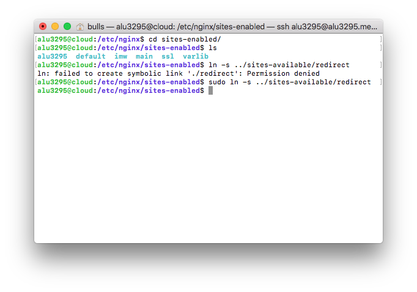

En nuestra máquina de desarrollo, descargaremos el archivo .zip proporcionado por el profesor.

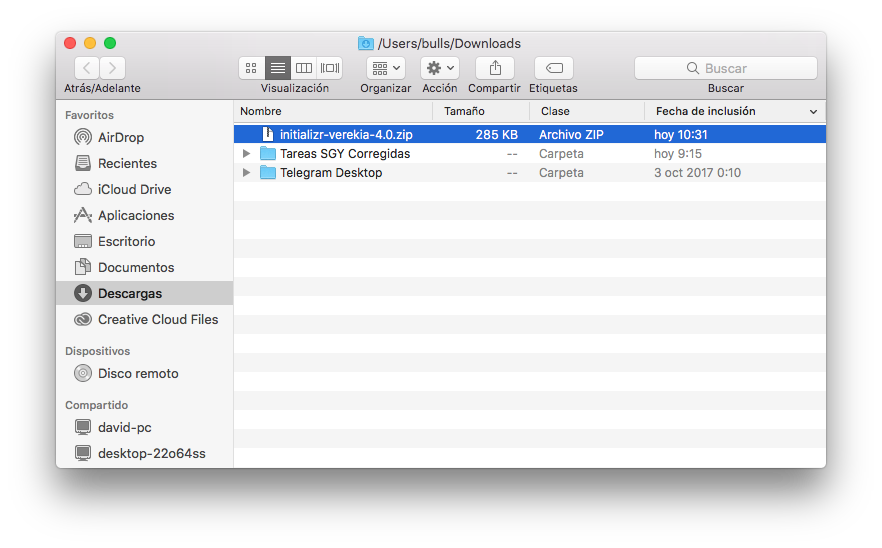

Ahora copiaremos el archivo .zip a nuestro servidor.

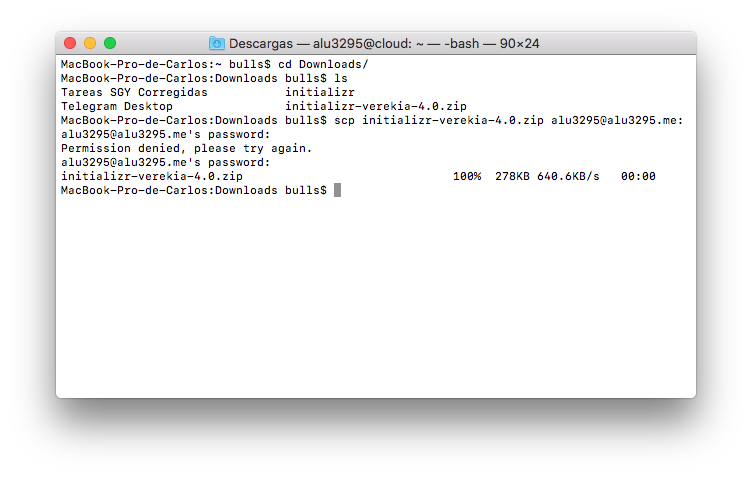

El siguiente paso será mover el archivo .zip desde el home de nuestra Máquina de Producción a un directorio llamado `target`, directorio que contendrá la información del `Virtual Host` target, donde serán redirigidas las conexiones.  
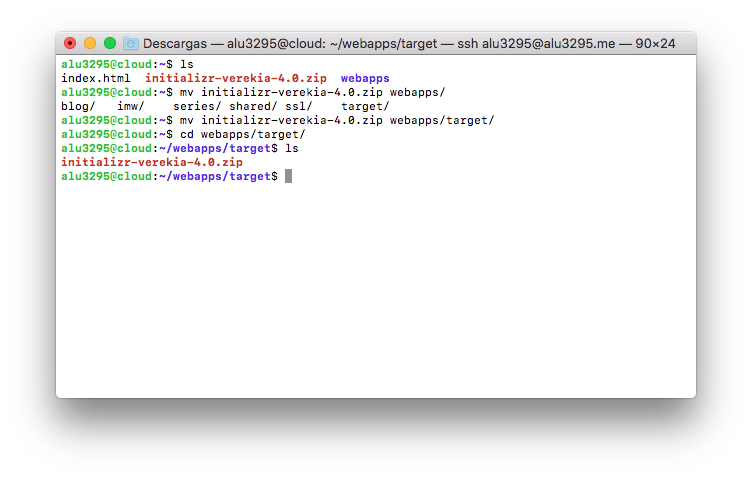

Lo descomprimiremos y veremos el contenido del directorio.

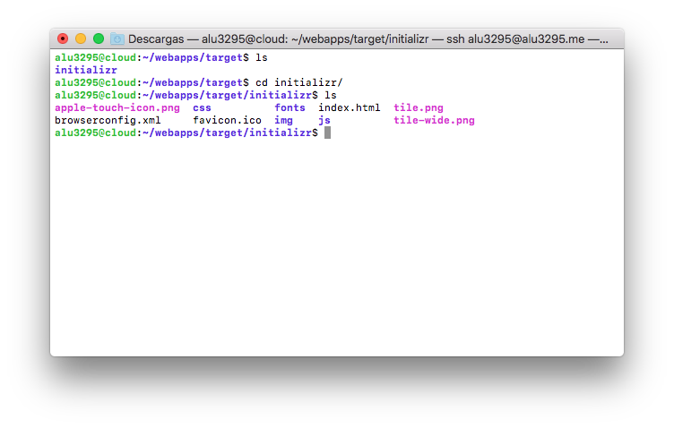

Ahora crearemos porsupuesto, la configuración del `Virtual Host`llamado `target`.

- Como parte de la práctica, crearemos una carpeta llamada `redirect` en `var/log/nginx/`, dicha carpeta contendrá los archivos `access.log y error.log`.

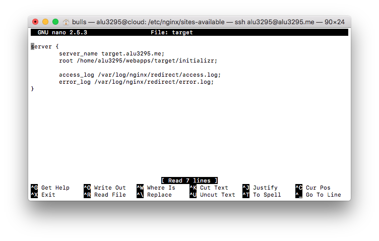

A fin de que la configuración anterior tenga efecto, vamos a crear un enlace simbólico en  `sites-enabled`.

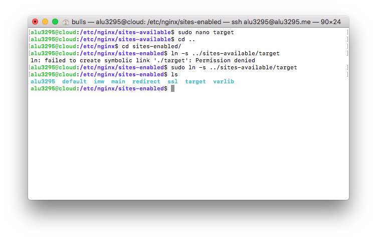

Finalmente, podemos ver el resultado, todas las conexiones de:
 - `redirect.alu3295.me`
 - `redirect.alu3295.me/cualquier_cosa`
 - `www.redirect.alu3295.me`
 - `www.redirect.alu3295.me/cualquier_cosa `

se redigirán a `target.alu3295.me`.

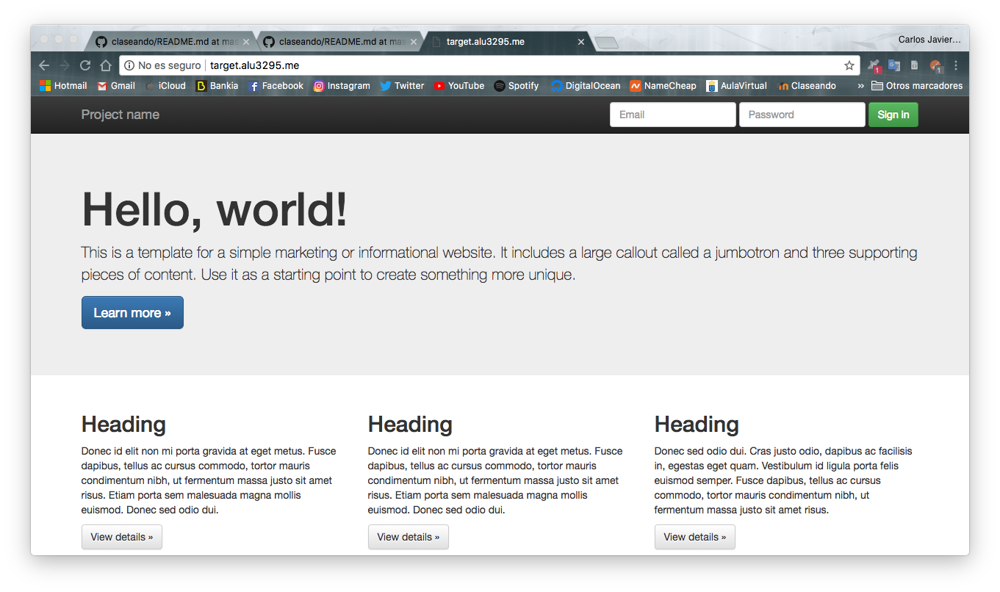

Fin de la práctica.
