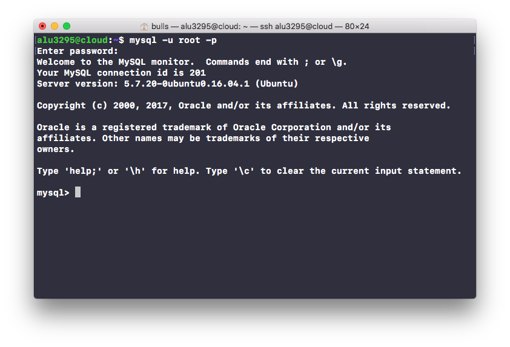
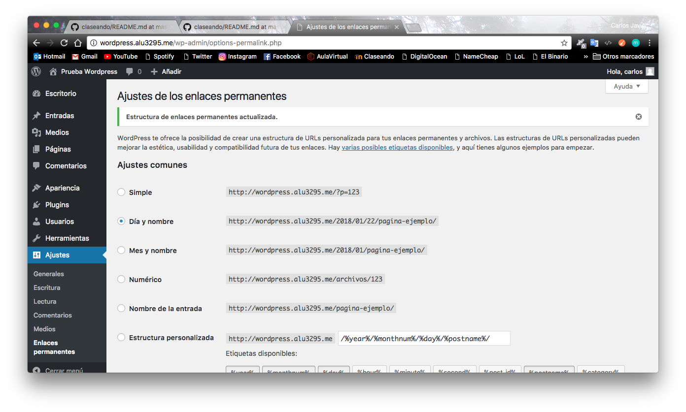

### UT4-A1: Implantación de Wordpress
Carlos Javier Oliva Domínguez

-----

#### Realizar la instalación de Wordpress en el dominio `wordpress.alu3295.me`.

Primeramente vamos a configurar `MySQLServer`.

Ahora vamos a crear una nueva base de datos, llamada `wordpressdb`.

También crearemos un usuario llamado `wpuser` identificado por la contraseña `Carlos1234`.

Finalmente daremos todos los privilegios al usuario `wpuser` sobre la base de datos `wordpressdb`.

AL avanzar en la práctica, en la parte de instalación de wordpress he tenido un error. Resulta que he dado todos los privilegios al usuario en cuestión sobre la base de datos `wordpress` que no existe, lo he solucionado insertando nuevamente el comando pero esta vez con `wordpressdb`.

Lo siguiente que haremos será descargar la última versión de Wordpress.

Ahora haremos un `unzip`, para descomprimir el contenido del archivo latest.zip que acabamos de descargar.

Lo siguiente será copiar el contenido del archivo que acabamos de descromprimir en la ruta `/usr/share/wordpress` que actuará como directorio principal de nuestro CMS.

Ahora tenemos que establecer los permisos necesarios para que el usuario web `www-data` pueda usar estos ficheros

Vamos a configurar el archivo `wp-config.php` que contiene las configuraciones de nuestro sitio, para ello copiamos el archivo de ejemplo `wp-config-sample.php` pero con el nombre `wp-config.php`.

Aquí vamos a configurar parámetros como Nombre de la base de datos, Nombre de usuario de la base de datos, contraseña, etc... Ojo, tenemos que usar los mismos datos que introdujimos en la base de datos `MySQL`.

Lo siguiente que haremos será crear un fichero de configuración para nuestro sitio en `/etc/nginx/sites-available/wordpress`.

Dicho fichero tendrá el siguiente contenido:

Lo siguiente será crear un enlace simbólico del fichero de configuración `wordpress` en la ruta `/etc/nginx/sites-enabled/`.

Ahora vamos a acceder a nuestra web `wordpress.alu3295.me` y nos saldrá un asistente de instalación como este, elegimos el idioma y hacemos clic en Confinuar.

Aquí configuraremos el Nombre del Sitio, Usuario y Contraseña de la base de datos MySQL, e-mail.

Tras finalizar lo anterior, nos informa de que hemos instalado el sitio correctamente.

Ahora probaremos a acceder mediante la url `wordpress.alu3295.me/wp-admin`.

#### Instalar y activar un tema gratuito.
Para esta parte vamos a elegir el tema gratuito `RokoPhoto Lite` y lo instalamos.

Haremos clic en `Activar` y posteriormente tendremos el nuevo tema activado.

#### Ajustar los permalinks a Día y Nombre.

Ahora vamos a ajustar los permalinks a Día y Nombre.

Para que lo anterior tenga lugar, vamos a añadir la siguiente línea de configuración a nuestro fichero de configuración de nuestro sitio web.
~~~
location / {
  try_files $uri $uri/ /index.php?$args;
  }
~~~

#### Escribir un post con las estadísticas de uso de Wordpress.

Vamos a escribir un nuevo post con las características de uso de Wordpress propuestas por el profesor.

Comprobamos el resultado.

----
### Configuraciones Adicionales
Configuramos el tamaño máximo de subida de archivos. Para ello modificamos el fichero `/etc/php/7.0/fpm/php.ini`.

Modificamos el tamaño máximo por post.

Modificamos el tiempo máximo de procesamiento de peticiones.

Además de esto, debemos añadir una línea en el fichero de configuración de Nginx:

Reiniciamos el Servicio Nginx.

