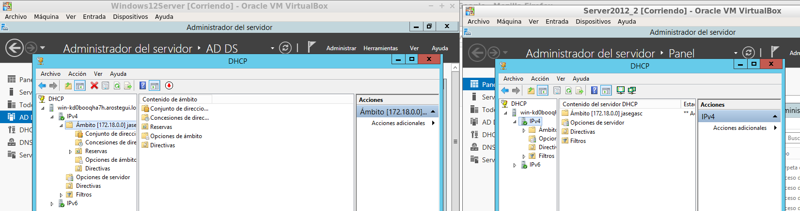

# DHCP Failover

Actividad Grupal

Víctor Gabriel Carvajal Aróstegui

Carlos Javier Oliva Domínguez

Miqueas García González 
----

Vamos a crear unas máquinas virtuales con **Windows Server 2012**. El objetivo de esta práctica es que la información se pase de una máquina a otra de modo que, si una máquina se cuelga, consiga la información de otra máquina.

`Inicio -> Herramientas administrativas -> DHCP`

`Pestaña -> IPV4 -> Ámbitos`

`Botón derecho -> Conmutación de errores`

Es necesario tener **dos servidores** a partir de este paso debido a que nos pude salir el siguiente error.

Para ser capaces de hacer esta práctica, los dos servidores deben estar en **red interna** y el servidor principal debe tener como servidor asociado **la ip del secundario** mediante la opción **conmutación por error**, como aparece en la siguiente imagen.

En el siguiente paso haremos la configuración por conmutación por error. Podremos configurar parámetros como `nombre de la relación`, `modo de espera` (en nuestro caso) y lo cambiamos a modo activo e insertamos una contraseña en `secreto compartido`.

Finalizamos la configuración con los siguientes detalles.

Ahora finalizaremos la configuración y comprobaremos que las configuraciones se han aplicado correctamente.

Ahora volvemos a nuestro ámbito principal y pulsamos en botón derecho en `replicar ámbito`. Esto hará que en el otro servidor aparezca el ámbito.

Configuración recibida en el servidor 2 por el servidor 1.

Como podemos comprobar, se ha replicado la configuración del ámbito del servidor 1 al servidor 2.

Encendemos nuestra máquina cliente en **red interna** y vemos que el dominio es el proporcionado por el servidor DHCP.

También podemos ver la correcta recepción de la dirección IPv4 por parte del servidor DHCP.

