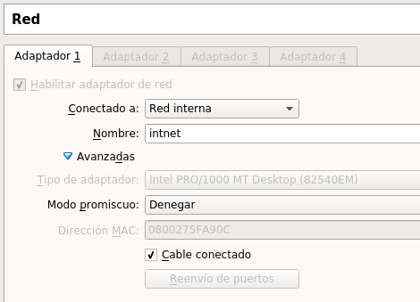

##  Instalación y configuración de un servidor DHCP en Linux.
Carlos Javier Oliva Domínguez
---
*El objetivo de esta práctica será crear un Servidor DHCP que va a proporcionar direcciones ip a los equipos y en los rangos que le determinemos.*

Para empezar, vamos a crear las máquinas virtuales, ambas dos las pondremos en `Red interna` para no asignar direcciones ip de forma innecesaria a los equipos reales de la clase.

Para ello tenemos dos máquinas, ambas con Ubuntu Desktop pero una de ellas va a actuar como Servidor DHCP y otra como cliente.

Tras la instalación de ambas máquinas, empezaremos configurando el Servidor, concretamente la dirección ip, que tendrá que ser estática.

Ahora lo siguiente que haremos será instalar el Servicio `DHCP` mediante el gestor de paquetes.

Tras la instalación del DHCP iremos a la configuración  del propio servicio, que se encuentra en la ruta `/etc/dhcp/dhcp.conf` y vamos a configurar los rangos que queremos que asigne nuestro Servidor DHCP.

En la imágen anterior podemos ver los rangos que hemos asignado al Servidor, estos rangos serán para que el servidor los administre entre sus clientes e irán desde `172.18.6.11 - 172.18.6.50`.

Tambien podemos proveer este fichero de configuración con datos como `puerta de enlace`, `dns`, entre otros.

Lo siguiente que vamos a hacer será reiniciar el servicio DHCP para que reciba la configuración que acabamos de asignarle, y posteriormente veremos el status del mismo, para comprobar que todo ha ido correctamente.

Ahora a modo de comprobación iremos al cliente que habíamos creado anteriormente y pondremos la configuración de red en DHCP, para que el Servidor DHCP le asigne la dirección correspondiente.

Como podemos comprobar en la imágen anterior el equipo cliente ha recibido, por parte del Servidor DHCP la primera dirección disponible `172.18.6.11`.

Ahora, partiendo de la configuración que habíamos puesto a nuestro Servidor DHCP añadiremos unas cuantas configuraciones más.

En este punto vamos a configurar nuestro servidor para que proporcione la dirección ip `172.18.6.50` al cliente con la dirección MAC `08:00:27:7c:93:8a`.

Volveremos a recargar el Servidor DHCP y comprobamos que está iniciado correctamente.

Finalmente comprobamos el resultado y podemos ver que la configuración DHCP ha sido recibida correctamente por parte del cliente.

Fin de la práctica.
