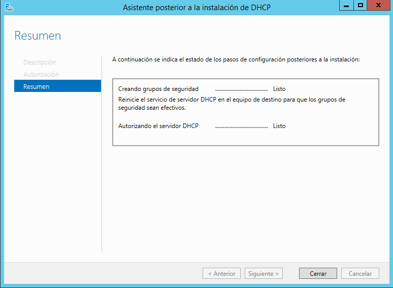
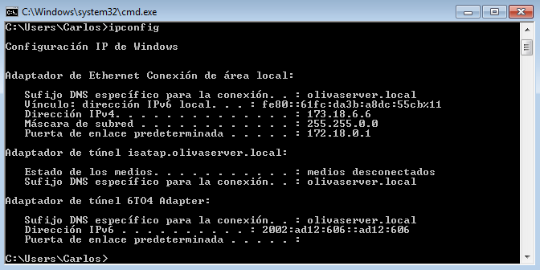

Carlos Javier Oliva Domínguez

**Instalación y Configuración DHCP Windows Tarea**

*En esta práctica vamos a aprender como configurar el servicio `DHCP` en una máquina con Windows Server 2012. Esto nos servirá, para que este servicio asigne direcciones ip. de forma automática a los equipos que se encuentren conectados a este servidor y en la misma red.*

**1.0 Instalación servicio DHCP**

*Lo primero que haremos será añadir roles a nuestro servidor, dicho rol será el de brindar `DHCP` a una red.*

Junto con servicio `DHCP` vamos a añadir ciertas características fundamentales para su funcionamiento.

Para autorizar el funcionamiento del servicio `DHCP` debemos autorizar el mismo con un usuario perteneciente al grupo administradores.

El sistema nos confirma que el servicio se ha instalado correctamente.

**2.0 Creación de ámbitos**

* Tras la confirmación del servicio `DHCP` vamos a proceder a la creación de ámbitos, que nos servirán para agrupar de forma administrativa un grupo de direcciones ip.

**2.1 Ámbito uno (172.18.0.0)**

Vamos a utilizar un intervalo de direcciones ip's que van desde la `172.18.6.1` a `172.18.6.50`.

Dentro de este intervalo vamos a explir las primeras 5 direcciones ip, puesto que en un futuro puede que necesitemos configurar servicios de forma estática. Para comenzar asignaremos de forma estática la dirección `172.18.6.1` a nuestra máquina servidor.

Asímismo definiremos la `Puerta de enlace predeterminada` que corresponde a la de la red a la que está conectada el aula.

Es de vital importancia añadir el `Dominio principal` puesto que es donde actuará este ámbito número uno.

Activamos el ámbito para que los equipos conectados al Servidor comiencen a recibir direcciones ip de forma automática.

Ahora es momento de dirigirnos a un equipo cliente y ver si ha recibido la correspondiente direccion ip por parte del Serrvidor, para ello abriremos una consola y ejecutamos el comando `ipconfig`.

Como hemos visto en la foto anterior, el cliente ha recibido correctamente la primera dirección ip disponible(`172.18.6.6`), teniéndo en cuenta las exclusiones previas en el ámbito uno.

**2.2 Ámbito dos (173.18.0.0)**

Ahora en este `ámbito2` vamos a utilizar el mismo rango de actuación y de exclusión que en el `ámbito1` pero esta vez en la red `173.18.0.0`.

Podemos ver un resumen de nuestros dos ámbitos creados.

En este punto nos toca dirigirnos a una máquina cliente y comprobar el nuevo despliegue de direcciones ip.

Como hemos visto en la foto anterior, el cliente ha recibido correctamente la primera dirección ip disponible(`173.18.6.6`), teniéndo en cuenta las exclusiones previas en el ámbito uno.

**3.0 Superámbito**

En este punto vamos a elegir los dos ámbitos creados con anteriridad y crearemos un superámbito con el objetivo de crear una única entidad administrativa.

Comprobamos que la creación del superámbito se ha efectuado correctamente.

Ahora probaremos a desactivar el superámbito para dejar de proporcionar ips a los equipos mediante DHCP.

Como podemos comprobar en la siguiente imágen, el equipo cliente que hemos usado está recibiendo direcciones de forma automática, pero no es una im que esté dentro del rango que hemos predefinido en el Servidor DHCP. Esto es porque hemos desabilitado el superámbito.

Ahora volveremos a activar el superámbito y comprobamos que volvemos a recibir las direcciones ip por parte del servidor DHCP.

