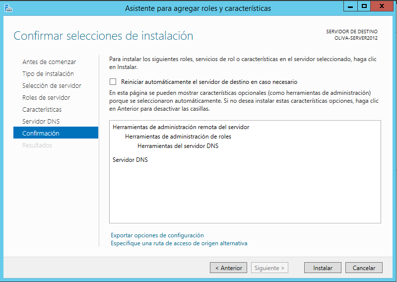
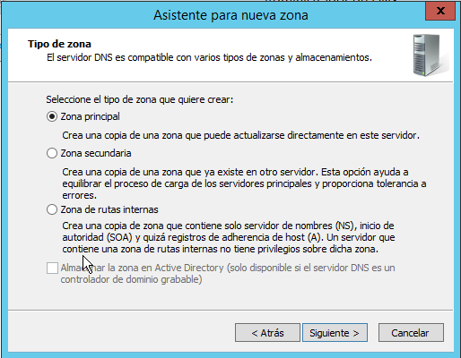
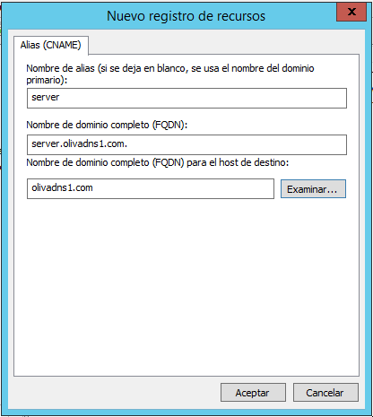
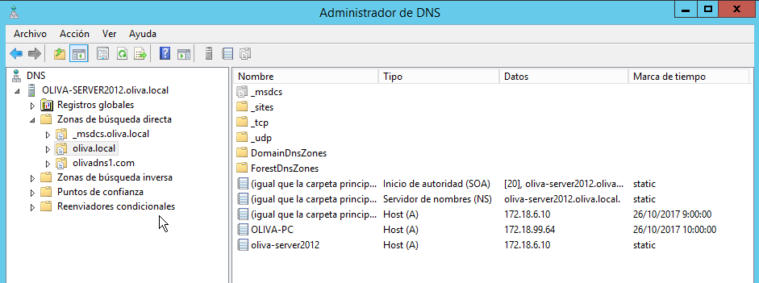

## Instalación y Configuración DNS W2012
Carlos Javier Oliva Domínguez

----
*En la siguiente práctica vamos a realizar la instalación y configuración de un servidor `DNS` en una máquina con `Windows Server 2012`.*

### 1.0 Crear una zona de búsqueda directa para tu servidor

Para comenzar vamos a crear una zona de `búsqueda directa` en el Servidor.

Primeramente vamos a agregar los roles:

Ahora elegiremos el Servidor de destino, que en su caso será nuestra máquina Windows Server 2012.

Seguidamente añadiremos la característica de `Servidor DNS`.

Confirmamos las características que vamos a instalar y haremos clic en `Instalar`.

Dado que nuestro Servidor DNS es compatible con varios tipos de zonas y almacenamientos, crearemos una `Zona principal`.

En la siguiente imágen configuraremos el nombre que queremos que tenga nuestra nueva zona, que especificará la parte del espacio de nombres DNS para el que actuará el servidor de autoruzación.

Crearemos nuestro propio archivo de zona.

Ahora como vemos, tenemos un resumen de todas las características de nuestra zona de `búsqueda directa`.

### 2.0 Crear una zona de búsqueda inversa para tu subred

El segundo paso de la práctica consta de la instalación de una zona de `búsqueda inversa`.

Un paso importante será identificar la red de actuación de dicha zona.

Al igual que en el punto anterior podremos crear un archivo de zona o podremos copiarlo de otro servidor. En nuestro caso vamos a crear uno nuevo, con el nombre por defecto que nos da el asistente.

### 3.0 Configuración de reenviadores

Nos disponemos a configurar los reenviadores públicos en nuestro propio Servidor DNS para resulver consultas DNS que éste no pueda.

### 4.0 Configurar el servidor para ser servidor DNS Caché (en la configuración estática de red)

En este punto empezaremos creando un nuevo host, para ello iremos a nuestra zona de `búsqueda directa` y lo crearemos.

Pondremos el `FQDN` y la dirección ip estática, que corresponderá con nuestro servidor DNS.

Configuraremos el cliente para que su servidor DNS sea el servidor W2012.

Primeramente la dirección ip.

Y el dominio.

### 5.0 Registros en la zona de búsqueda directa

#### 5.1 Un alias para tu servidor denominado server
Lo que haremos en este punto será crear un alias (`CNAME`) para nuestro servidor denominado `server`.

Comprobamos que se ha creado correctamente en nuestra zona de `búsqueda directa`.

#### 5.2 Una impresora con IP fija denominada printer
Ahora añadiremos una nueva impresora y la vamos a asociar a una ip fija que hemos dispuesto para ella `172.18.6.15`.

#### 5.3 Un servidor de correo (ficticio) denominado correo, asociado a una dirección en tu servidor.

Crearemos un nuevo host al que llamaremos correo con la dirección ip `172.18.6.16`.

Crearemos un nuevo registro de recuersos para asociarlo a nuestro Servidor.

#### 5.4 Subzona
En este punto vamos a crear un nuevo Dominio DNS al que llamaremos servicios.

Tras el paso anterior vamos a crear una nueva impresora, un servidor ftp y el equipo del administrador del sistema.

Crearemos un nuevo host y vamos a asociarle una ip expresamente para la impresora2.

Creamos otro nuevo host y le añadimos una ip también.

Finalmente añadiremos el equipo del administrador del sistema, con su ip correspondiente.

Comprobaremos el árbol de zona veremos la subzona (servicios) y los host(Servicios) de tipo `A` que acabamos de crear.

### 6.0 Comprobación de resolución de nombres en el Servidor
Ahora comprobaremos las configuraciones anteriormente efectuadas, desde la consola del Servidor DNS.

A la Impresora 1:

Al Servidor ftp dentro de la subzona servicios:

A la Impresora 2 dentro de la subzona servicios:

### 7.0 Validar Cliente en el Dominio.

Primeramente vamos a validar el Cliente en el Dominio y comprobamos que éste aparece en la zona de búsqueda del Servidor.

comprobamos la ip del Cliente para ver si concuerda con la que aparece en la zona de búsqueda del Servidor.

### 8.0 Comprobar desde el Cliente

Comprobaremos los servicios desde el Cliente y veremos que nuestro Servidor DNS `172.18.6.10` es el que hace la resolución de nombres.

Al servidor:

A la impresora 1:

A la impresora 2 perteneciente a servicios:

Al Servidor ftp perteneciente a servicios:

#### 8.1 Comprobar fuera de la intranet

A la página del Instituto.

 A la página de Google.

Como hemos visto en las comprobaciones el encargado de la Resolución de nombres ha sido nuestro Servidor DNS `(172.18.6.10)` en todos los casos.

Fin de la práctica
