Óscar Moreira 2º ASIR

Carlos Javier Oliva 2º ASIR
___
# DNS Linux Bind9

___
___

# Enunciado práctica

Realizar la instalación y configuración de un servidor DNS bind9 en una máquina Linux. Se piden las siguientes acciones de configuración y prueba del funcionamiento del servicio:

- Indicar a Linux que el servidor DNS es él mismo (/etc/resolv.conf)
- Configurar servidor como caché DNS (/etc/bind/named.conf.options) con reenviadores de DNS con DNS públicos (p.e.: 8.8.8.8 y 80.58.61.250).
- Comprobar resolución de nombres externos, tanto desde el servidor como desde un cliente al que le preste servicio DNS.
- Configurar como DNS maestro instalando un dominio ficticio (tu empresa virtual) y añadiendo configuración para búsquedas de zona directa y zona inversa (/etc/bind/named.conf.local)
- Crear un archivo de búsqueda directa y otro de búsqueda inversa, similares a los que se muestran en el manual, con los registros que consideres oportunos. Utiliza la configuración básica incluida en los archivos db.local (directa) y db.127 (inversa).
- Comprobar que se resuelven los nombres desde la consola del servidor.
- Comprobar desde la consola del cliente que se resuelven correctamente los nombres dados de alta en el servidor (aunque en algunos casos, si se trata de direcciones ficticias, no se obtenga respuesta).
- Investigación (para nota): Clona la máquina con el servidor bind9 instalado y configura el nuevo linux para que bind9 se comporte como un servidor esclavo (slave) del principal (master). Comprueba el funcionamiento entre maestro, esclavo y cliente.

___
___

# 1. Práctica

## 1.1 Instalación Bind9 y configuración servidor

> En el servidor.

___

### Instalación

- Lo primero que haremos será instalar ***bind9*** en el servidor:

  ~~~console
  sudo apt-get install bind9
  ~~~

  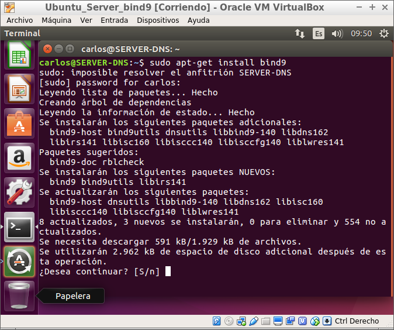

___

### Configuración

- Una vez instalado tener en cuenta que debemos tener una IP estática en el servidor.
Cuando la cambiemos comprobaremos con el comando: `ifconfig`.

  - Como veremos nuesta IP es estática y es la `172.18.6.1` para el servidor.

    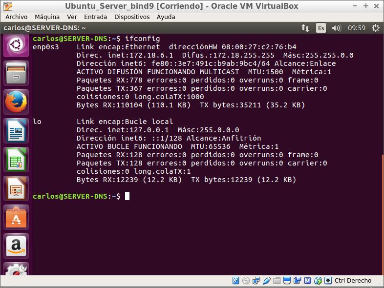

- Cuando ya tengamos la IP configurada estáticamente modificaremos el archivo en la ruta `/etc/resolv.conf` en el que le pondremos nuestra IP como *nameserver*.

  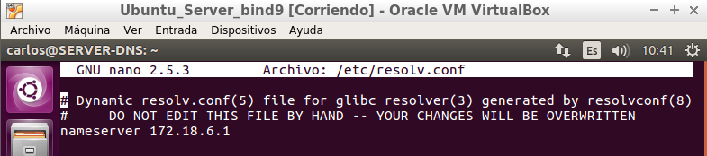

#### Reenviadores

- Seguiremos con la configuración de los reenviadores en la que tendremos que ir al archivo en la ruta: `/etc/bind/name.conf.options` , y en ***forwarders*** pondremos los reenviadores que nosotros queramos, en nuestro caso usamos los de google.

  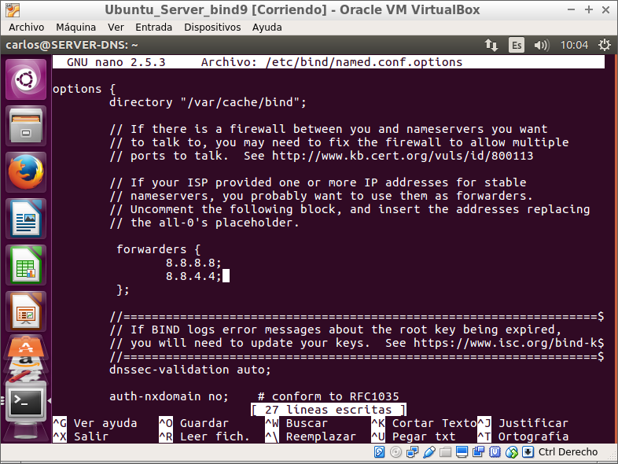

___

## 1.2 Configuración cliente

> En el cliente.

- El primer paso que haremos en el cliente será ponerle como *dns* la IP de nuestro servidor.

  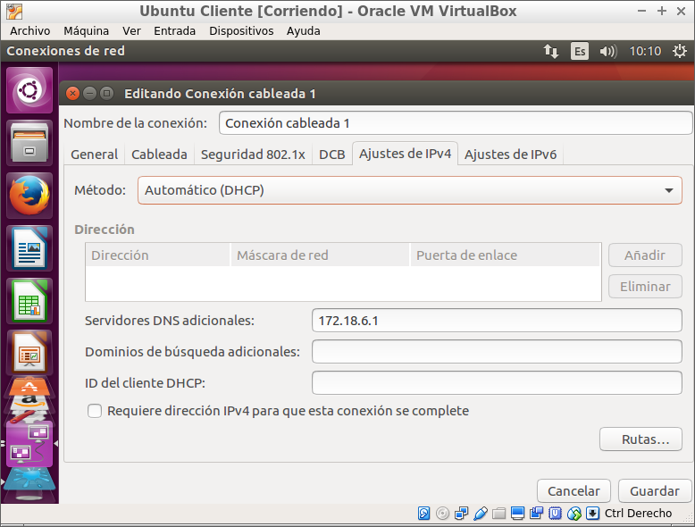

- Luego iremos también al archivo resolv.conf en la ruta: `/etc/resolv.conf` y pondremos como *nameserver* la IP de nuestro servidor.

  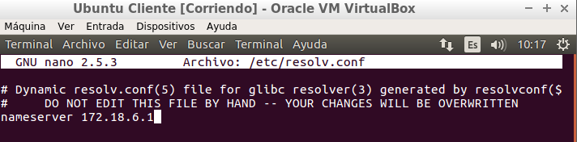

> Desde el servidor

- Ahora pasaremos al servidor a comprabar que funciona la resolución de nombres bien.

  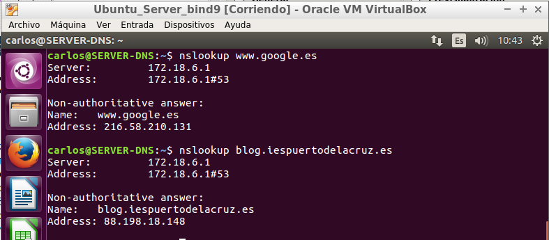

> Desde Cliente

- Ahora desde el cliente comprobamos que también se resuelven nombres con el comando `nslookup`, en nuestro caso lo hicimos hacia *www.google.com* y *blog.iespuertodelacruz.es*.

  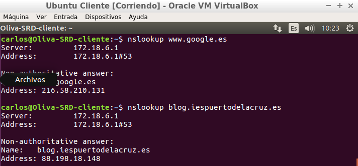

  - Veremos que nos da la IP del servidor que creamos y es el que nos da la respuesta.

___

## 1.3 Zona directa e inversa servidor

> Desde el servidor

- Ahora pasaremos a configurar la zona directa e inversa en el servidor.

- En el servidor iremos al fichero `named.conf.local` que se encuentra en la ruta: `/etc/bind/named.conf.local`

- En este fichero sera donde le digamos que habrá una zona directa y otra inversa.

- Primero añadiremos la zona directa y luego la inversa como en las imagenes.

  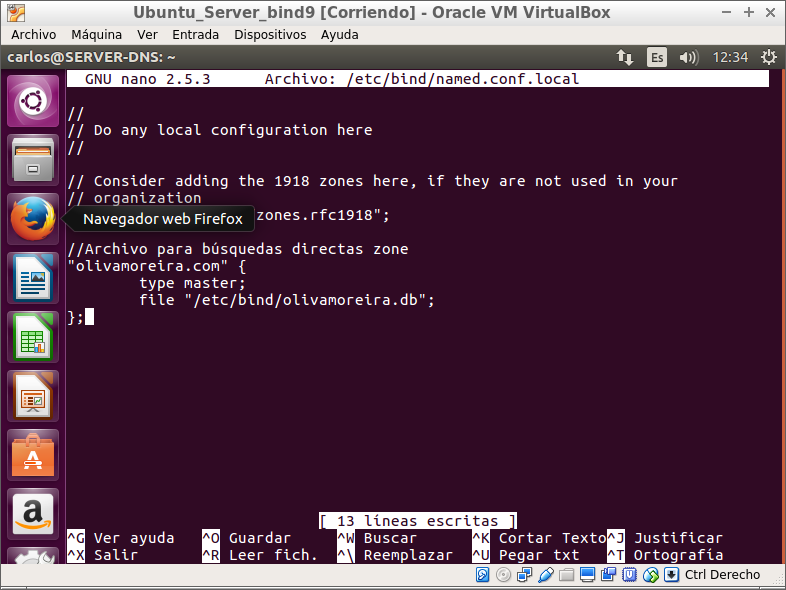

  - Como vemos en la zona directa hemos puesto que hay un fichero llamado: *olivamoreira.db* que luego lo crearemos y modificaremos.

  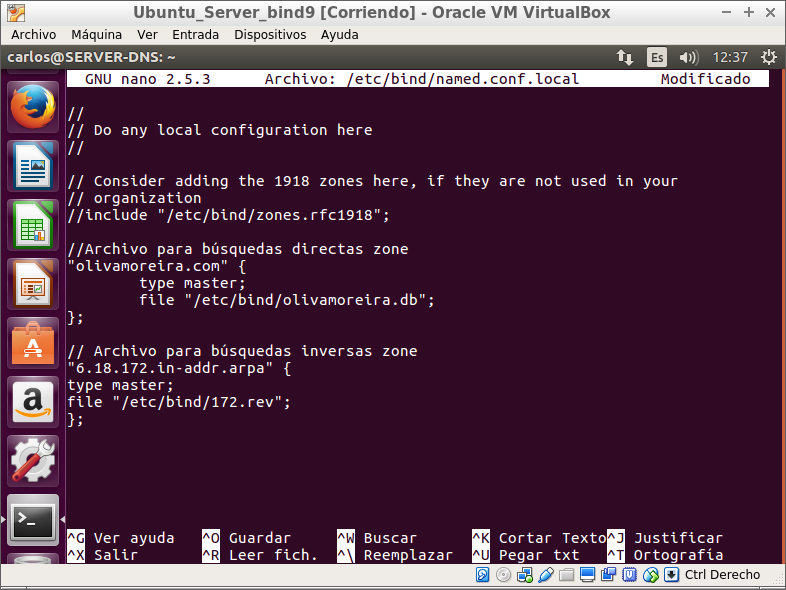

  - En la zona inversa también hemos creado un fichero llamado: *172.rev* que crearemos luego y modificaremos.

- Ahora iremos a la ruta:`/etc/bind/` y aqui dentro crearemos los ficheros *olivamoreira.db* y *172.rev* y dentro de estos habra una configuración similar a otros de la misma ruta, que seria *olivamoreira.db* con *db.local* y *172.rev* con *db.127*.

  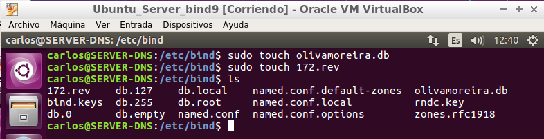

- Copiaremos lo que hay dentro de uno y lo pondremos en los creados por nosotros.

- Una vez lo copiemos haremos algunos cambios:

  - olivamoreira.db:

    - Añadiremos nuestro nombre de servidor y luego debajo de localhost como en la imagen añadiremos unos cuantos hosts.

      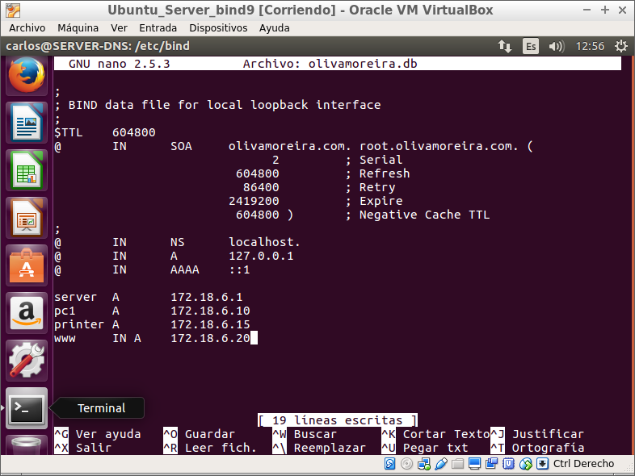

  - 172.rev:

    - Añadiremos nuestro nombre de servidor en la parte superior como en la directa y debajo de localhost enla parte inferior pondremos la red a la que pertenece al contrario:

      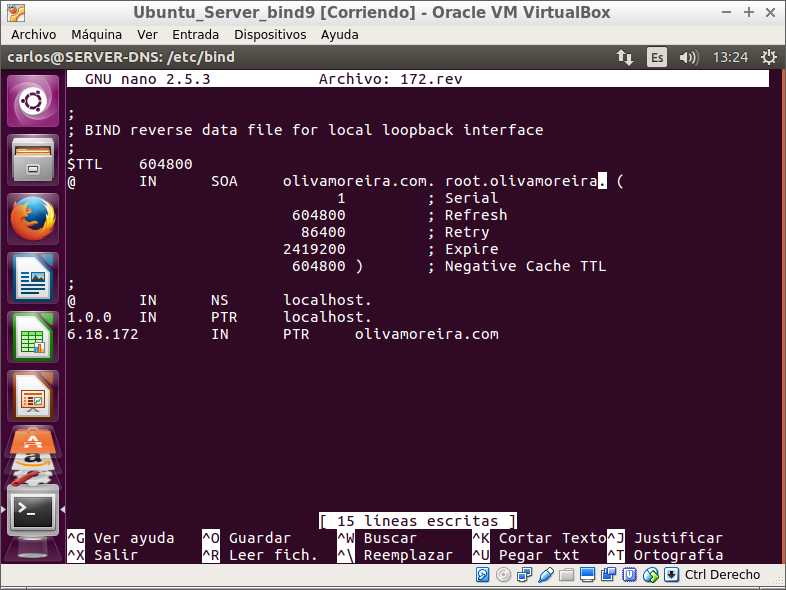

___
___

# Comprobación final

> Desde el cliente

Ahora desde el cliente comprobaremos que sigue funcionando y que el cliente resuelve los nombres delos hosts creados en la zona.

  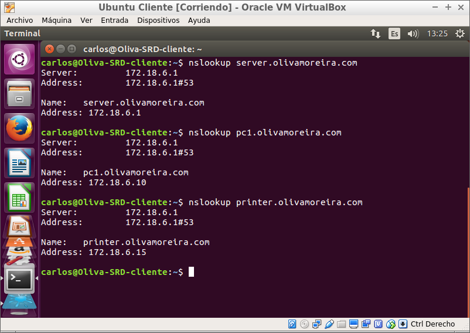

___
___

Fín de la práctica.
