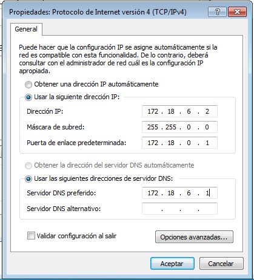

Carlos Javier Oliva Domínguez.
2º ASIR.

## **Práctica: Instalaciones y Configuraciones.**

*El objetivo de esta práctica es aprender a montar un Servidor de Dominio haciendo uso del servicio Active Directory, para unir distintos usuarios a dicho Servidor de Dominio.*

- #### Preparando la Máquina Virtual.
Para esta práctica vamos a necesitar en primer lugar dos máquinas, una Servidor y otra Cliente.

Para ello hemos elegido:
- #### Servidor: Windows Server 2012.
- #### Servidor: Ubuntu Desktop 16.04 LTS.
- #### Cliente: Windows 7 Profesional.
- #### Cliente: Ubuntu Desktop 16.04 LTS.

# 1.0 Configuraciones.
Procederemos a configurar las distintas máquinas para la realización de la práctica.

## 1.1 Windows:
Contarán con la siguiente configuración de red:

- #### Servidor: Windows Server 2012 con una configuración de red en `Adaptador Puente.`
- Y con la siguiente configuración de red:

- #### Cliente: Windows 7 Profesional con una configuración de red en `Adaptador Puente.`
- Y con la siguiente configuración de red:

## Ubuntu
Contarán con la siguiente configuración de red:

- #### Servidor: Ubuntu Desktop 16.04 LTS con una configuración de red en `Adaptador Puente.`
- Y con la siguiente configuración de red:

- #### Cliente: Ubuntu Desktop 16.04 LTS con una configuración de red en `Adaptador Puente.`
- Y con la siguiente configuración de red:

# 2.0 Active Directory.
Comenzaremos con la instalación del Active Directory.

Tras la instalación del Active Directory, procederemos a su configuración añadiendo un nuevo Bosque, es decir, crearemos un dominio en local dentro de nuestro servidor.

Finalizada la configuración del Active Directory, procederemos al inicio de sesion dentro del Servidor Windows.

## 2.1 Unidades Organizativas.

Una vez configurado todo lo anterior, procedemos a crear una Unidad Organizativa sobre la que vamos a trabajar.

Configuramos el usuario con el que accederemos a la máquina Servidor desde la máquina Cliente, conectando ambas mediante el dominio `@olivaserver.local`.

## 2.2 Configuraciones equipo Cliente.
Vamos a proceder a la configuración del cliente, uniéndolo al Servidor, mediante el DOminio que hemos creado anteriormente.

Autorizamos el acceso a dicho Servidor, mediante usuario y contraseña del mismo.

En la siguiente imágen se muestra la pantalla de Inicio de Sesión, a la que accederemos con los datos que habíamos creado en el Servidor en el apartado 2.1.

