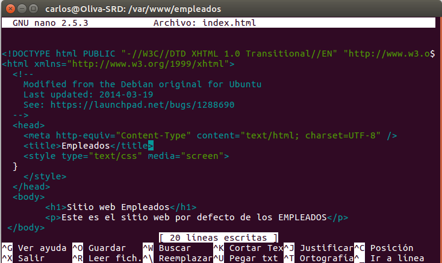
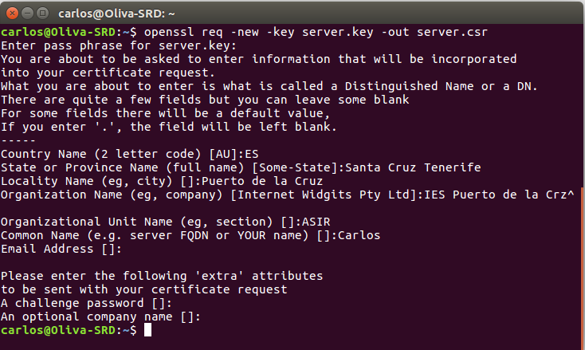
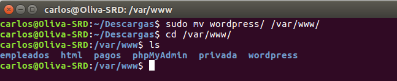
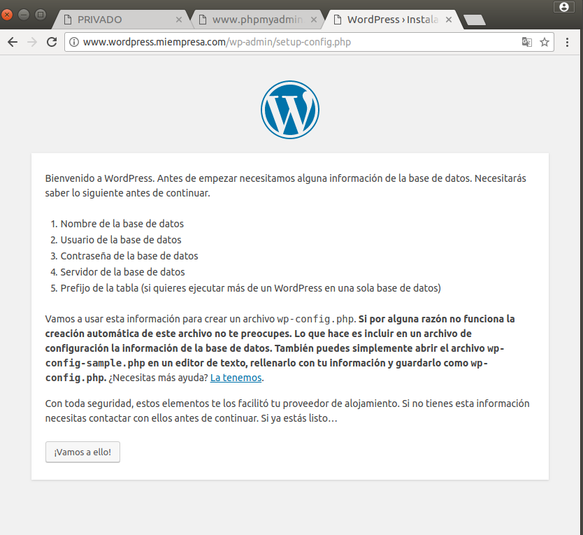
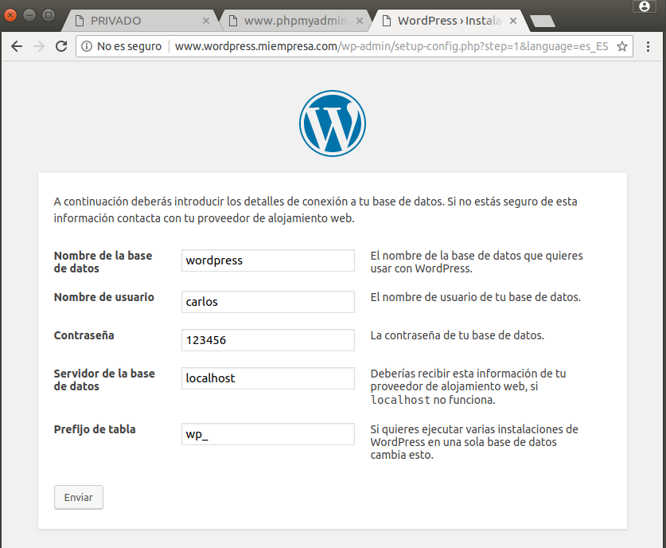

Óscar Moreira

Carlos Oliva

# Apache Linux

___
# Explicación práctica

Esta práctica consistirá en instalar y configurar en Linux los servicios: `Apache`,`PHP`, `MySQL`, `phpMyAdmin` y también haremos configuraciones de acceso a carpetas privadas y configuraciones *SSL*.

 ___
 ___

# Práctica

## 1. Apache

- Lo primero que haremos sera instalar *Apache* : `sudo apt-get install apache2`

  

- Ahora si vamos al navegador y entramos en `localhost` veremos que nos saldrá el index que se creo en `/var/www/` al instalar *Apache*.

  

- Añadimos en `/etc/hosts` la IP con el nombre de *www.,iempresa.com*.

  

___

## 2. PHP

- Instalamos PHP: `sudo apt-get insall php`

  

- Ahora instalaremos las librerias de *Apache* para *PHP*: `sudo apt-ger install libapache2-mod-php`.

  

- Después de esto crearemos un *index.php* en `/var/www/html`.

  

- Ahora veremos que si entramos en *www.miempresa.com* nos saldra al index de *PHP*.

  

___

## 3. Crear hosts virtuales.

En este apartada crearemos sitios web que configuraremos con apache2.

- Lo priemro que haremos será crear el virtual host de *www.empleados.miempresa.com* para esto iremos a la ruta `/etc/apache2/sites-available/` y crearemos un fichero que llamaremos ***empleados.conf***.

  

- Luego haremos un enlace simbólico a `/etc/apache2/sites-enabled`

- Luego iremos al fichero `/etc/hosts` y lo añadiremos.

  

- Después de esto iremos a la ruta `/var/www/` y crearemos una carpeta llamada empleados y dentro un *index.html*.

  

- Ahora comprobaremos que el sitio web esta bien creado y que podemos acceder a la página.

  

___

## 4. Sitios web seguros (SSL)

Ahora pasaremos a crear sitios web pero en este caso con certifiacion *SSL*

- Una vez se instala *Apache* también se instala *SSL*.

- Pasaremos a generar un certificado autofirmado. Ejecutaremos los siguientes comandos:

  ~~~

    - openssl genrsa -des3 -out server.key 1024
    - openssl rsa -in server.key -out server.pem
    - openssl req -new -key server.key -out server.csr
    - openssl x509 -req -days 360 -in server.csr -signkey server.key -out server.crt

  ~~~

  

  

  

  

- Ahora iremos al la ruta `/etc/apache2/sites-available/` y crearemos el virtual host `pagos.conf` con susconfiguración *SSL*.

  

  

- Luego haremos un enlace simbólico a `/etc/apache2/sites-enabled`

- Después de esto iremos a la ruta `/var/www/` y crearemos una carpeta llamada pagos en la que crearemos un *index.html*

  

- Hecho todo esto lo añadiremos el nombre a `/etc/hosts`

  

- Cuando acabemos de configurar todo ejecutaremos el comando: `sudo a2enmod ssl` que sera el módulo que habilite el *SSL* en *Apache*.

  

- Ahora verificamos que funciona la página y que tendremos la certificación viendo que se muestra con *https*.

  

___

## 5. Acceso a carpetas privadas.

- Lo primero que haremos sera crear una carpeta en `/var/www/` llamada *privada*.

- Una vez creada dentro de ella crearemos un fichero llamda `.htaccess`.

  

- Despues de esto dentro de la ruta `/var` ejecutaremos el siguiente comando para crear una clave encriptada con el usuario: `sudo htpasswd -c /var/claves/usuario usuario`.

  

- Ahora hecho esto iremos al fichero `/etc/hosts` y añadiremos la web con su IP

  

- Dentro de la carpeta `/var/www/privada` crearemos un *index.html*

  

- Hecho esto iremos a la ruta `/etc/apache2/sites-available` y crearemos el host de la web segura.

  

- Luego haremos un enlace simbólico a `/etc/apache2/sites-enabled`

  

- Ahora entraremos en la página y veremos que nos pide usuario y contraseña y podremos entrar.

  

  

___

## 6. MySQL

- Instalararemos MySQL con: `sudi apt-get install mysql-server` y  en medio de la instalación pondremos contraseña para root de MySQL.

  

- Una vez instalado pasaremos a instalr php para MySQL: `sudo apt-get install php-mysql`

  

___

## 7. phpMyAdmin

- Para descargar *phpMyAdmin*  lo que haremos será descargar el fichero tar.gz

  

- Luego lo descomprimimos y lo pasamos a la ruta `/var/www/`

  

- Hecho esto crearemos una linea nueva en `/etc/host/` con el nombre *www.phpmyadmin.miempresa.com*

  

- Crearemos un *phpmyadmin.conf* en `/etc/apache2/sites-available` y luego haremos un enlace simbolico en `/etc/apache2/sites-enabled`.

  

- Ahora comprobaremos que funciona entrando en la página *www.phpmyadmin.miempresa.com*

  

___

## 8. Plataforma Wordpress

### 8.1 Base de dats y usuarios

- El primer paso que debemos realizar es crear un base de datos para *Wordpress*.

- Para esto entraremos en *MySQL* y crearemos una base de datos llamada *wordpress*.

  

- Luego iremos a *www.phpmyadmin.miempresa.com* y veremos que nos saldrá la base de datos que hemos creado.

  

- Creada la base de datos pasaremos a crear un nuevo usuario.

  

### 8.2 Wordpress

- Hecho todos los pasos anteriores pasaremos a descargar *Wordpress*.

  

- Ahora una vez descargado pasaremos la carpeta a la ruta `/var/www/`.

  

- Luego crearemos el fichero wordpress.conf en la ruta `/etc/apache2/sites-available`

  

- Creado el fichero wordpress.conf  haremos un enlace simbólico en la ruta `/etc/apache2/sites-enabled`

  

- Ahora crearemos una nueva linea con el nombre del host *www.wordpress.miempresa.com*

  

- Hecho esto entraremos en la web *www.wordpress.miempresa.com*.

  

- Configuraremos wordpress diciendole la base de datos, usuario, etc...

  

- Seguiremos configurandolo.

  > Saldrá un error en la configuración del correo porque en realidad no existe pero nos deja seguir con la configuración.

  

- Terminado podremos acceder.

  

- Ya hemos accedido y vemos el panel de control.

  

___
___

Fín de la práctica
