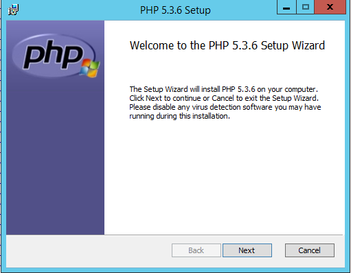
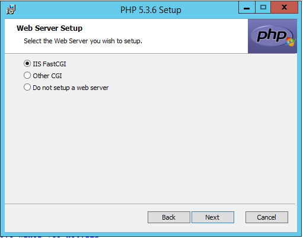
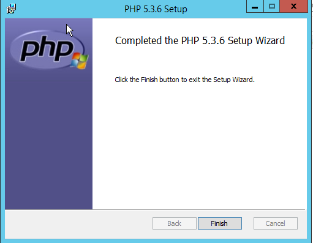
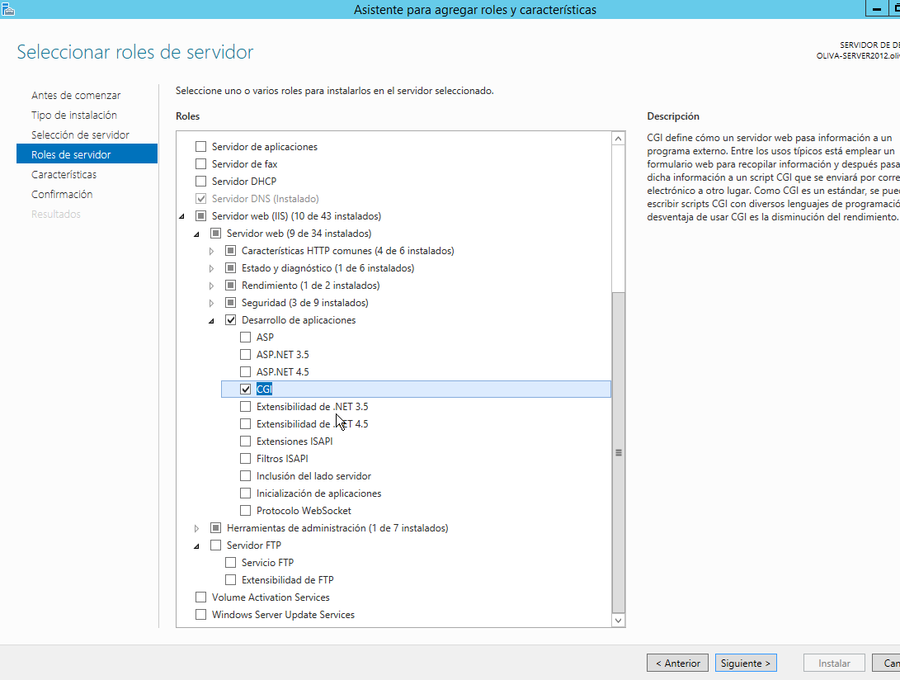
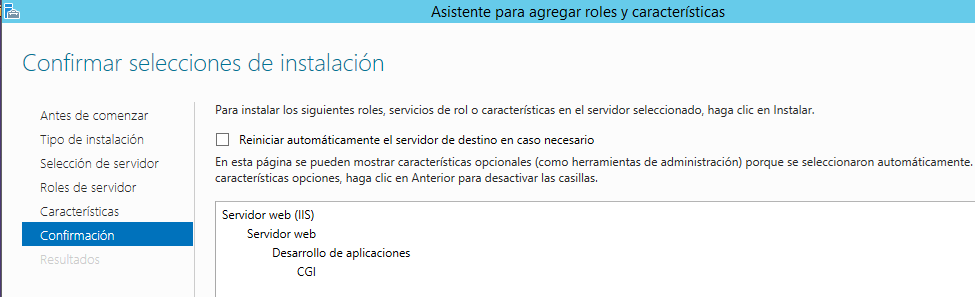
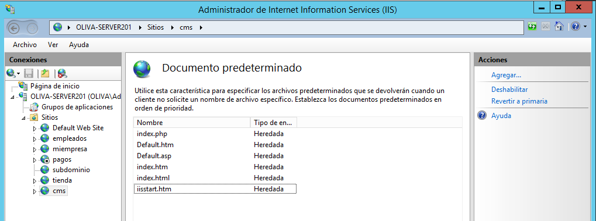

Oscar Moreira

Carlos Oliva

# Informe IIS - Servidor Web avanzado - PHP, MySQL, phpMyAdmin, FTP y Drupal

___

# Prácticas

### Parte 1:
- La primera parte de la práctica consistirá en crear un servidor web con soporte PHP, acceso FTP y gestor de bases de datos y phpMyAdmin.

### Parte 2:
- En esta segunda parte instalaremosy configuraremos un servidor FTP y el CMS llamado Drupal.

### Parte 3:
- En esta parte lo que haremos sera por nuestra cuenta elegir un cms e instalarlo desde el cliente transfiriendolo al servidor.

___
___

# 1. Parte 1

## 1.0 IIS Windows Server 2012 V

En este apartado instalaremos y configuraremos todas las características necesarias para nuestro servidor de tal forma que luego podremos trabajar desde el cliente y configurar desde el cliente.

## 1.1 Instalación PHP

- Lo primero que haremos será descargar PHP la versión 5.3.8

  

- Descargado lo siguiente sera instalarlo y seguiremos los pasos que veremos en las imágenes siguientes.

  

  

  

  

  

- Ahora añadiremos la carácterística llamada CGI en el servidor.

  

  

- Una vez instalado el CGI pasaremos a crear nuestro sitio web y lo primero sera crear la carpeta llamada *cms*

  

- Dentro de esta carpeta crearemos un fichero *index.php* con el código siguiente dentro de él.

  ~~~
  <?php phpinfo(); ?>
  ~~~

  

- Crearemos un alias.

  

- Despuñes de esto iremos a *IIS* y crearemos el sitio web *cms.miepresa.com*.

  

- Por último en el sitio web en *IIS* en documentos predeterminados pondremos el *index.php* al principio.

  

- Ahora ya comprobaremso que entrando en nuestro sitio web en un navegador nos saldrá el contanido de PHP.

  

___

## 1.2 Instalación MySQL

Para instalar el *MySQL* seguiremos los siguientes pasos:
- Primero iremos a este [enlace](https://dev.mysql.com/donwloads/installer) y descargamos la segunda opción de 376.3M (instalador completo).

  

- Una vez descargado seguiremos los siguientes pasos para la instalación.

  

  

  

  

  

  

  

- Y siguiente hasta acabar.

## 1.3 phpMyAdmin

- Descargaremos phpMyAdmin en este [enlace](http://www.phpmyadmin.net)

  

- Crearemos una carpeta llamada phpmyadmin en *miempresa* con todos los ficheros.

  

- Ahora creamos un nuevo dominio para phpmyadmin

  

- Creado el dominio crearemos el sitio web en *IIS*

  

- Ahora verificamos si entrando a la web nos sale la página.

  

___
___

# Parte 2

## 2.1 Filezilla

> Desde servidor

- Nuestro servidor ftp lo haremos con el programa *Filezilla*

- Lo primero será descagar el Filezilla-server.

  

- Luego lo instalamos

  

- Una vez dentro crearemos un usuario llamado *ftpuser*.

  

- Luego añadiremos la carpeta de *cms* de nuestro servidor y le daremos todos los permisos.

  

- Después de esto crearemos un dominio ftp.miempresa.com.

  

___

## 2.2 phpMyAdmin cliente

> Desde cliente

- Desde el cliente entramos em phpmyadmin.miempresa.com y verificamos que funciona.

  

  

___

## 2.3 Drupal

- Descargaremos el CMS llamado Drupal.

  

- Luego de esto entraremos en ftp.miempresa.com  y verificamso que podemos entrar al servidor ftp.

  

  

- Ahora descargaremos el Filezilla client

  

- Lo instalaremos

  

- Ahora desde el cliente transferiremos los archivos del Drupal descargados al servidor a la carpeta cms.

  

- Ahora crearemos una base de datos en phpMyAdmin llamada cms.

  

- Ahora creamos un usuario para la base de datos con los privilegios necesarios.

  

- Si ahora entramos en la dirección *cms.miempresa.com* irems directamente a la instalación y configuración de Drupal.

- Seguiremos los siguientes pasos.

  

  

  

  

  

  

  

  Con este error iremos al fichero crearemos un fichero llamado settings.php que sera una copia de default.settings.php y le daremos permisos a los usuarios parapoder modificar.

  

  

  Veremos que podemos seguir con la instalación.

  

  

  

- Ahora para poder usar bien Drupal sin errores iremos al fichero que se encuentra en `cms\sites\default\files` y le daremos permisos de modificación.

  

- Descargamos el tema marinelli para Drupal y lo subimos para usarlo en Drupal.

  

- Luego de esto crearemos un artículo y un menu de link.

  

  

- Veremos que lo que hemos creado funciona.

  

  

  

___
___

# Parte 3
En nuestro caso hemos elegido como CMS el Joomla.

- Lo primero que haremos sera en la carpeta de mi empresa en el servidor crear otra dentro en la que alojaremos los ficheros de Joomla.

- Desde ftp server compartiremos esa carpeta con todos los permisos para el usuario.

  

- Crearemos un host

  

- Después crearemos un sitio web en *IIS*

  

- Luego descargaremos el Joomla

  

- Una vez descargado lo que haremos será instalarlo siguiendo los pasos que veremos en las imágenes.

  

  

  

- Hecha la instalación iremos a la dirección creada para este apartado eingresaremos con el usuario y contraseña que creemos.

  

- Si entramos veremos que tenemos todas las opciones para modificar la web.

  

___
___

Fín de la práctica
