Óscar Moreira

Calos Oliva
___

# Panel de Control Hosting Web
___

___

# Práctica

Esta práctica consistira en tener un panel de control de hosting en un servidor en el que tengamos: `Linux`, `Apache`, `MySQL` y `PHP`, lo que se conoce por sus siglas como `LAMP`.

En nuestro caso elegimos el panel de control llamado *Webmin* y lo hemos instalado en ***Ubuntu 16.04***.

___
___

# Procedimiento

Empezaremos teniendo instalado el sistema operativo *Ubuntu 16.04* y empezaremos instalando *Apache*, *PHP*, *MySQL* y por último el panel de control *Webmin*.

___

# 1. Apache

- Lo primero que haremos será instalar *Apache* con el comando: `sudo apt install apache2`

  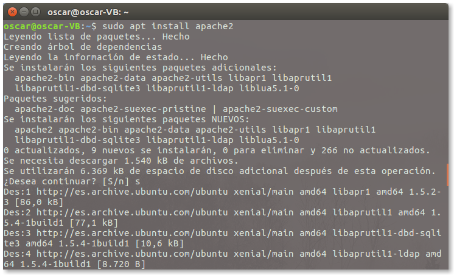

- Luego verificaremos que el servicio esta corriendo: `sudo systemctl status apache2`

  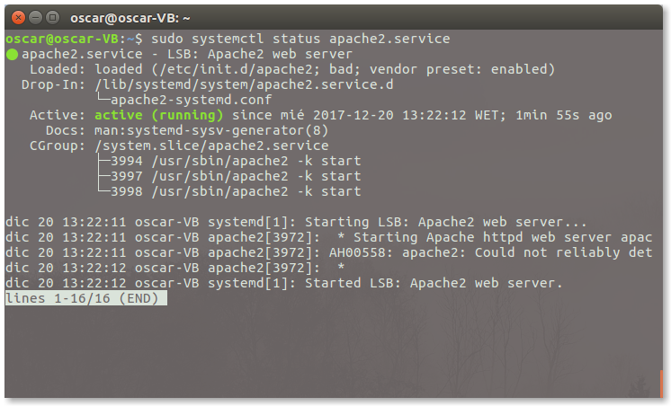

- Confirmado que esta corriendo el servicio iremos al navegador e iremos a ***localhost***  y nos debe salir la página por defecto de *Apache*.

  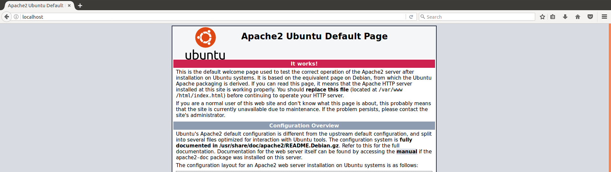

___

# 2. PHP

- Instalaremos *PHP* : `sudo apt install php`

  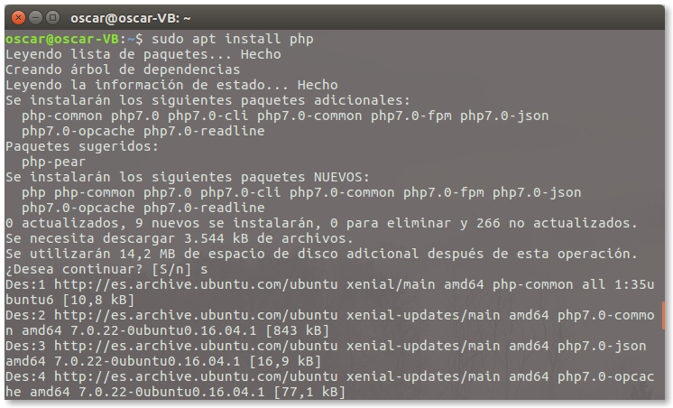

- Una vez instalado pasaremos a instalar las librerías de *PHP* para *Apache*. `sudo apt install libapache2-mod-php`

  

- Ahora pasaremos a crear un **index.php**, esto lo crearemos en la ruta por defecto `/var/www/html`, dentro habrá un index.html que le cambiaremos el nombre para que no lo detecte y crearemos el **index.php** ahi dentro.

  - Contenido del index.php:

    ~~~
    <?php

    phpinfo();

    ?>
    ~~~

  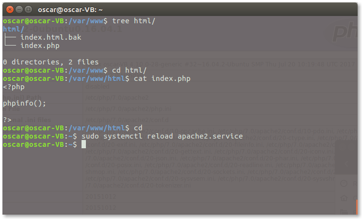

- Ahora si entramos en ***localhost*** en el navegador veremos que ya no nos sale el index de apache y nos sale el **index.php** que acabamos de crear.

  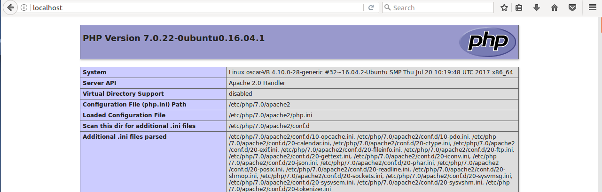

___

# 3. MySQL

- Instalaremos *MySQL*: `sudo apt install mysql-server`

  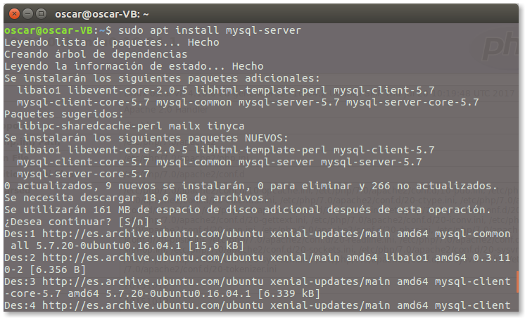

- En medio de la instalación nos pedira una contraseña ***root*** para *MySQL*.

  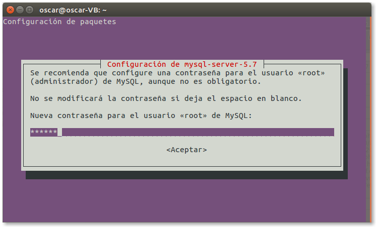

  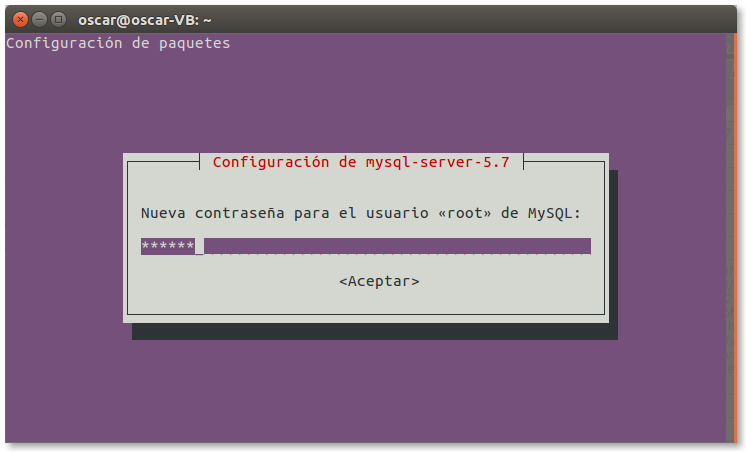

- Por último instalaremos *PHP* para *MySQL*.

  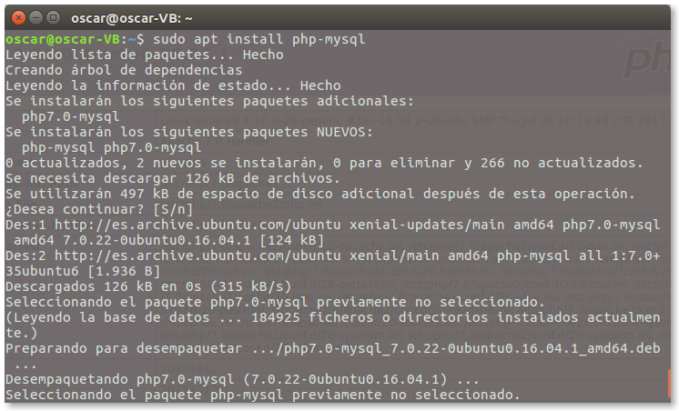

___
___

# 4. Webmin

En este apartado explicaremos como descargar e instalar *Webmin* y también hacer alguna configuración y ajustes para hacer de ejemplo en la práctica.

## 4.1 Instalación Webmin

- Iremos a la página http://www.webmin.com/download.html y descargaremos el que se señala en la imágen.

  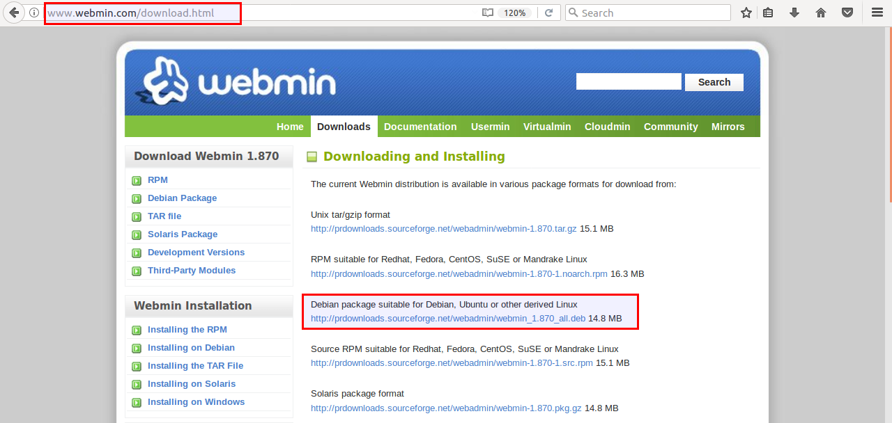

- Después de esto con el comando `sudo dpkg -i webmin...` instalaremos webmin.

  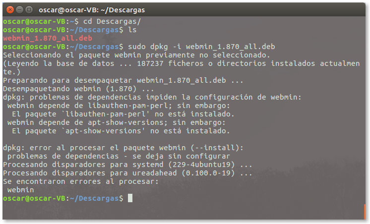

- Nos da este error porque faltan paquetes asique ahora ejecutaremos el comando: `sudo apt install -f` para que se instalen antes de volve a ejecutar el comando de instalación.

  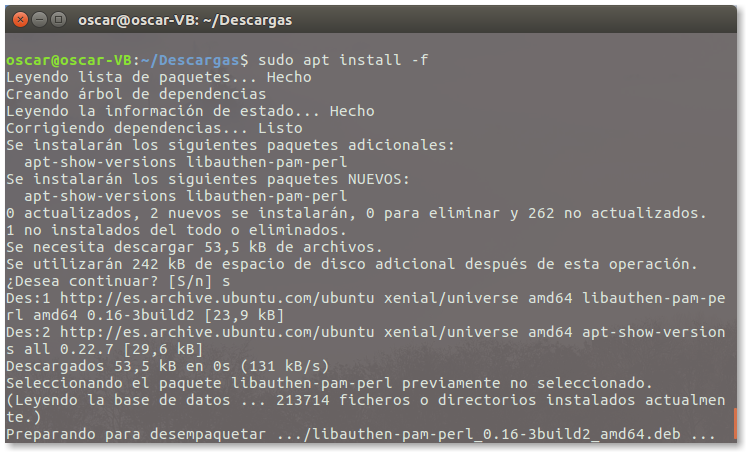

- Ya instaladas las dependencias ahora volveremos a ejecutar el comando de instalación.

  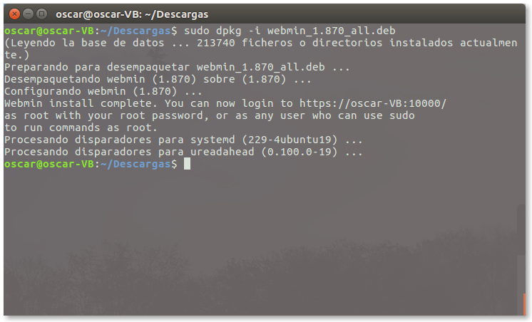

Con esto ya lo tendremos instalado.

___

## 4.2 Inicio Webmin

- Para poder entrar al panel de control iremos a un navegador y pondremos la ruta https://localhost:10000 y dentro nos pedira usuario y contraseña que es el que estamos usando ahora mismo.

  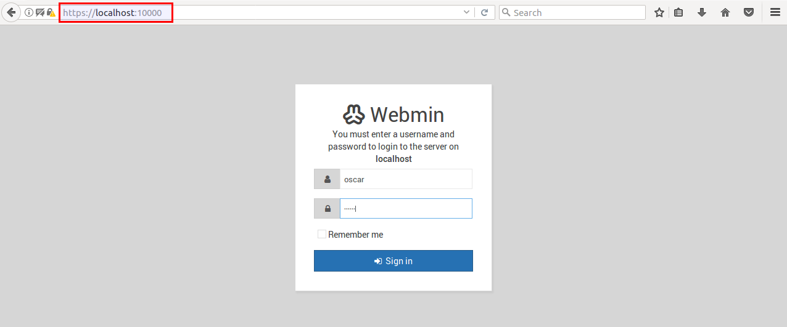

- Una vez dentro nos saldrá un panel que nos dara información sobre el servidor.

  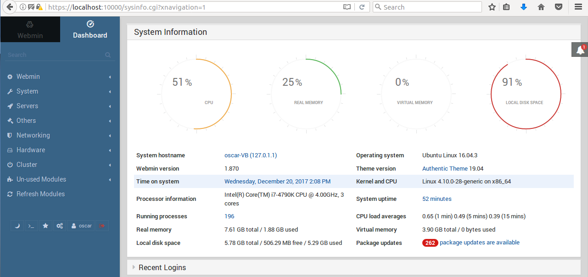

___

## 4.3 Configuraciones Webmin

Estas configuraciones son para poner algún ejemplo de algo que se puede hacer desde un panel de control.

- La primera configuración que haremos será cambiar el idioma.

- Iremos al panel izquierdo a `Webmin --> Change your Language and Theme` y lo pondremos en español como en la imagen.

  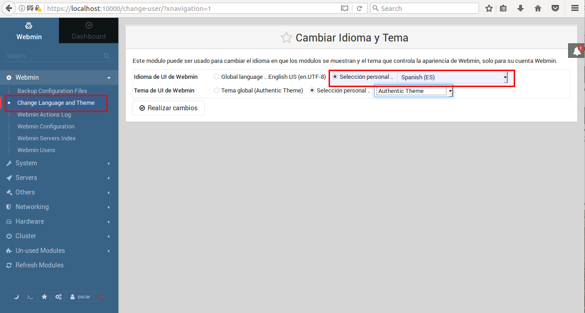

Con las siguientes imágenes que veremos se vera que el idioma está en español.

___

### 4.3.1 Configuración MySQL en Webmin.

- Para entrar a MySQL en Webmin iremos al panel izquierdo y entraremos en `Servidores --> Servidor de Base de Datos MySQL`. Aquí veremos que tenemos 4 bases de datos.

  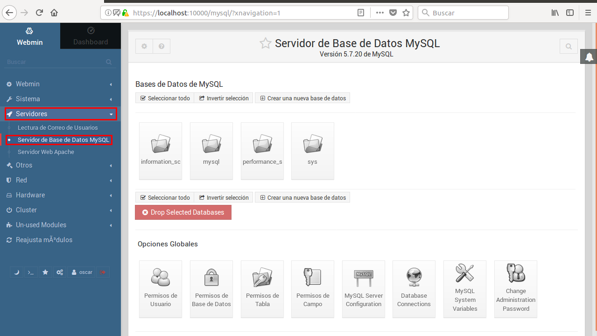

- Para verificar que esta correcto abriremos una terminal y entraremos en MySQL y miramos las bases de datos que hay.

  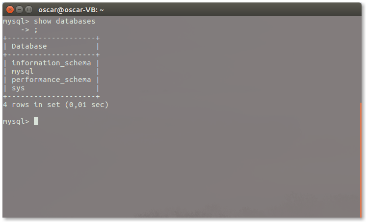

- Vemos que son las mismas y esta bien.

- Ahora pasaremos a crear una nueva Base de Datos en nuestro Servidor y le añadiremos una tabla.

  > Esta base de dato tendra unos campos y su propio nombre, asi luego verificamos que todo funciona.

  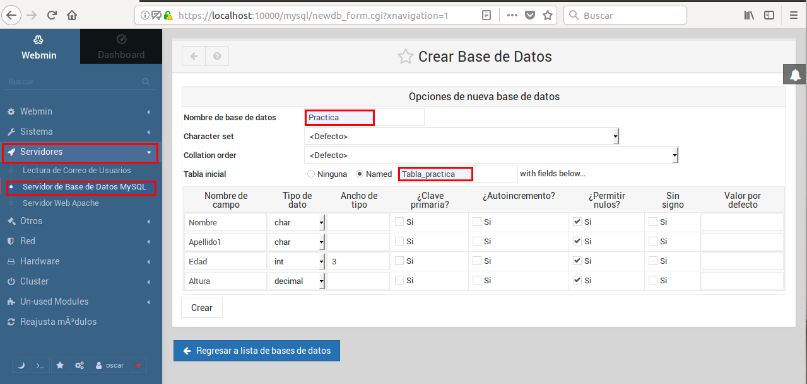

- Terminamos la creación y vemos que ya nos sale en el panel de control la nueva Base de Datos.

  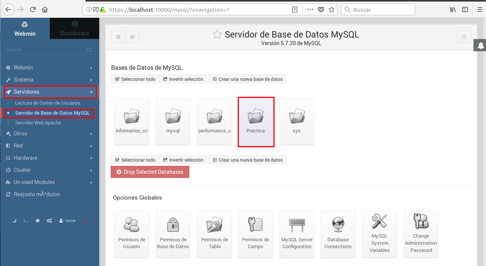

- Ahora iremos a la terminal con MySQL y verificamos que la nueva Base de Datos nos sale y también su tabla.

  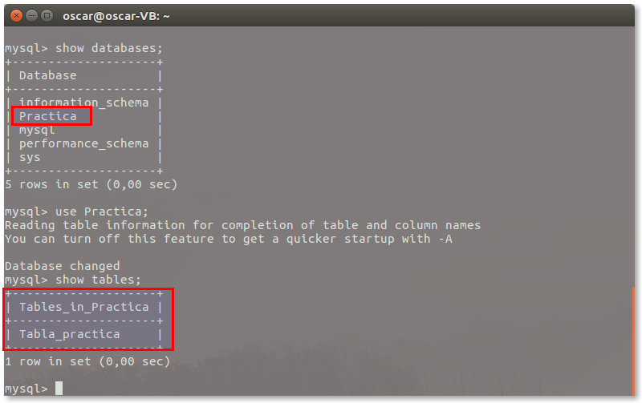

- Y miramos dentro de la tabla que tengamos los campos puestos por webmin.

  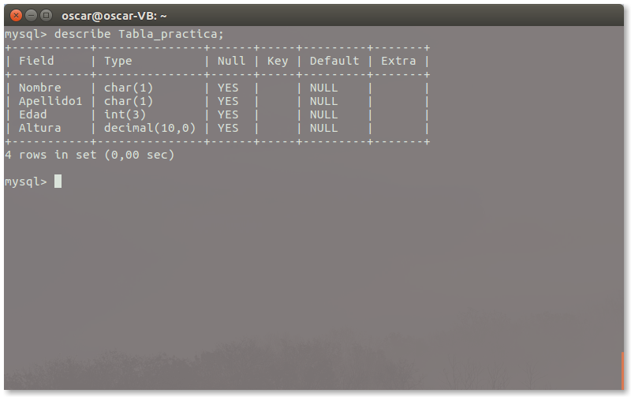

Vemos que esta todo correcto.

___
___

Fín de la Práctica
