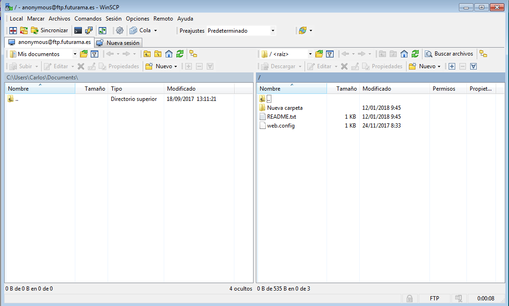
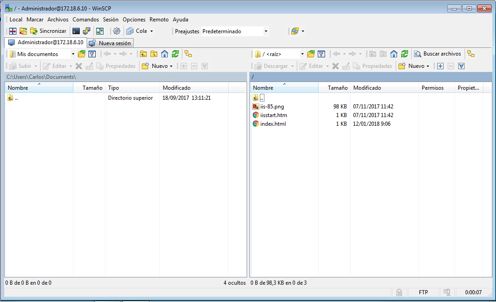
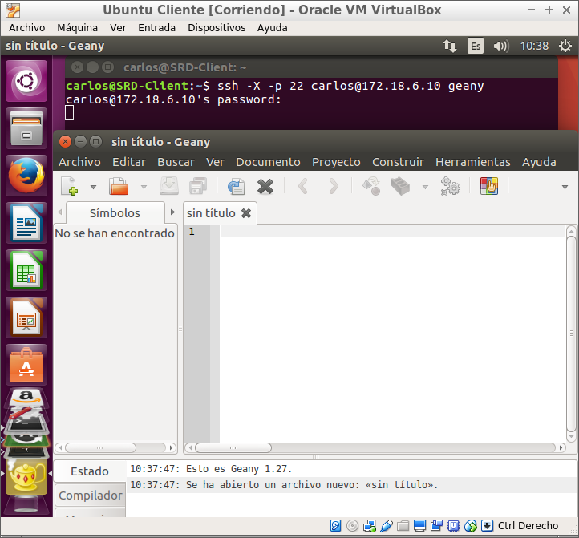
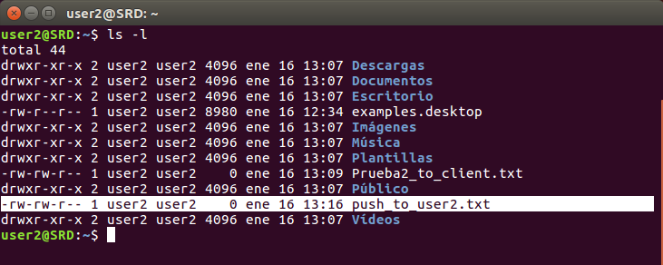

## Práctica de Windows 2012 Server - SRD – 2º ASIR
### Instalación y Configuración de un Servidor FTP
Carlos Javier Oliva Domínguez

-----
Siguiendo los pasos detallados en las guías y tutoriales proporcionados:

#### 1. Instalar Servicio FTP en Windows 2012 Server, a través de Agregar roles y características (IIS)

Habilitamos el Servicio FTP:

Procedemos a instalar dicho Servicio.

#### 2. Acceder a la creación y configuración de Sitios FTP por medio de la Administración de IIS.

Tras la instalación del Servicio FTP, contaremos con un panel como este, que nos permitirá configurar nuestro Servicio FTP.

#### 3. Crear tres nuevos sitios FTP (en todos ellos se debe poder acceder a través de las IPs del servidor y, en algún caso, de un nombre DNS ftp.tudominio.ext):

Primeramente vamos a crear una zona nueva, usaremos `futurama.es` como nombre DNS.

Dentro de nuestra zona de búsqueda directa, vamos a crear un nuevo host con la ip de nuestro Servidor `(172.18.6.10)`.

Seguidamente, creamos un nuevo alias para acceder a nuestro Servidor FTP `ftp.futurama.es`.

##### 3.1.0 Uno asociado a la unidad C: completa. No debe permitir accesos anónimos. Sin uso de SSL. Sólo el usuario Administrador podrá acceder al sitio. Modos lectura y escritura.  Ahora realiza las siguientes acciones:

Primeramente, iremos a nuestro administrador IIS y elegiremos la creación de un nuevo sitio FTP. Elegiremos un nombre y `C:\` como ruta de acceso física.

Seguidamente, elegiremos la dirección ip, `172.18.6.10` en mi caso, y especificamos el puerto `21`. También podemos optar por poner el nombre del host virtual que creamos anteriormente, `ftp.futurama.es`. Configuramos también un certificado SSL, usando el que habíamos creado en prácticas anteriores.

Tal como requiere el enunciado de esta parte del ejercicio, elegiremos la autenticación `Básica`, para impedir el acceso a usuarios anónimos. Daremos también permisos de lectura y escritura al usuario Administrador.

##### 3.1.1 Examina todas las opciones de configuración de la página principal de tu Sitio FTP (IIS) y haz una descripción breve de cada una en el informe. No modifiques nada aún.

`Aislamiento de usuario FTP`: El aislamiento de usuario FTP es una solución que permite a los proveedores de acceso a Internet (ISP) ofrecer a sus clientes directorios FTP individuales para cargar contenido.

`Autenticación FTP`: Sirve para configurar los métodos de autenticación que los clientes FTP pueden utilizar para obtener acceso al contenido.

`Compatibilidad con el firewall...`: Con el fin de modificar la configuración de las conexiones pasivas cuando los clientes FTP se conecten a un servidor FTP ubicado detrás de un firewall.

`Configuración SSL de FTP`: Sirve para administrar el cifrado para las transmisiones de canal de control y canal de datos entre el servidor FTP y los clientes.

##### 3.1.2 Trata de acceder al sitio ftp desde el propio servidor a través de un navegador y un explorador de archivos.

Accedemos al sitio ftp mediante el navegador `ftp://ftp.futurama.es`. Nos pedirá usuario y contraseña, recordemos que habíamos concedido el acceso al usuario Administrador.

Tras loguearnos, comprobamos que podemos acceder al disco local `C:\` de nuestra máquina Servidor.

##### 3.1.3 Comprueba accesos permitidos y denegados. Comprueba también permisos asignados. Accede ahora desde un cliente Windows de la misma forma. Realiza comprobaciones.

Autenticación desde un cliente.

Comprobación desde un cliente:

##### 3.1.4 Instala el software WinSCP en el cliente Windows, configura la conexión a tu sitio ftp y trata de establecer conexión y realizar comprobaciones.

Instalaremos la app propuesta en el ejercicio.

Nos autenticaremos con el usuario `Administrador` y comprobamos:

Podemos comprobar que tenemos acceso al disco local `C:\` gracias al Servicio FTP.

##### 3.2.0 El segundo asociado al directorio `wwwroot` de Inetpub. Se permitirá el acceso a todos los usuarios de Active Directory en modo lectura y escritura. No permitimos acceso anónimo y habilitamos en este caso la posibilidad (permitir, no requerir) de conexiones SSL asociadas a uno de los certificados que poseas en IIS.

Para este segundo sitio FTP, daremos acceso solamente al direcotio `wwwroot`.

Configuramos la dirección `ip`, el `virtual host` asociado a ésta misma y el `puerto` por el que redigiremos las conexiones. También configuraremos un certificado `SSL`.

Permitiremos solamente una autenticación `Básica`.

##### 3.2.1 Realizar diferentes comprobaciones válidas e inválidas de conexión y operaciones, tanto desde el servidor como desde el cliente. Realizar una configuración de conexión SSL desde WinSCP.

Comprobación desde el Servidor.

Comprobación desde el cliente.

Vemos el contenido del directorio, tras loguearnos con el usuario `empleado1`.

##### 3.3.0 El tercer sitio FTP debe asociarse a una carpeta cualquiera del servidor que contenga información (archivos y carpetas), pero que no sea importante. Permitiremos acceso anónimo y sólo se podrá consultar y leer. Comprobar desde servidor y cliente.

Para este tercer sitio FTP, vamos a permitir el acceso a una carpeta pública en nuestro directorio Documentos.

Al igual que los anteriores sitios, configuramos los Enlaces y el Certificado SSL.

Para este último, vamos a permitir la conexión anónima, pudiendo solamente leer.

Daremos permiso a `Todos` a la carpeta en cuestión.

Comprobamos en el Servidor, nos lista el contenido del directorio, sin necesidad de autenticarnos.

Nos conectaremos desde el cliente Windows.

Comprobamos que podemos acceder al contenido.

##### 3.3.1 Se debe crear un nuevo registro DNS que permita acceder a nuestro sitio FTP a través de la dirección ftp.miServer.com (o el dominio que utilices habitualmente).

Utilizaremos el Host Virtual que llevamos usando en toda la práctica.

##### 3.3.2 En un principio es posible que debas detener un sitio web para que pueda iniciarse otro. Tras comprobar el funcionamiento por separado de los sitios, encontrar una solución para que nuestro servidor ofrezca varios sitios FTP simultáneamente.

Para permitir que nuestro Servidor nos proporsione varios sitios FTP de forma simultanea, basta con cambiar los puertos, así redirigiremos cada uno de ellos por puertos diferentes, permitiendo así una co-existencia.

Para este usaremos el `puerto 2121`

Intentamos conectar desde el cliente Windows, especificando eso si, el puerto que hemos predefinido.

Comprobamos que accedemos perfectamente al sitio FTP.

Ahora, sin parar el sitio FTP anterior, configuraremos un nuevo sitio FTP (de los que ya tenemos creados) pero usaremos el `puerto 2222`.

Intentaremos acceder al nuevo sitio FTP, especificando el `puerto 2222`.

Finalmente, comprobamos que podemos acceder perfectamente al contenido.

-----
### Instalación y Configuración de un Servidor FTP en Linux

Siguiendo los pasos detallados en las guías y tutoriales proporcionados:

#### 1. Instalar Servicio SSH en el servidor Linux.

Instalamos el `SSH Server`.

#### 2. Crear dos usuarios en el sistema, con diferentes privilegios y niveles de acceso al filesystem.

Creamos los usuarios:
-  `user1`
-  `user2`

#### 3. Comprobar, desde una máquina cliente, acceso de los usuarios mediante ssh.

Antes de hacer las comprobaciones pertinentes, tenemos que instalar el Servicio SSH en el cliente.

Vamos a comprobar la conexión desde el cliente, con el usuario `user1`.

#### 4. Tratar de ejecutar una aplicación gráfica del servidor de forma remota, desde el cliente, mediante ssh.

En este punto he optado por instalar la aplicación `Geany` en el Servidor, y mediante el Servicio `ssh` accederemosa  dicha app, que no se encuentra instalada en la máquina Cliente.

# 

#### 5. Acceder, también desde el cliente, mediante sftp (ftp seguro, incluido en el paquete ssh) al sistema de ficheros del servidor y probar acceso, carga y descarga de archivos con ambos usuarios.

##### Comprobación `GET` desde la máquina Cliente, con user1:

Desde el cliente, accederemos al Servidor mediante `SFTP` usando el usuario `user1`.

#### 6. Realizar varias copias de archivos hacia / desde el servidor mediante scp, utilizando también los dos usuarios creados anteriormente.

Primeramente, desde el `Servidor`, vamos a crear un archivo, que posteriormente copiaremos `Prueba_to_client.txt`.

Ahora, desde la máquina cliente, accederemos al usuario `user1` mediante `SFTP`. Y copiaremos el fichero que creamos en el apartado anterior mediante `get {nombre_fichero.txt}`.

##### Comprobación `GET` desde la máquina Cliente, con user2:

Primeramente, desde el `Servidor`, vamos a crear un archivo, que posteriormente copiaremos `Prueba2_to_client.txt`.

Ahora, desde la máquina cliente, accederemos al usuario `user2` mediante `SFTP`. Y copiaremos el fichero que creamos en el apartado anterior mediante `get {nombre_fichero.txt}`.

##### Comprobación PUT desde la máquina Cliente, con user1:

Desde la máquina Cliente, creamos el archivo que posteriormente subiremos `push_to_user1.txt`.

Ahora nos loguearemos con el usuario `user1` y subiremos el archivo que creamos en el apartado anterior, al Servidor, mediante `PUT`.

Realizado lo anterior, nos dirigiremos al `Servidor` y mediante el comando `ls -l` listamos los archivos y directorios, comprobando que el archivo que creamos anteriormente, `push_to_user1.txt` se ha transferido.

##### Comprobación PUT desde la máquina Cliente, con user2:

Al igual que en el apartado anterior, creamos el archivo que posteriormente subiremos `push_to_user2.txt`.

Ahora nos loguearemos con el usuario `user2` y subiremos el archivo que creamos en el apartado anterior, al Servidor, mediante `PUT`.

De vuelta en el `Servidor` usamos el comando `ls -l` y listamos los archivos y directorios, comprobando que existe el fichero `push_to_user2.txt` que transferimos en el apartado anterior.

#### 7. Instalar el paquete proftpd.

Instalación del paquete:

#### 8. Investigar y editar el fichero de configuración `/etc/proftpd/proftpd.conf` buscando información en Internet.

Tras la instalación vamos a descomentar la línea `DefaultRoot`, tal como se muestra a continuación.

#### 9. Tratar de conectar al servicio ftp gestionado por proftpd tanto desde el servidor como desde un cliente.

Ahora vamos a hacer la conexión al Servidor FTP, pero esta vez usaremos solamente la dirección IP, y gracias a la gestión del Servicio `proftpd`.

#### 10. Desde la máquina cliente, probar el acceso al ftp mediante los usuarios creados y realizando diferentes operaciones de listado, subida y descarga de archivos.

En este punto vamos a conectarnos al Servidor FTP al igual que el apartado anterior, pero esta vez con el usuario `user1`.

#### 11. Informar sobre la configuración, uso y funcionamiento de proftpd.

Tras la conexión, vamos a hacer un listado de directorios, donde podemos ver los archivos que usamos con anterioridad (`Prueba_to_client`, `push_to_user1`, `etc`).

Ahora, desde el Servidor vamos a crear un nuevo fichero, que usaremos como ejemplo. `prueba_proftpd.txt`.

Seguidamente, mediante el comando `get` vamos al cliente y descargaremos el archivo de prueba que creamos en el apartado anterior `prueba_proftpd.txt`.

Fin de la práctica.
