## IIS - Servidor Web avanzado - Carpetas seguras y privadas
Carlos Javier Oliva Domínguez

----
### Preparamos la máquina
Primeramente vamos a crear una nueva zona de búsqueda directa en los servicios DNS y lo asociaremos al dominio `miempresa.com`.

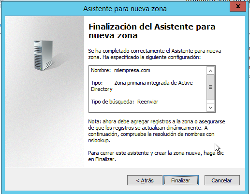

Asociaremos dicho dominio a la ip de nuestro servidor, en este caso `172.18.6.10`.

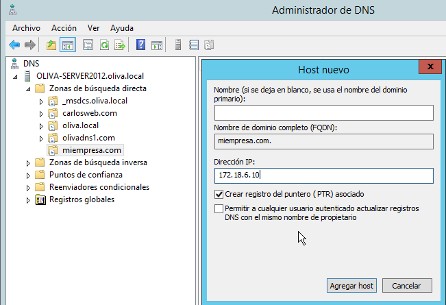

### Sitio web principal
Crearemos también una carpeta `miEmpresa` en C:\ y una subcarpeta llamada `principal`.

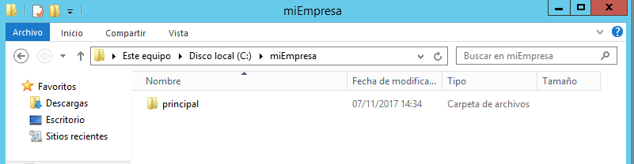

Ahora crearemos un nuevo sitio web `IIS` asociado a la subcarpeta anterior.

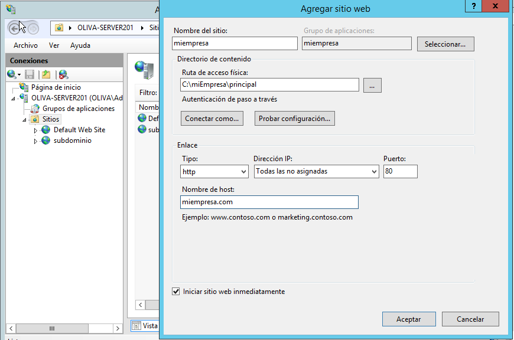

También con acceso a través de la dirección `www.miempresa.com`.

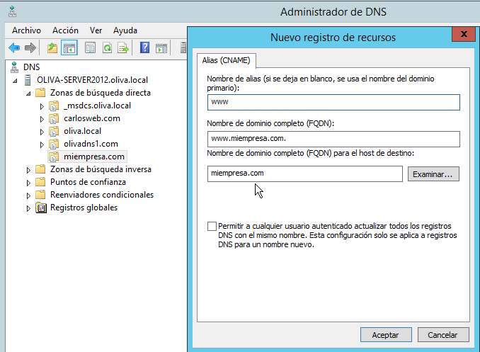

Añadiremos un index que actuará como  página principal.

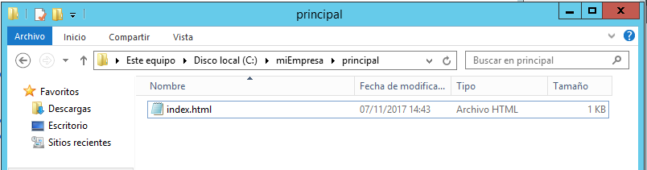

Tras acceder a la dirección `www.miempresa.com` nos aparece la página que hemos pre-establecido en el apartado anterior.

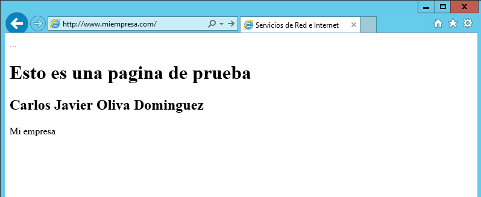

### Sitio web PAGOS
Crearemos un nuevo sitio web denominado `pagos` como subdominio de miempresa `pagos.miempresa.com` y configuraremos este último para ser accedido de forma segura, vía `https`.

Nuevo sitio: Primero vamos a crear una carpeta llamada `pagos` dentro de `miempresa.com` en `Zonas de búsqueda directa`.

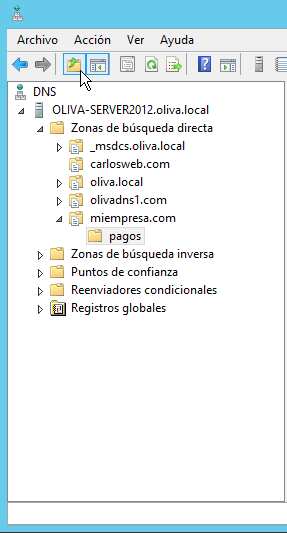

Ahora crearemos un nuevo host que será `pagos.miempresa.com`.

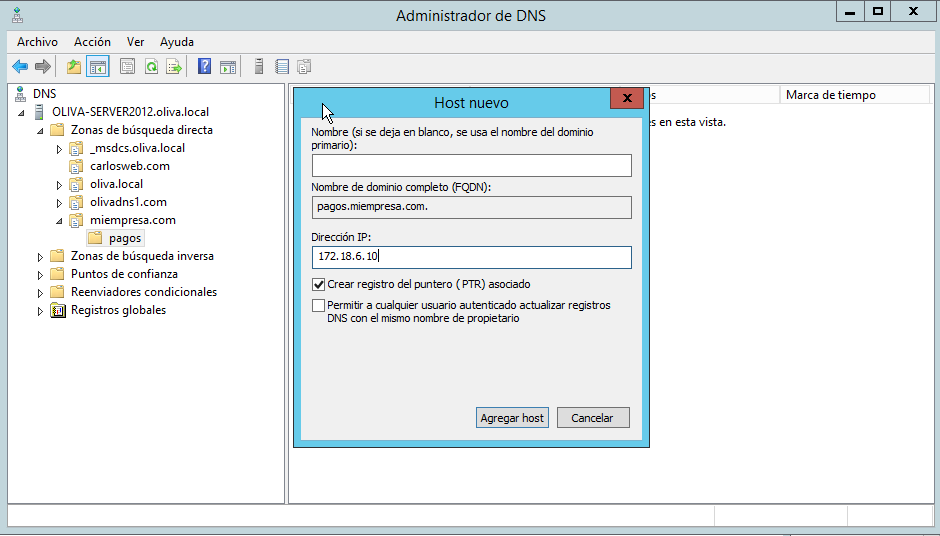

También crearemos un directorio llamado `pagos` dentro de la ruta donde estamos guardando los distintos archivos de nuestras web, `C:\miEmpresa\`.

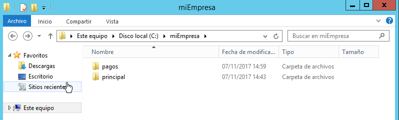

Finalmente iremos a `IIS` y agregamos nuestro nuevo sitio `pagos`.

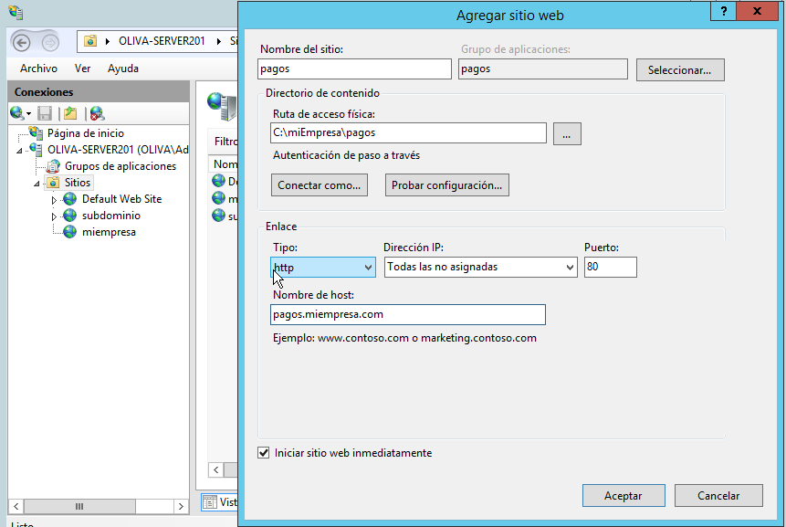

Comprobamos el resultado desde el propio Servidor.

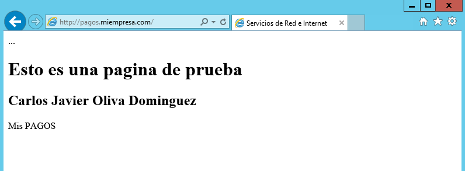

Comprobamos resultado desde un cliente Windows 7.

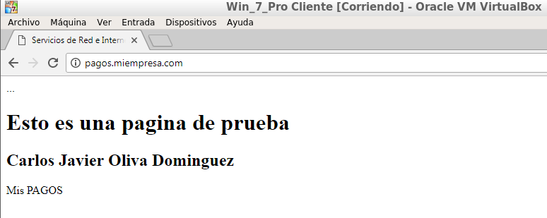

Como hemos visto en la configuración de `IIS` en el momento de añadir un nuevo sitio, las conexiones por defecto serán mediante `http` redirigidas al puerto `80`. Vamos a tomar medidas de seguidad y conectaremos mediante `https` redirigiendo todas las conexiones al puerto `443`.

Para ello vamos a generar un certificado SSL autofirmado.

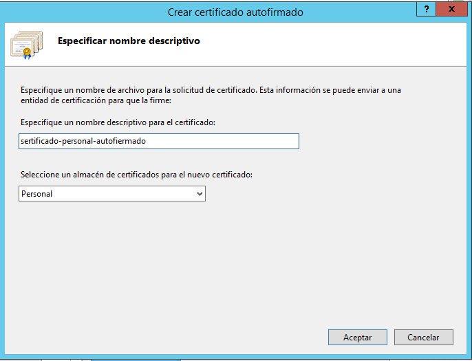

En este punto vamos a poner la dirección de nuestra web `pagos` y elegiremos el tipo de conexión por `https`.

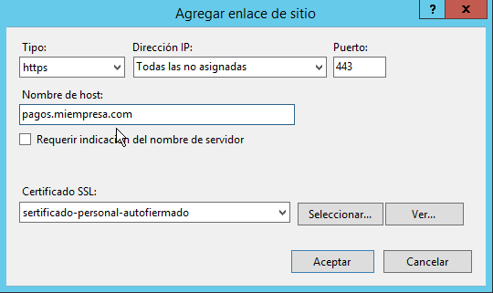

Comprobamos el resultado. Nos pone una advertencia asegurando que hay un error en el certificado. Esto se debe a que es un certificado autofirmado, para solucionarlo habría que generar un certificado proporcionado por una Entidad Certificadora.

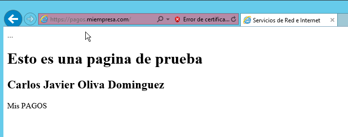

### Sitio web TIENDA
Vamos a crear un nuevo sitio web denominado `tienda` como subdominio de miempresa `tienda.miempresa.com` y al igual que el anterior lo configuraremos para ser accedido de forma segura, vía `https`.

Creamos la carpeta `tienda` dentro de nuestra Zona de búsqueda directa.

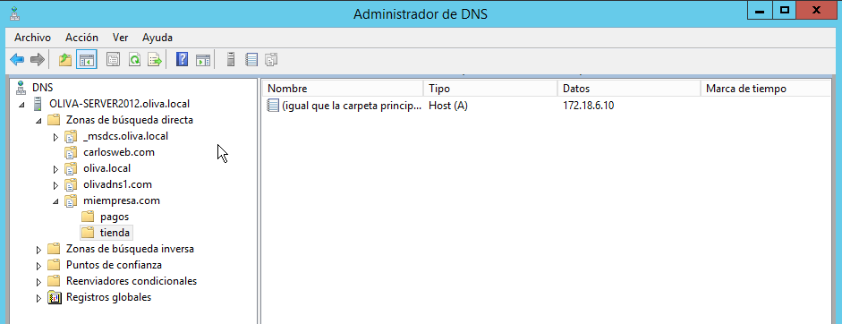

Al igual que con si sitio web `pagos`, crearemos un directorio llamado tienda dentro de la ruta donde estamos guardando los distintos archivos de nuestras web, C:\miEmpresa\.

Ahora desde `IIS`añadiremos un sitio web con la dirección `tienda.miempresa.com`.

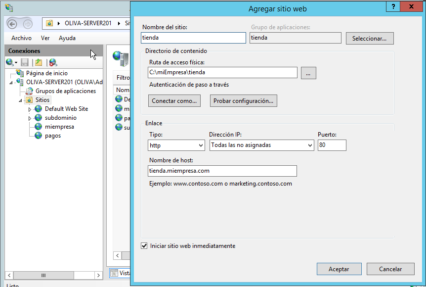

Comprobaremos que podemos acceder a nuestra web.

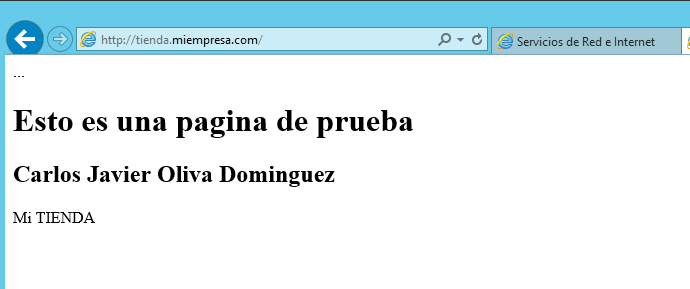

Tras acceder, nos damos cuenta de que ha sido mediante `http` y queremos que sea a travéz de `https`. Para ello vamos a generar un certificado SSL, pero esta vez mediante OpenSSL.

Rellenaremos los datos del propietario del Certificado.

El certificado vamos a llamarlo `certreq.txt` y lo guardaremos en el directorio bin de `OpenSSL`.

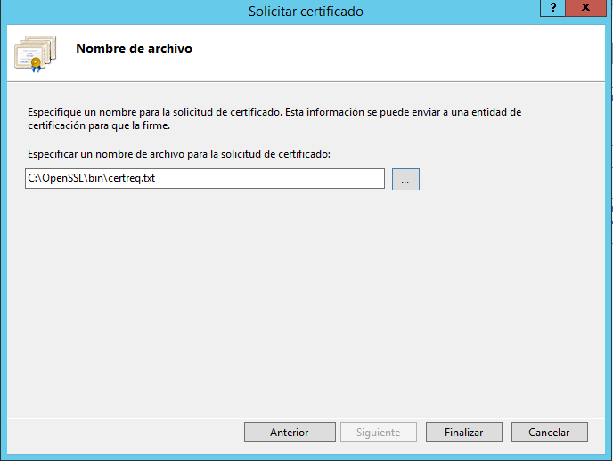

Ahora abiremos una consola cmd y nos dirigimos al direcotrio `bin` del OpenSSL y vamos a generar una clave RSA privada.

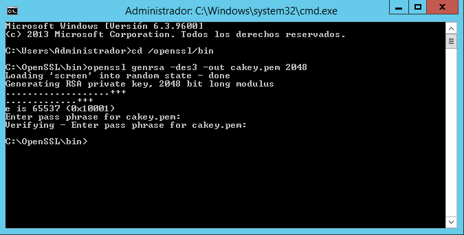

Ahora, hay que crear un certificado digital de la CA que contendrá información sobre la misma, rellenamos toda la información que nos pide y por linea de comando decimos que es válido por un año.

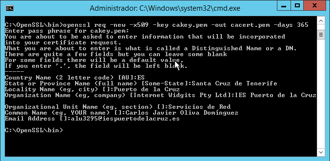

Ahora creamos el Certificado digital para nestra web. Lo llamaremos `iis.crt`

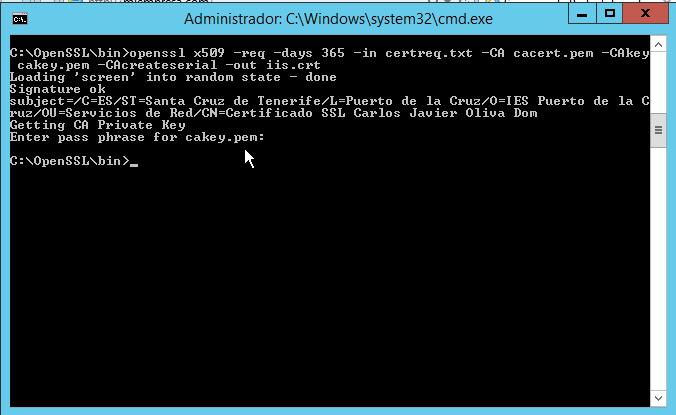

Tras lo anterior podemos ver que nuestro Certificado ha sido generado correctamente.

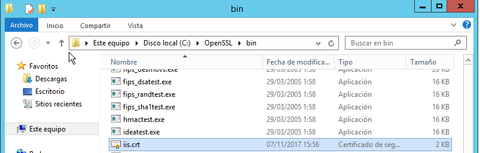

En el siguiente punto tendremos que completar la solicitud de nuestro Certificado.

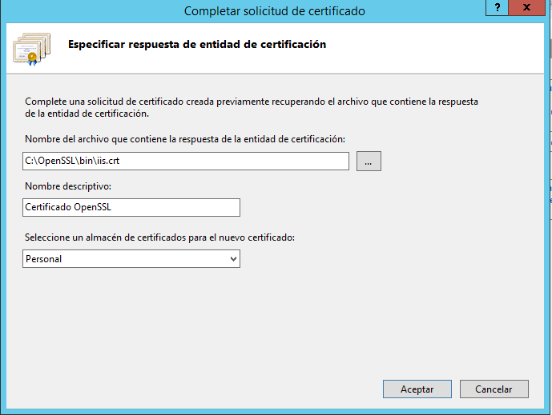

Ahora tendremos dos Certificados, el que autofirmamos anteriormente y el que acabamos de generar.

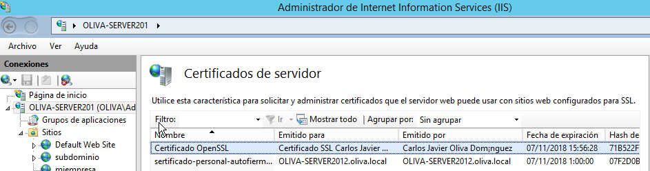

Lo siguiente será agregar un nuevo enlace a nuestra web `tienda.miempresa.com` mediante `https` y eliminar el anterior `(http)` para permitir únicamente las conexiones de forma segura.

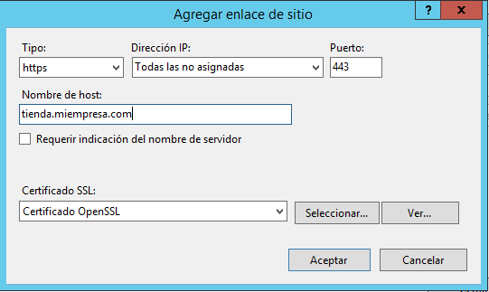

Ahora accederemos a nuestra web y comprobamos la conexión mediante `https`.

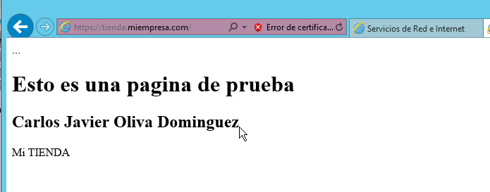

Nos sale la misma advertencia del Certificado pero esto se debe a lo que ya hemos comentado, si queremos cambiarlo necesitamos una Entidad certificadora.

Al hacer clic en dicha advertencia nos dará una información del propietario del Certificado.

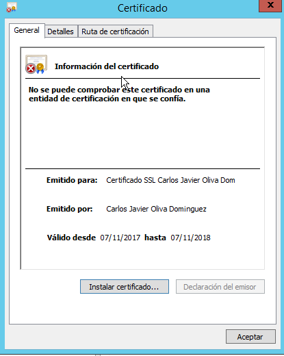

### Sitio web EMPLEADOS
En este sitio vamos a crear carpetas privadas con el fin de permitir solo el acceso a las mismas, a usuarios registrados en el sistema.

Primeramente crearemos una carpeta llamada `empleados` que estará dentro de la ruta donde estamos guardando los distintos archivos de nuestras web, C:\miEmpresa\.

Luego vamos a crear un nuevo alias dentro de nuestro administrador DNS `empleados.miempresa.com`

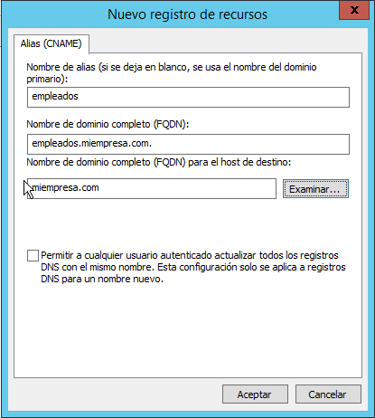

Ahora crearemos una carpeta llamada `empleados` dentro de `miEmpresa` en nuestra Zona de búsqueda directa.

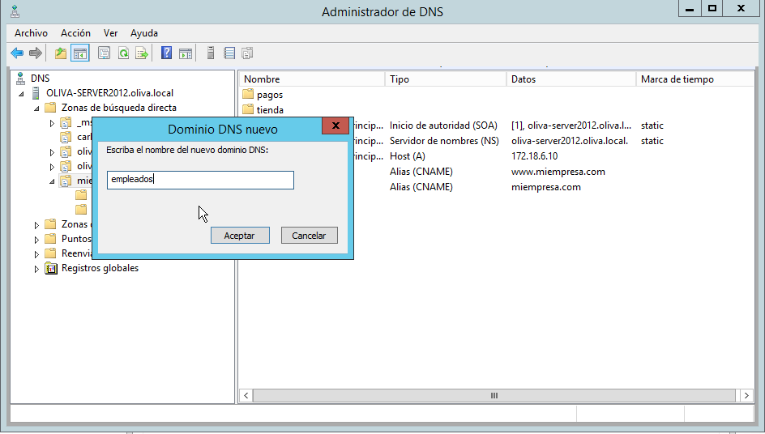

Y dentro de esta vamos a crear varias carpetas pertenecientes a distintos usuarios y una común para todos.

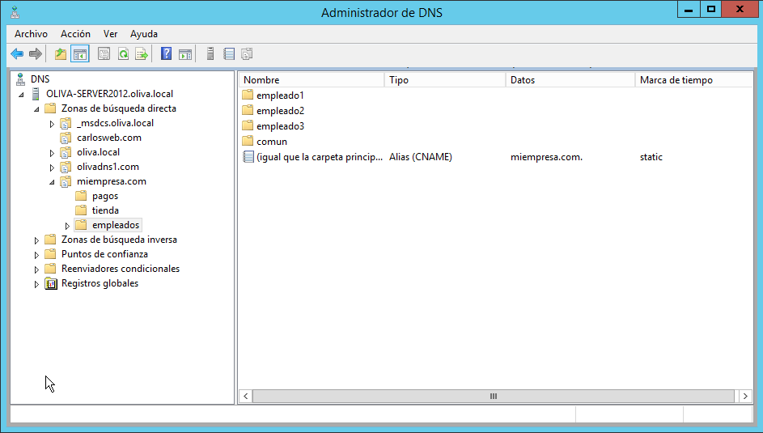

Ahora agregaremos un nuevo sitio `empleados.miempresa.com` en nuestro IIS.

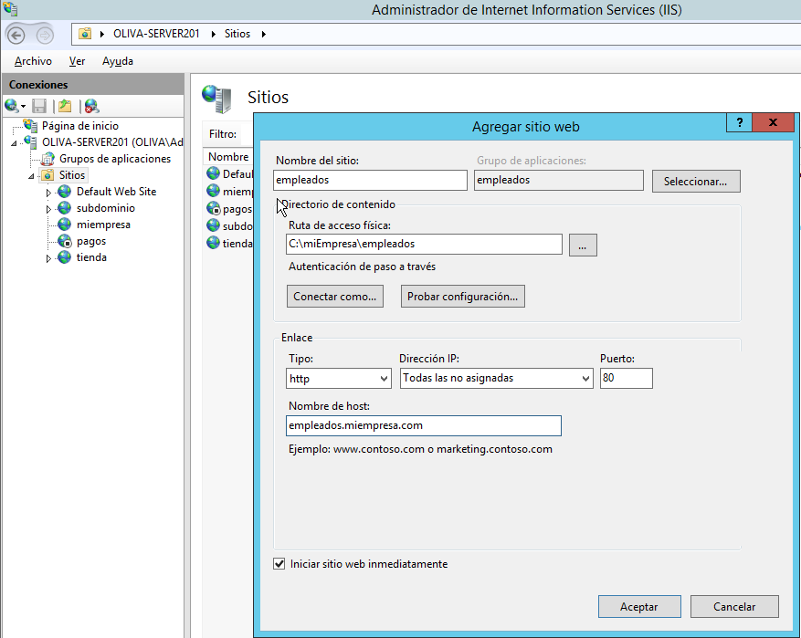

En la configuración de nuestro sitio `empleados` activaremos la opción `Exámen de directorios` para que nos liste los sub directorios de éste.

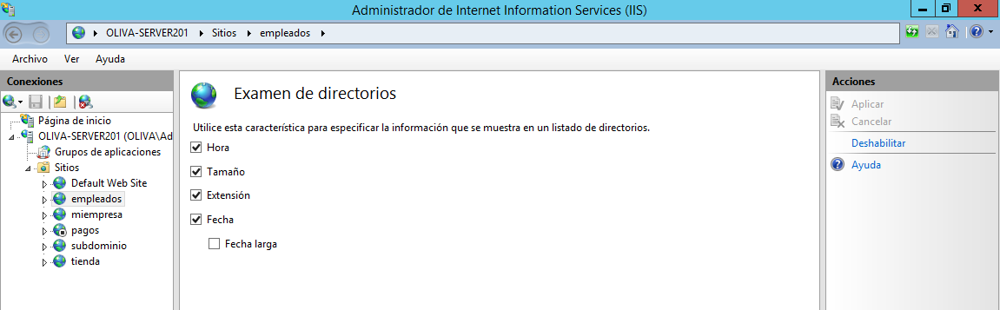

Tras lo anterior tendremos todos los directorios de `C:\miEmpresa\empleados\` pero serán de libre acceso para todos los usuarios que accedan a nuestro sitio.

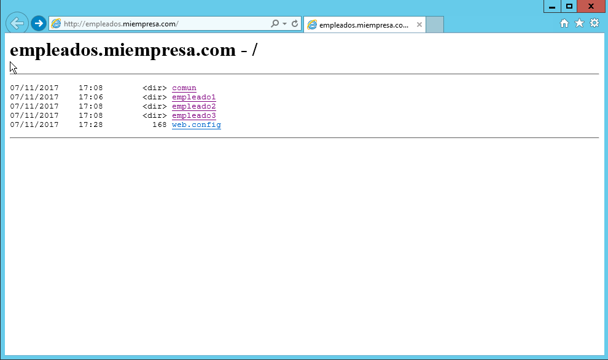

Para restringir esto lo que haremos será autorizar el acceso solamente a los usuarios `"empleado1", "empleado2", "empleado3"` a sus respectivas carpetas y permitiendo el acceso de todos ellos a la carpeta `comun`.

Queremos que incluso los usuarios no registrados puedan acceder al sitio `empleados.miempresa.com` para ello vamos a activar la `Autenticación anónima` y `Autenticación básica`:
- A nivel de Servidor:
  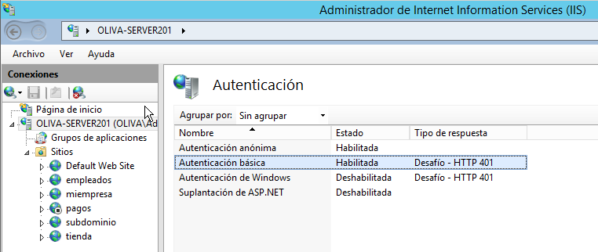

- A nivel de Sitio:
  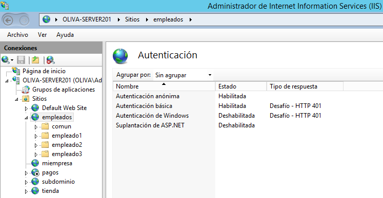

Puesto que queremos que solamente accedan al contenido de empleados los usuarios registrados, vamos a deshabilitar la `Autenticación anónima`.

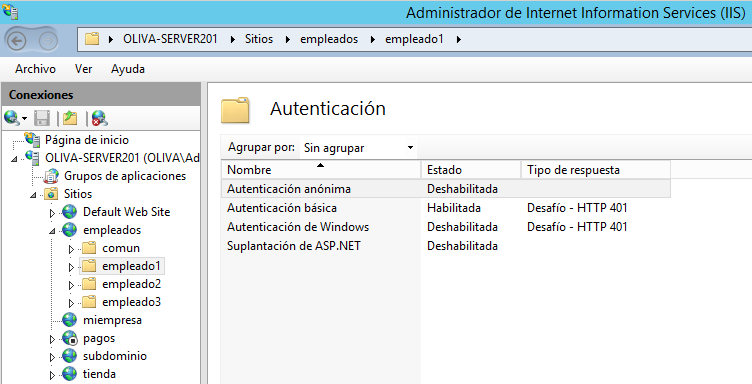

Tras lo anterior tendremos que crear los respectivos usuarios propietarios de los directorios en cuestión.

Para ello nos dirigiremos a `Usuarios y equipos de Active Directory` y generamos 3 usuarios `empleado1, empleado2, empleado3` y un nuevo grupo `común`.

Usuario empleado1:

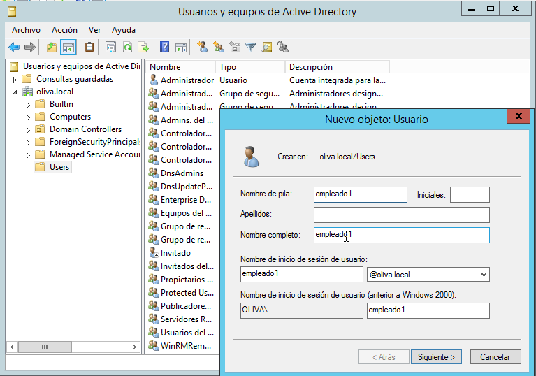

Añadiremos una contraseña respetando las distintas políticas de seguridad.

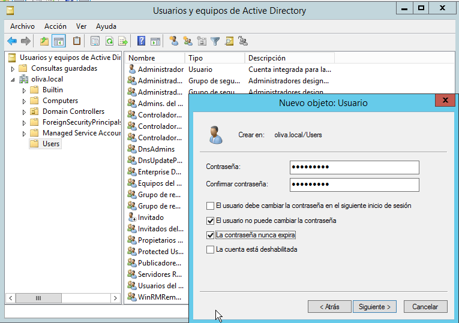

Creación del grupo `comun`:

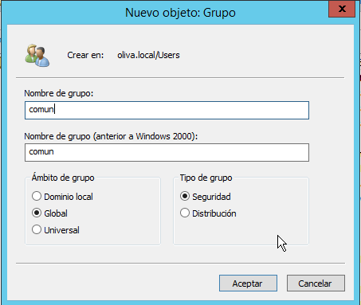

Tras lo anterior añadiremos los usuarios `empleado1, empleado2, empleado3` como miembros del grupo `comun`, esto les permitirá el acceso al mismo solamente a éstos.

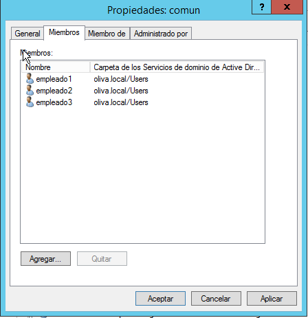

Ahora nos dirigiremos a `C:\miEmpresa\empleados\` y modificaremos los permisos de los distintos directorios, añadiendo por miembros a los correspondientes usuarios.

- El usuario `empleado1` es miembro del directorio `empleado1`.
- El usuario `empleado2` es miembro del directorio `empleado2`.
- El usuario `empleado3` es miembro del directorio `empleado3`.
- Los usuarios `empleado1, empleado2, empleado3` son miembros del directorio `comun`.

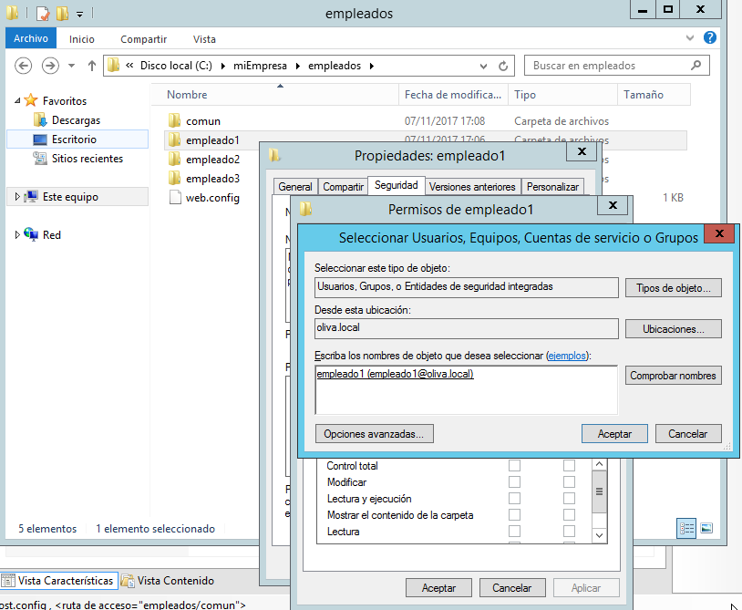

Permitimos el `Control total` para el usuario `empleado1`.

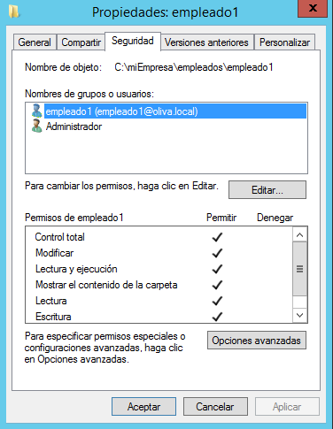

Ahora para el directorio `comun` permitiremos el `Control total` a los usuarios pertenecientes al grupo `comun`.

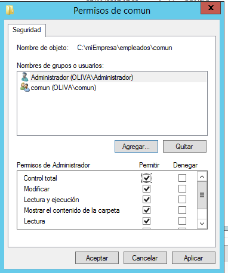

Seguidamente vamos a comprobar el acceso desde nuestro Servidor.

Intentaremos acceder al directorio `empleado1` y nos pide usuario y contraseña.
- Usuario: empleado1 (propietario de este directorio)
- Contraseña: la que establecimos al crear el usuario en el Active Directory.

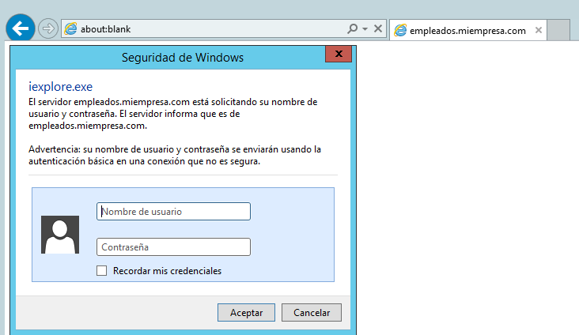

Comprobamos que podemos acceder correctamente.

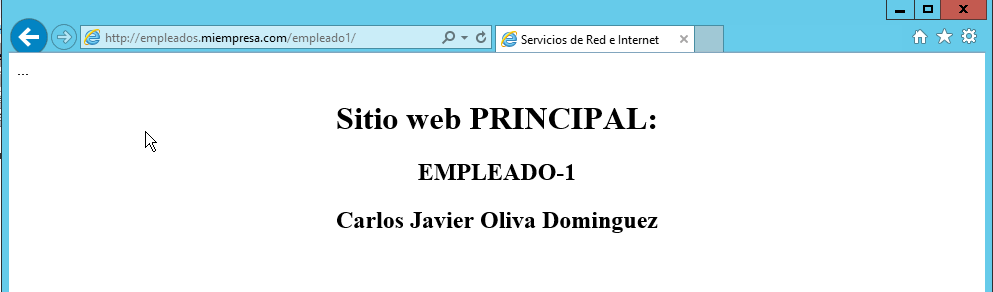

Ahora si intentamos entrar en el directorio `comun` no nos pedirá credencial alguna puesto que al hacer el paso anterior el navegador "cachea" dichas credenciales y nos permite el acceso puesto que el usuario `empleado1` forma parte del grupo `comun`.

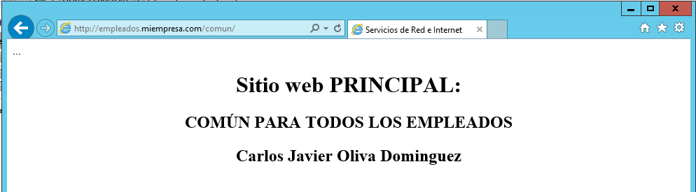

También comprobaremos el acceso desde un cliente Windows 7.

Al igual que en el paso anterior tras intentar acceder a un directorio nos pedirá unas ciertas credenciales.

Intentaremos acceder al directorio `empleado2` y nos pide usuario y contraseña.
- Usuario: empleado2 (propietario de este directorio)
- Contraseña: la que establecimos al crear el usuario en el Active Directory.

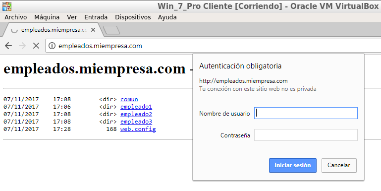

Comprobamos que hemos accedido correctamente.

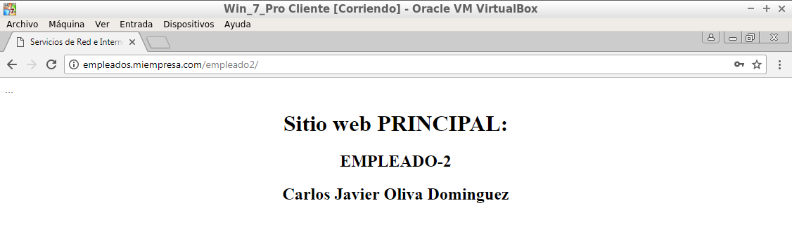

Ahora al igual que en el apartado anterior, si intentamos entrar en el directorio `comun` no nos pedirá credencial alguna puesto que al hacer el paso anterior el navegador "cachea" dichas credenciales y nos permite el acceso puesto que el usuario `empleado2` forma parte del grupo `comun`.

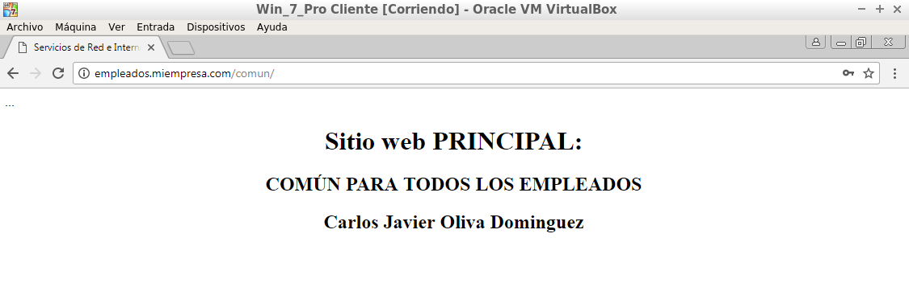

Fin de la práctica.
