## Práctica de IIS Windows 2012 Server I
Carlos Javier Oliva Domínguez

----
Instalar IIS en Windows 2012 Server (Asistente para configurar servidor, Servidor de
Aplicaciones IIS).

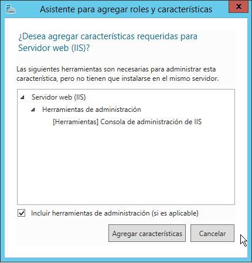

Incluiremos Autenticación Básica y de Windows.

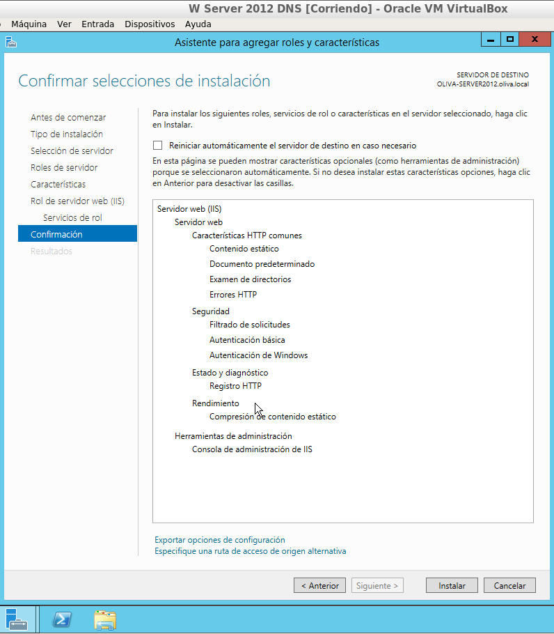

Comprobar acceso a nuestro servidor web (localhost) desde un navegador web (debe
aparecer una página en construcción).

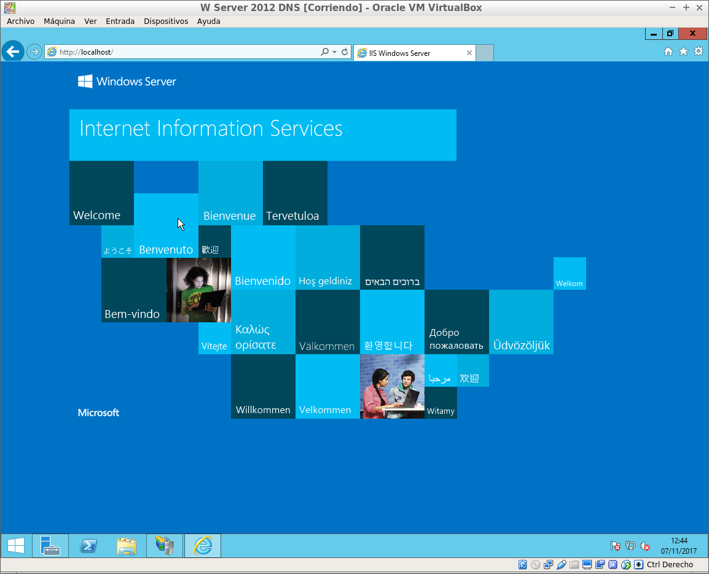

Entrar en cliente Windows 7 y acceder, desde un navegador web, a la página principal del
servidor a través de la IP del servidor.

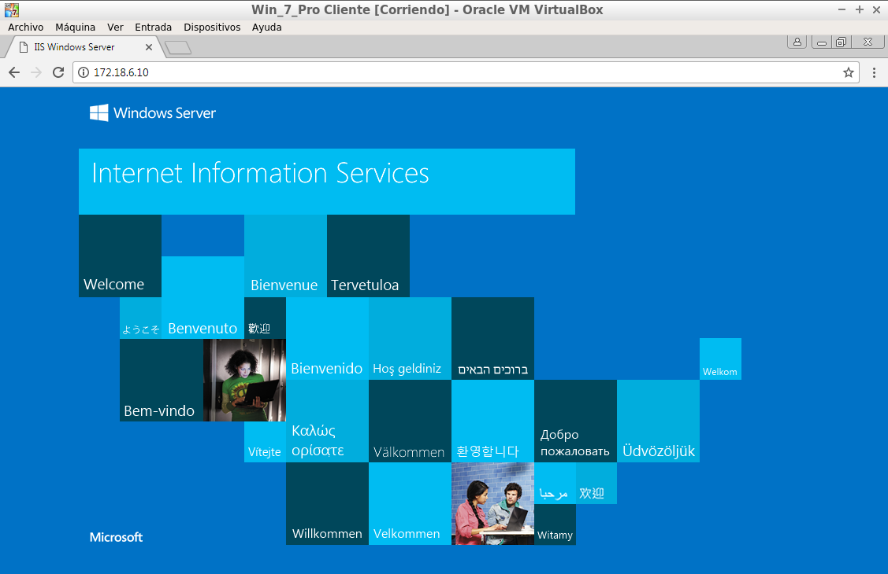

Acceder ahora desde el cliente Windows 7 a la misma página mediante el nombre principal del dominio y
desde cualquier otro alias que haya sido definido en la configuración DNS.

  * Para ello necesitamos crear primeramente una nueva zona en la que vamos a trabajar. Configuramos un nuevo host llamado `carlosweb.com`.

  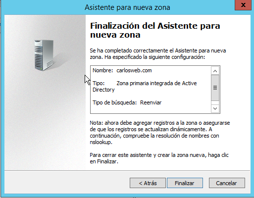

  * Comprobamos el resultado

  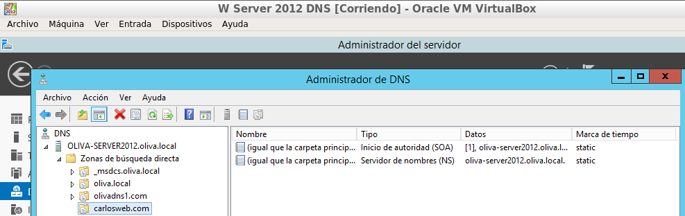

  * Lo siguiente será crear un nuevo host al que llamaremos `server`.

  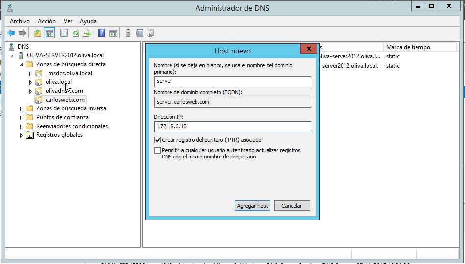

  * Ahora crearemos un nuevo alias al que llamaremos `www`.

  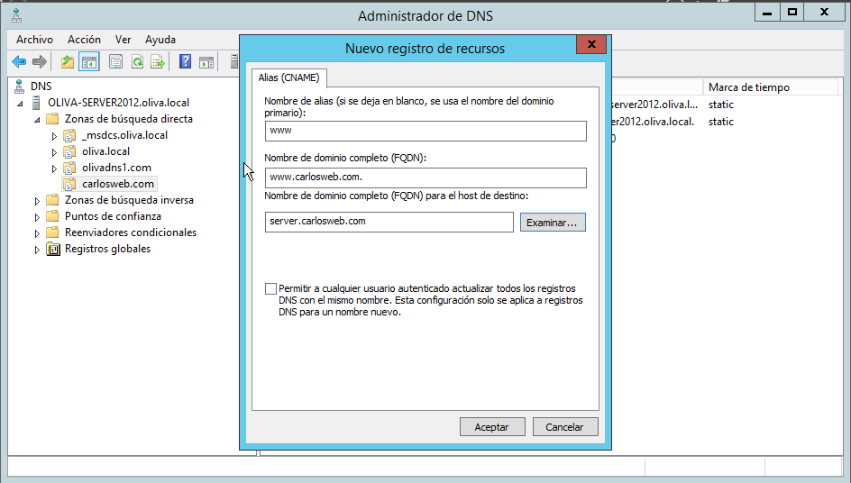

Comprobaremos en el cliente Windows 7 mediante la dirección `server.carlosweb.com`

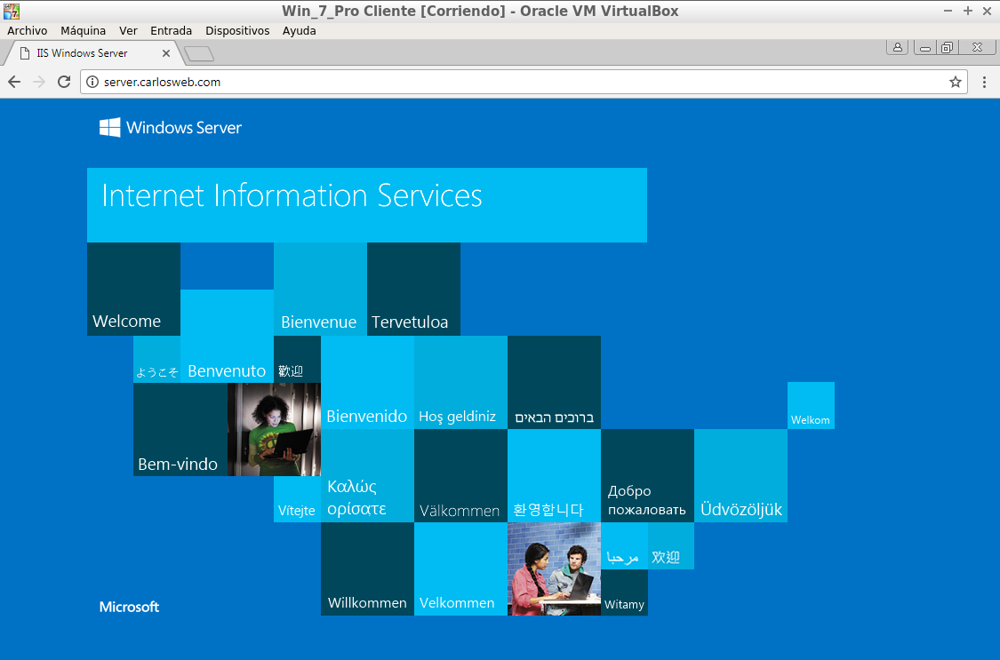

• Tratar de acceder desde Windows 7 al sitio www del dominio principal. ¿Qué ocurre? Añade un
alias en el servicio DNS que relacione el sitio www con el dominio principal. Intenta ahora
acceder desde Windows 7.

Comprobaremos en el cliente Windows 7 mediante la dirección `www.carlosweb.com`

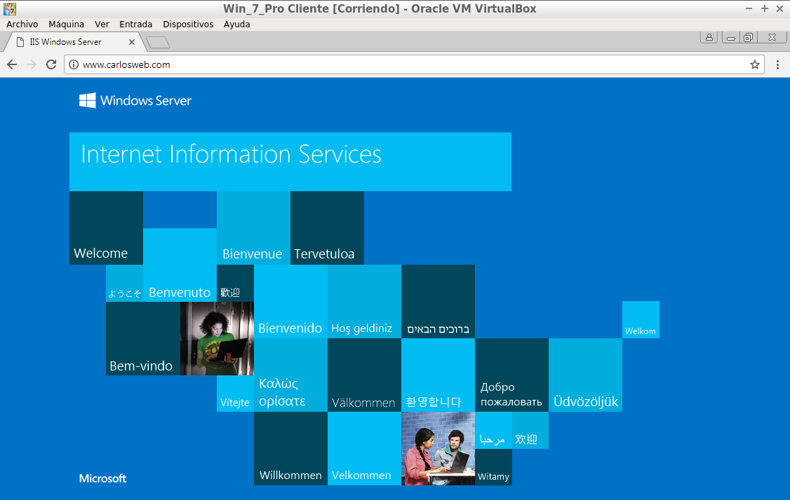

• Crea una página web HTML sencilla (index.htm) como página principal de tu dominio y
colócala en `C:\Inetpub\wwwroot`. Comprueba el acceso a esta página desde el propio
servidor y desde el cliente, utilizando los diferentes alias y direcciones configurados en el
servicio DNS.

Desde la dirección `server.carlosweb.com` en el Servidor.

Desde la dirección `www.carlosweb.com` en el Servidor.

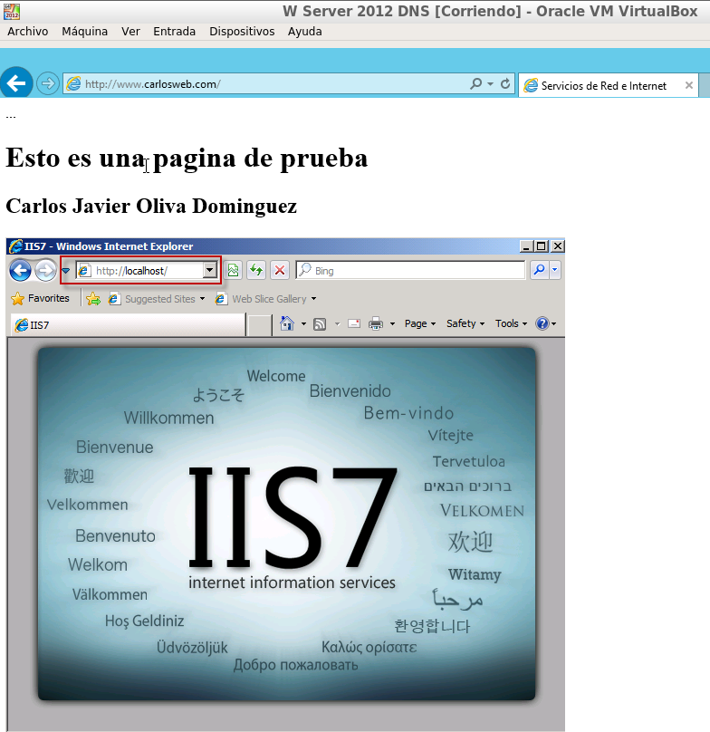

Desde la dirección `server.carlosweb.com` en el cliente Windows 7.

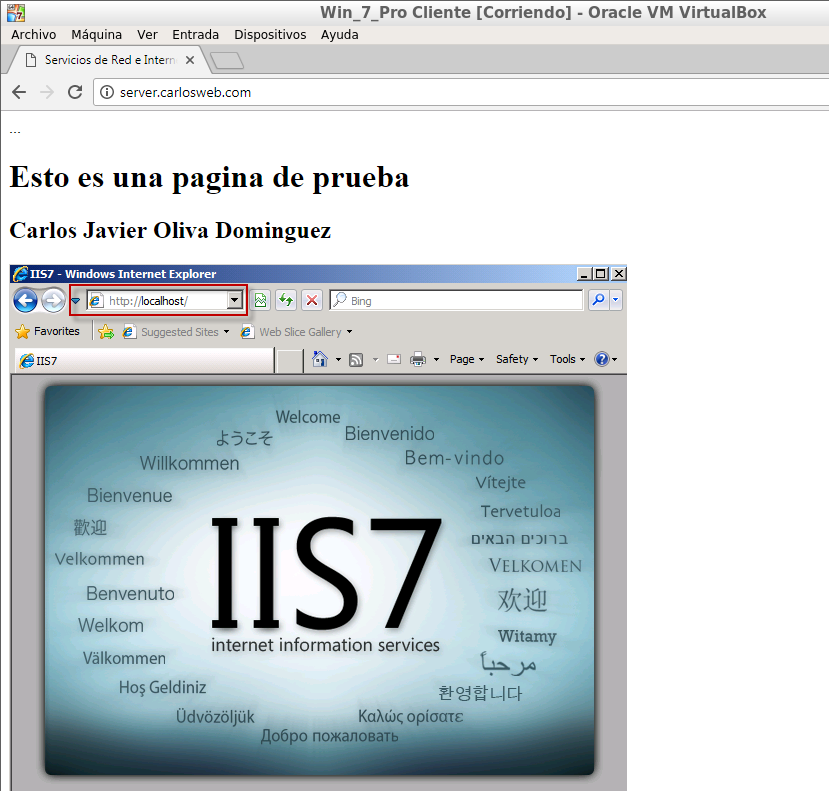

Desde la dirección `www.carlosweb.com` en el cliente Windows 7.

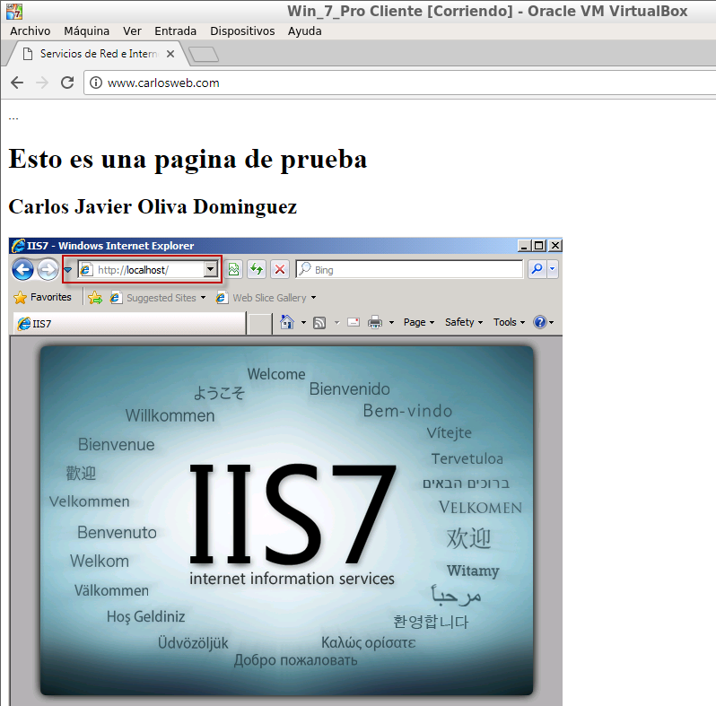

Fin de la práctica.
