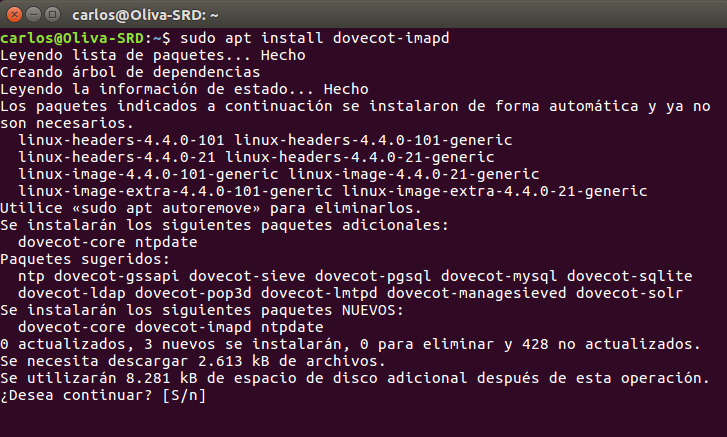
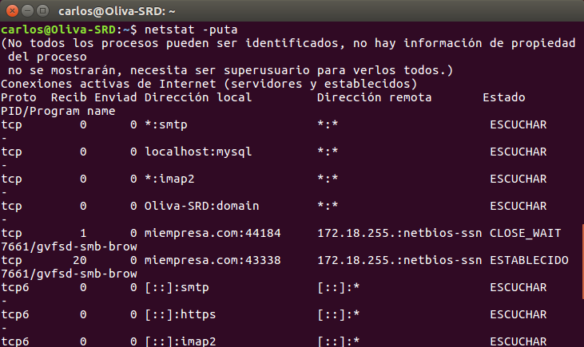
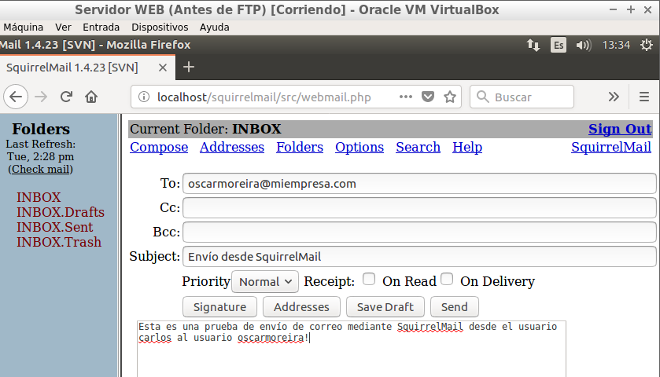

Óscar Moreira Estévez

Carlos Oliva

# Instalación y configuración de un Servidor de correo en LINUX

## 1. Instalación servicio SMTP

- Lo primero que haremos sera instalar el servidor *Postfix* siguiendo los siguientes pasos:

  

  

  

  

- Ahora comprobaremos que el servicio esta corriendo.

  

  - `netstat -utap`

    

- En este paso haremos pruebas de envío de mensajes mediante telnet en el que seguiremos los siguientes comandos que veremos dentro de la imagen.

  - `telnet localhost 25`

    

  - Iremos a la ruta `/varspool/mail`  miraremos que se reciba el correo enviado al usuario indicado.

      

### 1.2 Cliente OperaMail

- Instalaremos un cliente de correo en un cliente en nuestro caso ha sido el *OperaMail*.

  

- Creamos dos lineas nuevas en el fichero `/etc/hosts` en el que introduzcadmos la IP del servidor para los dns(smtp.miempresa.com y pop.miempresa.com).

  

    

- Comprobamos haciendo ping a un dns para verificar que hace conexión.

  

- Ahora creamos dos cuentas de usuario.

  

  

- Ahora comprobaremos que funciona bien el servicio smtp.

  - De Carlos a Oscar:

    

    

  - De Oscar a Carlos:

    

    

___

## 2. Imap y SquirrelMail

### 2.1 IMAP

- Lo primero instalaremos el servicio IMAP : `apt install imapd`.

  

- Comprobamos que el servicio esta corriendo bien.

  

  - `netstat -utap`

    

### 2.2 SquirrelMail

- Ahora instalaremos la aplicación de correo *SquirrelMail*.

  

- Enla ruta `/usr/share/squirrelmail` se encuentra la carpeta de aplicación.

  

- Ahora iremos a la carpeta de configuración `/etc/squirrelmail`

- Una vez dentro copiaremos el contenido del fichero `apache.conf` y crearemos un host virtual nuesvo en `/etc/apache2/sites-available`, lo habilitamos y reiniciamos el servicio.

  

  

  

- Hecho esto pasaremos a comprobar que ha funcionado.

- Accedemos via http a `localhost/squirrelmail`

  

- Nos logueamos con un usuario de los creados anteriormente.

- Ahora veremos que estando dentro que tenemos uno de los correo que hemos enviado anrteriormente a carlos.

  

  

- Y comprobamos con el usuario oscar también.

  

  

- Ahora probaremos a enviar mensajes desde *SquirrelMail*.
  - A usuario oscar:

    

    

  - A usuario carlos:

    

    

- Tmabién comprobaremos que se han recibido en la ruta `/var/mail`

  

  

___

## 3. Servicio POP3

- Instalaremos el servicio *POP3*: `apt install dovecot-pop3d`

  

- Comprobamos que el servicio esta funcionando bien.

  

  - `netstat -utap`

    

- Ahora configuramos nuestro cliente de correo *OperaMail* para que acceda a la recepción de un correo a través del protocolo *POP3*.

  

- Veremos que tenemos los dos usuarios de correo con el POP activado.

  

- Ahora comprobamos que funciona enviando un correo a través del cliente.

- Enviamos un correo de Carlos a Oscar.

  

- Vemos que lo recibimos.

    

- Hemos enviado otro de Oscar a Carlos y vemos que lo recibimos también.

  

- Por último en la ruta `/var/mail` no deberiamos recibir los correos pero los hemos recibido y a todos los alumnos nos ha ocurrido igual.

  

  

___
___

Fín de la práctica
