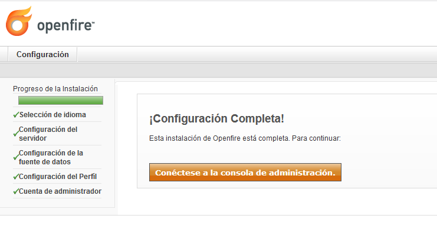
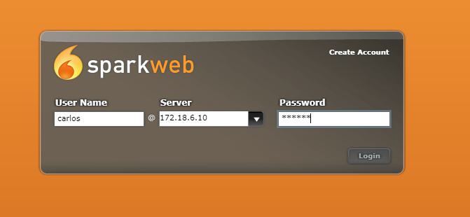

Óscar Moreira Estévez

Carlos Oliva
___

# Servidor de Mensajería Instantánea Windows Server

___
___

## 1 Requisitos

Para poder comenzar hacer la práctica necesitaremos tener instalado en el servidor:

  - IIS
  - PHP
  - MySQL
  - phpMyAdmin

## 2. Openfire

- Lo primero que haremos será descargar el servidor de mensajería instantánea *OpenFire* desde este [enlace](https://www.igniterealtime.org/downloads/index.jsp#openfire).

- Descargamos el de 64 bits con *bundledJRE*.

  

### 2.1 Instalación

- Ahora pasamos a la instalación siguiendo los siguientes pasos como las imágenes:

  

  

  

  

  

  

- Una vez instalado iremos crearemos una base de datos nueva con *phpMyAdmin*.

  

### 2.2 Base de Datos

- Creada la base de datos pasamos a entrar en el navegador en la ruta: http://127.0.0.1:9090, en la que comenzaremos la configuración.

  

  

  

  

### 2.3 Configuración OpenFire

- En este paso de la instalación deberemos poner la ruta de enlace hacia la base de datos como vemos en la imagen.

  

  

  

- Una vez completada la configuración nos conectaremos e ingresaremos con el usuario admin y contraseña admin.

  

- Vemos que ya estamnos dentro.

  

___
___

## 3. Spark

- Lo primero será descargar el cliente de mensajería llamado *Spark* desde este [enlace](https://www.igniterealtime.org/downloads/index.jsp#openfire)

  

- Luego lo ejecutamos el instaldor y lo instalamos con las opciones por defecto.

  

- Una vez instalado abrimos el cliente y nos saldrá algo así.

  

- Ahora iremos a la opción de `avanzado` y activaremos las dos siguientes opciones.

  

- Hecho esto ya podremos entrar con nuestro usuario.

  

- Veremos que entramos

### 3.2 Creación de usuarios

- Iremos a *OpenFire* y crearemos dos usaurios en nuestro caso Oscar y Carlos.

  

  

- Verificamos que estan creados.

  

## 4. Prueba de Conversación Online.

- Ahora lo que haremos será abrir el cliente *Spark* tanto en el servidor como en el cliente y mantendremos una conversación entre los dos usuarios creados.

- Mensajes:

  - Mensaje de Oscar a Carlos responde:

    

    

  - Mensaje de Carlos a Oscar

    

- Cuarto de conferencias:

  - Aquí vemos como Oscar invita a Carlos a que se una al cuarto de conferencias.

    

    

- Transferencia de archivos:

  - En este apartado vemos que Oscar le envía un fichero a Carlos.

    

- Capturas de pantalla:

  - Vemos que Carlso recibe una captura de pantalla de Oscar

    

    

  - Aquí vemos como Varlos lo abre.

    

___
___

## 5. SparkWeb

- Para instalar el *SparkWeb* iremos a este [enlace](https://www.igniterealtime.org/downloads/index.jsp#openfire) al final del todo y lo descargamos.

  

- Tendremos una carpeta llamada sparkweb.

  

- Crearemos un alias nuevo para nuestro sitio.

  

- Tambien añadiremos un sitio nuevo de IIS y añadir el fichero que contiene la carpeta.

- Pot último entraremos al sitio creado.

  

  

> Hemos tenido un error toda la clase incluido el profesor de que no nos logeaba.

___
___

Fín de la práctica.
