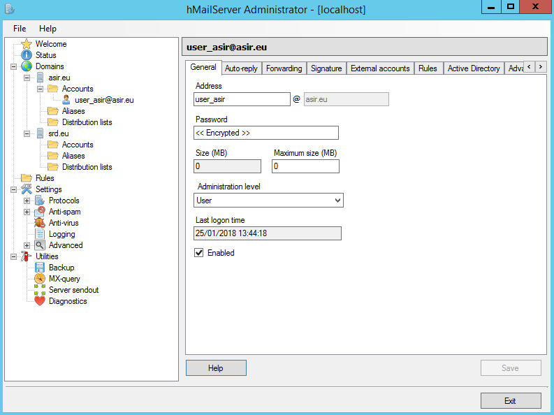

## Servicio SMTP Windows 2012 Server - Instalación y Configuración de un Servidor de Correo SMTP
Carlos Javier Oliva Domínguez

----
## SMTP - Windows Server 2012

### Instalar Servicio SMTP en Windows 2012 Server (manualmente o utilizando Asistente).
Primeramente comenzaremos con la instalación de la característica SMTP en nuestro Servidor.

### Configuración de servicio SMTP a través del administrador de aplicaciones (IIS) 6.0. Realizar las acciones de configuración correspondientes:

Acto seguido, pondremos la dirección IP del servidor , limitamos el numero de conexiones, y habilitamos el registro W3C.

En Propiedades del Registro, configuraremos la nueva `Programación de registro` de forma diaria.

#### Configurar envío de mensajes dentro de nuestra red local: Aceptar la conexión al servidor y la retransmisión de mensajes a todos los equipos menos los que aparecen en la lista (incluir una IP cualquiera en la lista para impedir su acceso y retransmisión)

#### Establecer autenticación anónima.

Para esta primera parte, estableceremos la autenticación anónima.

#### Echar un vistazo al resto de opciones de configuración del servidor. Aplicar cambios y reiniciar servicio.
Tras las configuraciones anteriores, reiniciaremos el servicio, poniéndolo en stop y luego poniéndolo en play.

####Comprobar la existencia del dominio AD predeterminado. Crea un dominio de tipo alias para disponer de cuentas en otro dominio.

Crearemos un nuevo dominio tipo `alias`, en mi caso `carlos.edu`.

#### Comprueba carpetas de correo creados en `C:\Inetpub\mailroot`.

Comprobaremos también que se han creado las correspondientes carpetas de correo en el Servidor.

### En el cliente Windows:
Instalaremos el gestor de correo `Opera Mail`.

#### Configurar el cliente de correo Live mail agregando dos cuentas de correo cualesquiera (usuarios AD -dominio- y no AD). Se deberá especificar: usuario / buzón, contraseña,  servidor SMTP.

Una vez finalizada la instalación de `Opera Mail`, procederemos a agregar una cuenta de correo.

Pondremos un usuario y contraseña cualquiera puesto que no es imprescindible, dado que la autenticación por el momento es `anónima`.

Dentro de la configuración de Servidores, tendremos algo así.

#### Enviar varios correos desde / hacia las diferentes cuentas y comprobar envío (real o ficticio) y carpetas mailroot. Las carpetas existentes en mailroot alojan mensajes en cola (Queue), mensajes para destinatarios desconocidos (Badmail) y mensajes entregados (Drop)

Escribiremos un mensaje y lo enviaremos a una cuenta de correo electrónico real.

Tras enviar el mensaje, nos dirigiremos a la ruta donde se alojan los mensajes enviados `(C:\inetpub\mailroot\Drop)`.

Finalmente, nos logueamos con la cuenta a la que enviamos el correo y comprobamos que lo hemos recibido.

#### Nueva configuración de servicio SMTP a través del administrador de aplicaciones (IIS) 6.0. Establecer autenticación básica de Windows. Probar diferentes configuraciones de dominio predeterminado, cifrado TLS, etc.

Para esta parte vamos a usar una `Autenticación Básica`.

Ahora comprobaremos que funciona con los correos, para esto debemos usar cuentas de usuarios existentes dentro de Active Directory y activando la conexión segura TLS.

Lo siguiente que haremos será enviar un correo a una cuenta que no exista y comprobaremos que pasa.

Finalmente comprobamos que el correo no ha sido enviado, puesto que la dirección de correo electrónico que introduje no es correcta, podemos comprobar la ruta `Badmails` y veremos lo siguiente:

Finalmente comprobamos enviar el mismo mensaje, pero esta vez si, a un correo existente.

Iremos al cliente, y abriremos el correo, podremos comprobar que hemos recibido el correo perfectamente.

Fin PRIMERA PARTE.

-----

-----

## Hmail Windows Server 2012

#### 1.0 Desinstalar Servicio SMTP
Primeramente tendremos que quitar la característica `SMTP` que instalamos en la primera parte. Para ello vamos a nuestro administrador de roles, `Administrar --> Quitar roles y funciones.`  
  

#### 2.0 Instalación de Servidor hMailServer
El primer paso en esta parte será ir a la pçagina oficial de descarga. Desscargaremos la última versión `(Latest version).`

Como parte importante para la instalación de hMailServer, es imprescindible instalar la Característica de `.NET Framework 3.5`.

Ahora haremos la instalación de `hMailServer`.

Elegiremos la primera opción:   

Elegiremos una contraseña:   

Finalmente confirmamos la instalación con las características elegias.   

Tras la instalación, lo ejecutaremos y nos conectaremos en `localhost` con el usuario `Administrador`.    

Ingresaremos la contraseña que predefinimos en el apartado anterior.    

Tras lo anterior, podremos ver la interface principal del programa.    

#### 3.0 Dominios
Ahora iremos al apartado `Domains` donde añadiremos nuestros dominios `srd.eu` y `asir.eu`.    

Comprobamos el resultado, viendo los dos dominios creados.    

#### 4.0 Backup
En este apartado vamos a realizar un diagnóstico, y comprobaremos todos los errores que tiene nuestro Servidor, pero vamos a centrarnos en el apartado `Backup`.    

Vamos a definir un directorio `(C:\Users\Administrador\Documents\BACKUP)`.    

Volveremos a hacer el diagnóstico y comprobamos que hemos corregido el error.    

#### 5.0 Usuarios de Dominio
En este punto, vamos a configurar diferentes usuarios en nuestros Dominios y la función `Auto-reply`.

Dominio `asir.eu`: Creamos el usuario `user_asir`.    

Dominio `srd.eu`: Activamos la función `Auto-reply`.       

#### 6.0 Servicio DNS
Vamos a crear dos `Zonas` nuevas en nuestro `Administrador de DNS`.

También crearemos un `host` al que llamaremos `mail` y un `MX` asocialo al mismo, en cada una de las `Zonas` anteriores.

`Zona srd.eu`   

`Zona asir.eu`

#### 7.0 Opciones adicionales

En este punto vamos a añadir una función entra al Dominio `asir.eu`. En este caso he elegido la opción  `Forwarding`.

Esto hará que se reenvíe el mensaje a otro correo.    

#### 8.0 Cliente Windows
Cliente `OperaMail`

#### 9.0 Envío y recepción de correos entre usuarios.

Ahora vamos a enviar un correo con el usuario `user_asir` hacia el usuario `user_srd`.    

Ahora comprobamos que recibimos el mensaje en el gestor `OperaMail` del cliente `user_srd`.    

Tras el envío del mensaje, también, comprobaremos que el usuario `user_srd` nos responde automáticamente, gracias a la función `Auto-reply` que configuramos anteriormente.    

#### 10.0 Listas de distribución
Mediante las `Listas de distribución` enviaremos correos a una lista de usuarios predefinidos en nuestro Servidor.    
Dentro de `Distribution list` vamos a crear un usuario en modo `público` para que cualquiera pueda mandar un correo a los usuarios de la lista de contactos.    

Ahora añadoremos miembros:    

###### 10.1 Comprobación
Para la comprobación lo que haremos será enviar un correo directamente al nombre de la lista de contactos dentro de la `Distribución` que creamos anteriormente `users_asir@asir.eu`.           

Esto hará que el correo que enviemos sea recibido en todos los miembros de `users_asir@asir.eu`.    

Podemos comprobar que hemos recibido varios correos, uno para cada miembro.

Fín de la actividad.
