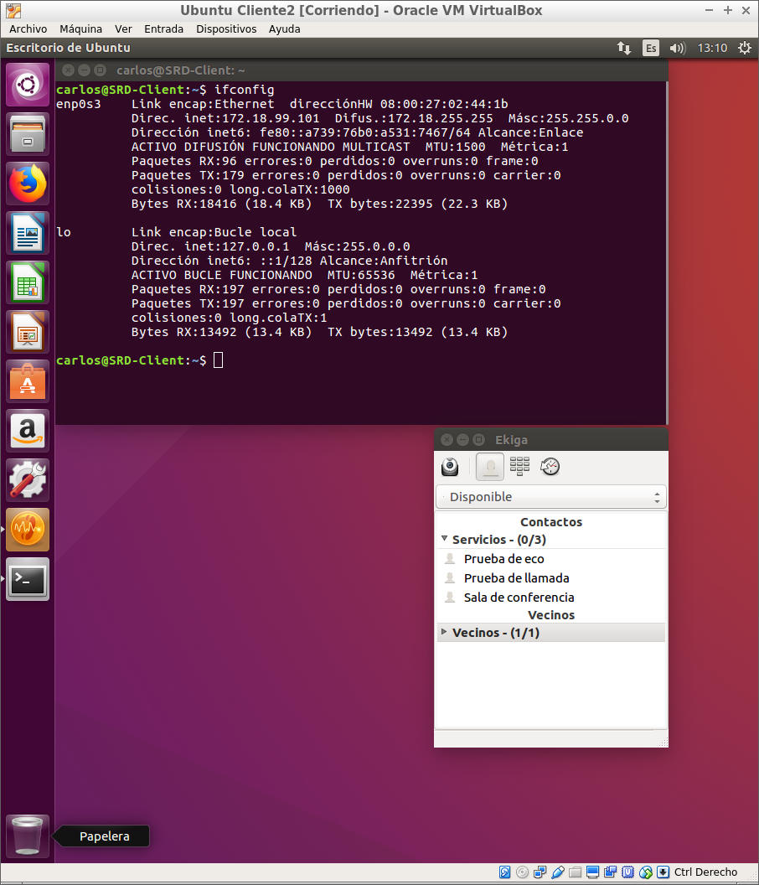

Óscar Moreira

Carlos Oliva

# Instalación y configuración del servicio VoIP

  

Nosotros hemos usado para esta práctica la herramienta llamada *Elastix*.

## 1. Instalación Elastix

- Lo primero que haremos será ir a la página oficial de Elastix para descargar la iso.

  

- Una vez descargada crearemos una nueva máquina virtual y le pondremos la iso descargada.

- Hecho esto la arrancamos y comenzamos la Instalación.

- Elegimos `Graphical install`

  

- Le pondremos un nombre de host.

  

- Luego le indicaremos un nombre de dominio.

  

- Elegimos idioma `Spanish`.

  

- Nos pedirá una clave de superusuario.

  

- Hecho esto nos saldrá una pantalla en la que eligiremos la opción (1).

  

- Esto nos pasará a otra pantalla en la que nos dará un link para que podamos acceder a la web.

  

## 2. Instalación del servicio desde Web.

- Habiendo hecho los pasos anteriores estando en la web nos saldrá para comenzar la instalación.

  

- Luego elegimos nombre de usuario y contraseña.

  

- Ahora le tendremos que poner una IP manualmente y le pondremos la que nos dio el servicio en el link de antes.

  

- La dejaremos en `Static IP`

  

- Pasaremos a elegir los puertos de tal forma que quede así.

  

- Elegimos el adaptador red por defecto.

  

- En la longitud de extensión le indicaremos solo 2 digitos aunque podríamos darle mas sin problema.

  

- Elegimos `Spain` como país y `Canary Island` como zona horaria.

  

- Ahora añadiremos un usuario.

  

- Eligiremos desde donde se pueden hacer y recibir llamadas.

  

- Lenguaje `Spanish Prompts Set`

  

- Terminado esto ya nos saldrá la ventana en la que podremos acceder al enlace.

  

- Una vez entremos en el enlace veremos lo siguiente.

  

- Dentro agregaremos un usuario para poder probar las llamadas.

  

___

## 3. Cliente softphone Ekiga

- En linux para instalarlo solo tendremos que ir a la aplicación de software e instalar `softphone Ekiga`.

  

- Una vez instalado nos saldrá esta ventana.

  

- Ahora editaremos la cuenta y le pondremos un nomvre y un usuario que pertenece al creado anteriormente.

  

- Hecho esto vemos que ya esta registrado.

  

## 4. Comprobación

- Ahora veremos que tenemos dos clientes para hacer la llamada uno con el usuario carlos y otro oscar.

  

  

- Ahora desde el usuario de Oscar llamaremos a Carlos.

  

- Vemos que la llamada se esta haciendo.

  

- Una vez coja la llamada se verá así.

  

___
___

Fín de la práctica.
